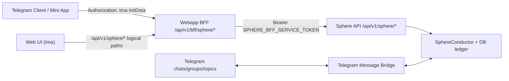

# LensForge Frontend Integration + Skin System Technical Spec (v1)

Date: 2026-02-26  
Audience: frontend engineer/team taking over UI/UX implementation  
Status: implementation-ready handoff for current backend

## 1) Purpose

This document defines:

1. The exact backend contract the frontend must integrate with.
2. The auth and identity boundaries for Telegram Mini App + agent messaging.
3. The stream/replay/ack behavior required for reliable live threads.
4. A pluggable skin architecture so the app can be re-skinned without changing core logic.

Primary outcome: a frontend team can build a high-quality Telegram web app UI that plugs into the existing Sphere Thread backend without guessing backend behavior.

## 2) Current System Snapshot (Implemented)

## Backend surfaces

1. Canonical Sphere API: `/api/v1/sphere/*`
2. Optional legacy alias: `/api/v1/c2/*` (deprecation metadata emitted)
3. Telegram-facing BFF adapter: `/api/v1/bff/sphere/*`
4. Standard error envelope on Sphere boundary:

```json
{
  "code": "STRING",
  "message": "STRING",
  "retryable": false,
  "details": {},
  "traceId": "uuid"
}
```

## Frontend stack in repo

Path: `/Users/paulcooper/Documents/Codex Master Folder/sphere-thread-engine/tma`

1. React + TypeScript + Vite + Tailwind.
2. Current router/pages:
   - Atlas (`/`)
   - Citadel (`/citadel`)
   - Forge (`/forge`)
   - Hub (`/hub`)
   - Engine Room (`/engine-room`)
   - Open Claw launcher (`/open-claw`)
3. Command catalog currently includes ~70 API command definitions (`tma/src/lib/commands.ts`).
4. API client normalizes Sphere calls to BFF paths in browser context.

## Telegram bridge status

Implemented server-side bridge in:
`/Users/paulcooper/Documents/Codex Master Folder/sphere-thread-engine/engine/src/telegram/messageBridge.ts`

Capabilities:

1. Inbound Telegram message -> Sphere thread write.
2. Outbound Sphere message intent -> Telegram sendMessage fanout.
3. Group/topic tracking via `(chat_id, message_thread_id)` link keys.
4. Bot commands:
   - `/thread`
   - `/link <thread-uuid>`
   - `/unlink`

## 3) Integration Topology



Key rule: browser UI never sends raw service token; BFF owns service auth to Sphere.

## 4) Auth and Identity Model

## 4.1 Auth boundary

1. BFF requires Telegram auth middleware (`Authorization: tma ...`) or dev bypass (non-prod).
2. Sphere canonical routes require service token:
   - `Authorization: Bearer <token>` or `x-sphere-service-token`.
3. Sphere rejects direct TMA auth (`SPHERE_ERR_TMA_DIRECT_FORBIDDEN`).

## 4.2 Agent API key boundary

For write calls through BFF (when enabled):

1. Header: `x-agent-api-key`
2. Keys map to principals via `SPHERE_BFF_AGENT_API_KEYS` (env).
3. BFF emits `x-sphere-agent-principal` response header when resolved.

## 4.3 Identity layers

1. Telegram human identity: `req.telegramUserId` from validated initData.
2. Agent principal identity: resolved from `x-agent-api-key` (ACL/membership layer).
3. Message signing identity: `did:key:*` (Ed25519) from frontend signer (`sphereIdentity.ts`).

Recommendation for your requirement ("each Telegram person is a different identity"):

1. Keep Telegram user identity for human session/auth.
2. Use separate agent API keys per person (principal isolation).
3. Keep per-user DID signer keys in local device storage for signed envelopes.

## 5) API Contract (Frontend-Relevant)

Frontend should code against logical `/api/v1/sphere/*` paths; API client may rewrite to BFF internally.

## 5.1 Read endpoints

1. `GET /api/v1/sphere/capabilities`
2. `GET /api/v1/sphere/status`
3. `GET /api/v1/sphere/lens-upgrade-rules`
4. `GET /api/v1/sphere/dids`
5. `GET /api/v1/sphere/dids/:did`
6. `GET /api/v1/sphere/threads/:threadId`
7. `GET /api/v1/sphere/threads/:threadId/lens-progression`
8. `GET /api/v1/sphere/threads/:threadId/replay?cursor=0`
9. `GET /api/v1/sphere/threads/:threadId/acks?cursor=0`
10. `GET /api/v1/sphere/threads/:threadId/stream?cursor=0&ack_cursor=0`
11. `GET /api/v1/sphere/threads/:threadId/members`
12. `GET /api/v1/sphere/threads/:threadId/invites`

## 5.2 Write endpoints

1. `POST /api/v1/sphere/dids`
2. `POST /api/v1/sphere/missions`
3. `POST /api/v1/sphere/messages`
4. `POST /api/v1/sphere/cycle-events`
5. `POST /api/v1/sphere/threads/:threadId/ack`
6. `POST /api/v1/sphere/halt-all`
7. `POST /api/v1/sphere/threads/:threadId/invites`
8. `POST /api/v1/sphere/invites/:inviteCode/accept`
9. `POST /api/v1/sphere/threads/:threadId/invites/:inviteCode/revoke`
10. `DELETE /api/v1/sphere/threads/:threadId/members/:memberPrincipal`

## 5.3 Required write-envelope fields

Messages (`POST /messages`):

1. `threadId`
2. `messageId`
3. `traceId`
4. `intent`
5. `attestation[]`
6. `schemaVersion` (`"3.0"`)
7. `agentSignature`

Cycle events (`POST /cycle-events`):

1. All above plus `eventType`.
2. Valid `eventType`:
   - `seat_taken`
   - `perspective_submitted`
   - `synthesis_returned`
   - `lens_upgraded`

ACK (`POST /threads/:threadId/ack`):

1. `traceId`
2. `intent` (`ACK_ENTRY`)
3. `schemaVersion` (`3.0`)
4. `attestation[]`
5. `agentSignature`
6. `targetSequence` or `targetMessageId`

## 5.4 Signature model (current)

1. Frontend creates Ed25519 keypair locally and derives `did:key`.
2. Frontend signs canonical payload and sends compact JWS-like signature string.
3. Server enforces signer validity by verification mode:
   - `off`
   - `did_key`
   - `strict`

## 6) Stream + Replay + ACK Client Protocol

## 6.1 SSE stream contract

Endpoint: `GET /api/v1/sphere/threads/:threadId/stream`

Events:

1. `ready` (contains `cursor`, `ackCursor`, `retryMs`, ack endpoints, `traceId`)
2. `log_entry` (`entry` + `cursor`, may include `replay: true`)
3. `ack_entry` (`ack` + `ackCursor`, may include `replay: true`)
4. `heartbeat`

## 6.2 Client behavior (required)

1. On open:
   - call replay for safety if local cursor exists.
2. Maintain two cursors:
   - `cursor` for log entries
   - `ackCursor` for ack entries
3. Persist cursors locally per `threadId`.
4. On reconnect:
   - reconnect with `cursor` + `ack_cursor`.
5. After rendering each new log entry:
   - write ACK to `/threads/:threadId/ack`.
6. On `retryable=true` errors:
   - exponential backoff.
7. On non-retryable auth/ACL errors:
   - block action and surface exact `code` + `traceId`.

## 7) Thread Membership + Invite Lifecycle

## Flow

1. Owner principal writes first message to new thread.
2. BFF bootstrap can auto-grant owner membership on successful first write.
3. Owner creates invite code (`maxUses`, optional expiry).
4. Invitee accepts invite code.
5. Invitee becomes `member`.
6. Owner can list/revoke invites and remove members (owner rules enforced).

## Common access errors

1. `BFF_ERR_THREAD_ACCESS_DENIED`
2. `BFF_ERR_OWNER_REQUIRED`
3. `BFF_ERR_INVITE_NOT_FOUND`
4. `BFF_ERR_INVITE_EXPIRED`
5. `BFF_ERR_INVITE_REVOKED`
6. `BFF_ERR_INVITE_EXHAUSTED`

## 8) Telegram Bridge Behavior (for chat mirroring)

## Inbound (Telegram -> DB/thread)

1. Polls Telegram `getUpdates`.
2. Resolves link key `chatId:messageThreadId`.
3. Creates/uses mapped `threadId` (deterministic default if no explicit link).
4. Writes `AGENT_MESSAGE` to conductor with payload containing Telegram metadata.
5. Author identity derivation:
   - `telegram:user:<id>` when user id exists
   - fallback sender/chat identity forms

## Outbound (DB/thread -> Telegram)

1. Listens for `log_entry` events.
2. For message-like intents, sends to all mapped chat links for that thread.
3. Avoids echoing message back to the same source link for inbound-origin messages.

## Group/topic support

Implemented by persisting bindings on `(chat_id, message_thread_id)`; this allows topic-specific routing inside Telegram forums/supergroups.

## 9) Frontend Architecture Requirement: Core vs Skin

This is mandatory for handoff implementation.

## 9.1 Hard separation

Do not couple visual layer to protocol logic.

1. `core` layer owns data, auth, API, state machines, and validation.
2. `skin` layer owns visual grammar, copy tone, layout composition, motion.
3. Skin layer cannot call network directly.
4. Core layer cannot hardcode colors/spacing/fonts or narrative copy.

## 9.2 Recommended directory split

```text
tma/src/core/*
tma/src/features/*
tma/src/skin-runtime/*
tma/src/skins/default/*
tma/src/skins/<brand-a>/*
tma/src/skins/<brand-b>/*
```

## 9.3 Skin contract (TypeScript)

```ts
export type SkinDefinition = {
  id: string;
  version: string;
  metadata: {
    name: string;
    tagline?: string;
    author?: string;
  };
  tokens: {
    color: Record<string, string>;
    typography: Record<string, string | number>;
    spacing: Record<string, string>;
    radius: Record<string, string>;
    shadow: Record<string, string>;
    motion: Record<string, string | number>;
  };
  copy: Record<string, string>;
  icons?: Record<string, React.ComponentType>;
  components?: Partial<SkinComponentMap>;
  layouts?: Partial<SkinLayoutMap>;
  featureFlags?: Partial<{
    showOpenClawByDefault: boolean;
    showAmbientEffects: boolean;
    denseTables: boolean;
  }>;
};
```

`SkinComponentMap` should include at minimum:

1. `AppShell`
2. `TopBar`
3. `BottomNav`
4. `Card`
5. `Button`
6. `Input`
7. `ThreadTimeline`
8. `InvitePanel`
9. `StatusBadge`
10. `EmptyState`

## 9.4 Skin switching behavior

1. Runtime select via query param (`?skin=...`) with local persistence.
2. Fallback to default skin if unknown skin id.
3. No app reload required for token-level switch.
4. Contract test verifies all required skin slots exist.

## 10) UX/Design Acceptance Requirements (from latest feedback)

The replacement frontend must satisfy:

1. Desktop readability first, with proper spacing and hierarchy.
2. Mobile must scroll reliably (no locked viewport or clipped content).
3. Buttons and interactive controls must be legible without zooming.
4. Navigation must be singular and clear (no competing nav systems).
5. Empty states must guide action (not dead-end text).
6. Engine/admin tooling must be gated (developer mode), not default primary UI.
7. Visual style should feel immersive and intentional, while preserving fast task completion.

## 11) Handoff Build Plan for New Frontend Team

## Phase A: Protocol-safe shell

1. Integrate capabilities/status/replay/stream/ack in a minimal shell.
2. Verify auth and membership/invite flows end-to-end.
3. Verify error handling on standardized envelope.

## Phase B: Extract skin runtime

1. Move current visual code to `skins/default`.
2. Keep only logic in `core` and `features`.
3. Add token-driven component primitives.

## Phase C: Ship first premium skin

1. Build "immersive" production skin on same contract.
2. Improve typography scale, spacing, motion, and hierarchy.
3. Keep protocol behaviors unchanged.

## Phase D: Telegram UX hardening

1. Validate on Telegram iOS, Android, Desktop.
2. Validate scroll + safe-area + keyboard interactions.
3. Validate group/topic routing assumptions with real chats.

## 12) Test Matrix (minimum for sign-off)

1. Invite acceptance + member list + send message + replay.
2. SSE reconnect with cursor continuity.
3. ACK write and ACK replay correctness.
4. Degraded/halted/quorum/auth error handling states in UI.
5. Telegram bridge inbound message appears in thread replay.
6. Thread outbound message appears in mapped Telegram chat/topic.
7. Skin switch does not break protocol interactions.

## 13) Environment Variables You Must Coordinate

Backend:

1. `SPHERE_BFF_SERVICE_TOKEN`
2. `SPHERE_BFF_REQUIRE_AGENT_API_KEY_WRITES`
3. `SPHERE_BFF_AGENT_API_KEYS`
4. `SPHERE_THREAD_ENABLED`
5. `SPHERE_C2_ALIAS_ENABLED`
6. `SPHERE_SIGNATURE_VERIFICATION`
7. `TELEGRAM_BOT_TOKEN`
8. `TELEGRAM_MESSAGE_BRIDGE_ENABLED`

Frontend (`tma`):

1. `VITE_API_BASE`
2. `VITE_DEV_INIT_DATA` (dev only)
3. `VITE_AGENT_API_KEY` (optional fallback)

## 14) Known Gaps (not solved by this spec)

1. Final art direction and motion language are not finalized.
2. Full marketplace payments/crypto key management are not in this UI scope.
3. Telegram bridge currently focuses on message text payload patterns; advanced attachments are not yet a first-class timeline format.

---

## Reference Files

1. `/Users/paulcooper/Documents/Codex Master Folder/sphere-thread-engine/engine/src/api/v1/c2Routes.ts`
2. `/Users/paulcooper/Documents/Codex Master Folder/sphere-thread-engine/engine/src/api/v1/sphereBffRoutes.ts`
3. `/Users/paulcooper/Documents/Codex Master Folder/sphere-thread-engine/engine/src/middleware/sphereServiceAuth.ts`
4. `/Users/paulcooper/Documents/Codex Master Folder/sphere-thread-engine/engine/src/middleware/telegramAuth.ts`
5. `/Users/paulcooper/Documents/Codex Master Folder/sphere-thread-engine/engine/src/telegram/messageBridge.ts`
6. `/Users/paulcooper/Documents/Codex Master Folder/sphere-thread-engine/tma/src/lib/api.ts`
7. `/Users/paulcooper/Documents/Codex Master Folder/sphere-thread-engine/tma/src/lib/sphereIdentity.ts`
8. `/Users/paulcooper/Documents/Codex Master Folder/sphere-thread-engine/tma/src/lib/commands.ts`
