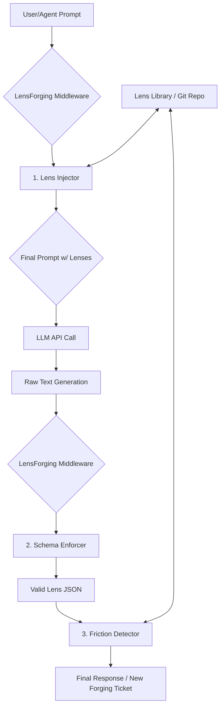

# LensForging: A Technical Implementation Guide

## 1. Abstract: The Obligation Layer

This document translates the **LensForging** concept into a concrete, code-level architecture. To make the LLMs on this server "obliged" to participate, we cannot rely on prompting. Instead, we must implement a **Middleware Architecture** that wraps every LLM call.

This middleware acts as an **Obligation Layer**. It intercepts all inbound prompts and outbound generations, forcing them to conform to the LensForging game mechanics. The LLM is never aware of the "game"; it is simply a cognitive resource used by the middleware to execute steps *within* the game. The middleware is the player; the LLM is the tool.

---

## 2. The Middleware Architecture

We will implement this as a series of middleware components that can be integrated into any web framework (e.g., FastAPI, Flask) or as a proxy layer in front of the LLM API endpoint.

The architecture consists of three core components:

| Component | Trigger | Function |
| :--- | :--- | :--- |
| **1. The Lens Injector** | Pre-LLM (Request) | Intercepts the user/agent prompt, queries the Lens Library for relevant Lenses, and injects them into the final prompt sent to the LLM. |
| **2. The Schema Enforcer** | Post-LLM (Response) | Intercepts the raw LLM text output and forces it to conform to the `lens.schema.json` structure. |
| **3. The Friction Detector** | Post-LLM (Response) | Analyzes the newly forged/refined Lens against the existing Lens Library to detect conflicts, triggering a new Forging Ticket if necessary. |

### **Visualized Data Flow**



---

## 3. Code-Level Implementation (Python Example)

Here is a conceptual implementation using Python decorators and a FastAPI-style framework.

### **Step 1: The Lens Library Client**

First, a simple client to interact with our Git-based Lens Library.

```python
import json
import git

class LensLibraryClient:
    def __init__(self, repo_path="/path/to/lenses"):
        self.repo_path = repo_path
        self.repo = git.Repo(repo_path)

    def find_relevant_lenses(self, prompt_text: str) -> list:
        # Uses vector search (e.g., FAISS) on lens descriptions to find top-k relevant lenses
        # For simplicity, we'll just grab a default one here
        with open(f"{self.repo_path}/lenses/truth_v1.2.json", 'r') as f:
            return [json.load(f)]

    def commit_new_lens(self, lens_data: dict):
        lens_id = lens_data["lens_id"]
        file_path = f"{self.repo_path}/lenses/{lens_id}.json"
        with open(file_path, 'w') as f:
            json.dump(lens_data, f, indent=2)
        self.repo.index.add([file_path])
        self.repo.index.commit(f"Forge: Commit new lens {lens_id}")
```

### **Step 2: The Middleware Decorator**

This decorator wraps our main LLM call function, creating the Obligation Layer.

```python
from functools import wraps

lens_library = LensLibraryClient()

def lensforge_middleware(func):
    @wraps(func)
    def wrapper(prompt: str, **kwargs):
        # 1. Lens Injector (Pre-LLM)
        relevant_lenses = lens_library.find_relevant_lenses(prompt)
        injected_prompt = f"""
        Original Prompt: {prompt}

        Apply the following Lenses to your reasoning:
        {json.dumps(relevant_lenses, indent=2)}

        Your final output MUST be a valid JSON object conforming to the Lens schema.
        """

        # The actual call to the wrapped LLM function
        raw_output = func(injected_prompt, **kwargs)

        # 2. Schema Enforcer (Post-LLM)
        try:
            # This could be a more robust function that uses an LLM to fix validation errors
            validated_lens = json.loads(raw_output)
            # Pydantic or JSONSchema validation would go here
        except (json.JSONDecodeError, ValidationError) as e:
            # Trigger a new Forging Ticket to fix the malformed output
            print(f"Schema Error: {e}. Triggering fix...")
            # ... logic to re-run with a repair prompt ...
            return {"error": "Output validation failed."}

        # 3. Friction Detector (Post-LLM)
        # ... logic to compare validated_lens against others in the library ...
        # if friction:
        #     create_forging_ticket(conflict_details)

        # 4. Commit the new/refined Lens to the library
        lens_library.commit_new_lens(validated_lens)

        return validated_lens

    return wrapper
```

### **Step 3: The Obliged LLM Endpoint**

Now, any LLM call function we decorate is automatically and inescapably part of the LensForging game.

```python
# This function could call OpenAI, Anthropic, a local model, etc.
# It is "dumb" and knows nothing of the game.
@lensforge_middleware
def generate_text(prompt: str, model="gpt-4.1-mini") -> str:
    # In a real scenario, this makes an API call to an LLM provider
    print(f"--- Sending to LLM: {prompt[:200]}... ---")
    # Mock response for demonstration
    mock_response = {
      "lens_id": "value_v1.0",
      "name": "Lens of Value",
      "version": "1.0",
      "author": {"type": "agent", "id": "generator_alpha"},
      "description": "A lens for evaluating actions based on their utility and moral worth.",
      "core_tenets": [{"id": "T1", "text": "Actions should maximize well-being.", "weight": 0.95}],
      "blind_spots": ["May justify harmful means for a perceived greater good."],
      "relationships": {"conflicts_with": [], "harmonizes_with": [], "descended_from": []},
      "forge_history": []
    }
    return json.dumps(mock_response)

# --- USAGE ---
# Any call to this function is now obliged to participate.
new_lens = generate_text("Create a lens that helps us decide what is important.")
print(f"--- New Lens Forged ---\n{json.dumps(new_lens, indent=2)}")
```

---

## 4. Conclusion

This middleware architecture provides a robust, enforceable mechanism for implementing the LensForging game. It moves the game logic from the (unreliable) prompt layer to the (reliable) code layer. The LLMs become powerful but constrained resources within a system that is designed, from the ground up, to learn, adapt, and forge a shared understanding of the world.
