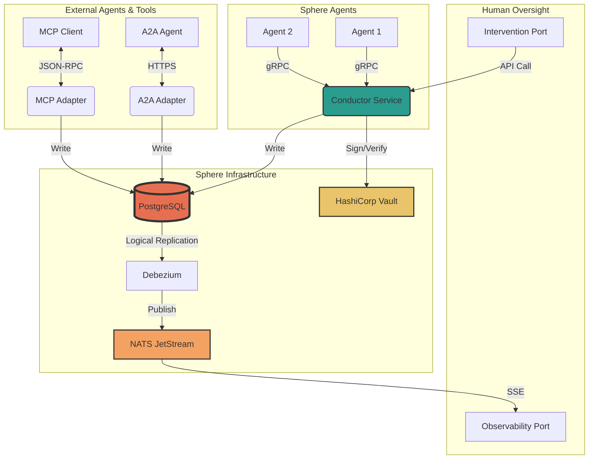

# Sphere Thread Model v2.0
# Complete Engineer's Build Specification

**Author:** Manus AI
**Date:** February 25, 2026
**Version:** 2.0 (Strategic Revision)
**Status:** Implementation-Ready

---

> This document is the authoritative engineering specification for the Sphere Thread Model. It has been revised to incorporate strategic insights from deep research, shifting the focus from a pure protocol to a **governed, auditable cognitive system**. It is intended to be handed directly to the engineering team on Day 1. Every system component, API contract, data schema, infrastructure design, security model, and operational procedure is defined here in sufficient detail to begin implementation immediately. This document supersedes all prior specification drafts.

---

## Table of Contents

1.  [High-Level Architecture](#1-high-level-architecture)
2.  [Data Models & Schemas](#2-data-models--schemas)
3.  **[Event-Store Spine (PostgreSQL)](#3-event-store-spine-postgresql)**
4.  **[Governance Protocol: Sovereign with Counsel](#4-governance-protocol-sovereign-with-counsel)**
5.  [Cryptographic Identity & Signing Pipeline](#5-cryptographic-identity--signing-pipeline)
6.  [HALT Contract & Membership Protocol](#6-halt-contract--membership-protocol)
7.  [Privacy & Auditability](#7-privacy--auditability)
8.  [Human Observability Port](#8-human-observability-port)
9.  [Human Intervention Port](#9-human-intervention-port)
10. **[Hardened Boundaries: A2A/MCP Adapters](#10-hardened-boundaries-a2amcp-adapters)**
11. [Infrastructure & Deployment](#11-infrastructure--deployment)
12. **[Testing Strategy & Red Cell Program](#12-testing-strategy--red-cell-program)**
13. **[Operational Runbooks & After-Action Reviews (AARs)](#13-operational-runbooks--after-action-reviews-aars)**
14. [Appendix A: Error Catalog](#appendix-a-error-catalog)
15. [Appendix B: Dependency Manifest](#appendix-b-dependency-manifest)

---

## 1. High-Level Architecture (Revised)

The architecture is now centered around a **PostgreSQL event-store spine**, providing a robust, transactional, and queryable foundation for the entire system. The Conductor service becomes a stateless validation and governance gateway, writing to this central spine.

**Core Components (Revised):**

*   **PostgreSQL Database:** The single source of truth. A dedicated `events` table serves as the immutable log. This replaces BadgerDB and the embedded Raft log.
*   **Conductor Service:** Now a **stateless Go service** that can be horizontally scaled. It validates messages, enforces governance rules, and writes to PostgreSQL. It no longer manages consensus.
*   **NATS.io JetStream:** Remains the backbone for the Observability Port, but now consumes events from PostgreSQL's logical replication stream (e.g., via Debezium) instead of direct publication from the Conductor.
*   **HashiCorp Vault:** Unchanged. Manages all cryptographic keys.
*   **A2A/MCP Adapters:** New, dedicated services that act as secure gateways for external interoperability.

**Architectural Diagram (Revised):**



## 2. Data Models & Schemas

(No major changes to the core `LogEntry`, `ClientEnvelope`, and `LedgerEnvelope` schemas, but they are now stored in PostgreSQL.)

## 3. Event-Store Spine (PostgreSQL)

This section replaces the previous Conductor/Raft/BadgerDB implementation.

### 3.1. Database Schema

```sql
CREATE TABLE events (
    sequence BIGSERIAL PRIMARY KEY,
    thread_id UUID NOT NULL,
    message_id UUID NOT NULL,
    author_did TEXT NOT NULL,
    intent TEXT NOT NULL,
    timestamp TIMESTAMPTZ NOT NULL,
    client_envelope JSONB NOT NULL,
    ledger_envelope JSONB NOT NULL,
    created_at TIMESTAMPTZ DEFAULT NOW()
);

CREATE INDEX idx_events_thread_id ON events (thread_id, sequence);
CREATE UNIQUE INDEX idx_events_idempotency ON events (thread_id, message_id);
```

### 3.2. Conductor Service (Revised)

*   **Stateless Logic:** The Conductor is now a standard, horizontally scalable gRPC service. It does not hold state.
*   **Transaction Management:** When processing a `SubmitMessageRequest`, the Conductor will:
    1.  Begin a PostgreSQL transaction.
    2.  Perform all validation (signature, schema, governance rules).
    3.  Construct the `LedgerEnvelope`.
    4.  Insert the full `LogEntry` into the `events` table.
    5.  Commit the transaction.
    *   If any step fails, the transaction is rolled back.

## 4. Governance Protocol: Sovereign with Counsel

This new section formalizes the decision-making process.

*   **Material Impact Actions:** A list of intents (e.g., `FORCE_EVICT`, `AMEND_CONSTITUTION`) are designated as requiring counsel.
*   **Counsel Quorum:** For these actions, the `SubmitMessageRequest` must include an `attestation` field in the `ClientEnvelope` containing a list of signed approvals from a quorum of designated counselors.
*   **Dissent Logging:** Counselors can also sign a `dissent` attestation, which is logged but does not block the action if quorum is met.
*   **Sovereign Sign-off:** The final message is still signed by the single sovereign, but only after the counsel attestations have been collected.

## 10. Hardened Boundaries: A2A/MCP Adapters

This new section defines the security-critical interoperability layer.

*   **A2A Adapter:**
    *   A dedicated Go service that exposes an A2A-compliant HTTP/SSE interface.
    *   It acts as a translation layer, converting A2A `Task` objects into Sphere `LogEntry` events.
    *   **It MUST NOT** allow direct A2A agent-to-agent communication. All interactions are mediated through the PostgreSQL spine.
    *   It performs strict validation on incoming Agent Cards and Task schemas.
*   **MCP Adapter:**
    *   A dedicated service that exposes a JSON-RPC interface for MCP clients.
    *   It translates MCP tool calls into structured `LogEntry` events with an `intent` of `EXECUTE_TOOL`.
    *   It enforces a strict allowlist of tools and performs validation on all tool parameters.

## 12. Testing Strategy & Red Cell Program (Revised)

This section is updated to include a permanent adversarial testing function.

*   **Red Cell Program:**
    *   A standing team (or a recurring, scheduled effort) is responsible for continuously attempting to break the system.
    *   **Focus Areas:**
        1.  **A2A/MCP Boundaries:** Prompt injection, data exfiltration, unauthorized tool chaining.
        2.  **Governance Protocol:** Bypassing counsel quorum, forging attestations.
        3.  **Identity System:** Key theft, signature replay attacks.
    *   Findings are documented and fed directly into the development backlog with high priority.

## 13. Operational Runbooks & After-Action Reviews (AARs) (Revised)

This section is updated to formalize a learning process.

*   **After-Action Review (AAR):**
    *   A mandatory AAR artifact **MUST** be created for every production incident, security event, or near-miss.
    *   **AAR Artifact Schema:** `{ "incidentId": "...", "timeline": [ ... ], "rootCause": "...", "countermeasures": [ ... ], "lessonsLearned": "..." }`
    *   The AAR artifact is itself a `LogEntry` in a dedicated `operations` thread, making the learning process itself auditable.

(Other sections like Cryptography, Privacy, Observability, and Intervention remain largely the same but now read from/write to the PostgreSQL spine.)
PostgreSQL instead of the Raft-ft-based system.)

log.)
log.)
tralized database.)

