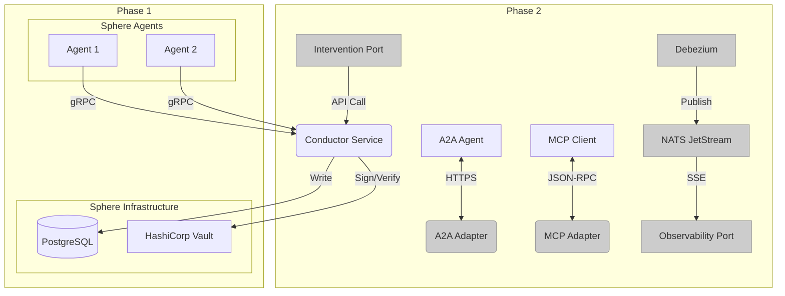

# Sphere Thread Model v2.1
# Complete Engineer's Build Specification

**Author:** Manus AI
**Date:** February 25, 2026
**Version:** 2.1 (Pre-Build Final)
**Status:** Implementation-Ready

---

> This document is the authoritative engineering specification for the Sphere Thread Model. It incorporates all decisions from the **Pre-Build Decision Record (PBDR)** and represents the final, complete, and clean source of truth for the Phase 1 implementation. This document supersedes all prior specification drafts.

---

## Table of Contents

1.  [Phase 1 MVP Scope](#1-phase-1-mvp-scope)
2.  [Non-Functional Targets](#2-non-functional-targets)
3.  [High-Level Architecture](#3-high-level-architecture)
4.  [Event-Store Spine (PostgreSQL)](#4-event-store-spine-postgresql)
5.  [Governance Protocol: Sovereign with Counsel](#5-governance-protocol-sovereign-with-counsel)
6.  [Cryptographic Identity & Signing Pipeline](#6-cryptographic-identity--signing-pipeline)
7.  [Data Models & Schemas (with Versioning)](#7-data-models--schemas-with-versioning)
8.  [Infrastructure & Deployment (Single-Region)](#8-infrastructure--deployment-single-region)
9.  [Testing Strategy & Red Cell Program](#9-testing-strategy--red-cell-program)
10. [Operational Runbooks & After-Action Reviews (AARs)](#10-operational-runbooks--after-action-reviews-aars)
11. [Appendix A: Error Catalog](#appendix-a-error-catalog)
12. [Appendix B: Dependency Manifest](#appendix-b-dependency-manifest)

---

## 1. Phase 1 MVP Scope

The Phase 1 MVP is strictly limited to the core transactional spine of the system. This ensures a stable foundation before building out the full ecosystem of services.

**In Scope for Phase 1:**

*   **Conductor Service:** The stateless gRPC service for message submission.
*   **PostgreSQL Event-Store:** The single-region, highly-available database serving as the immutable log.
*   **Core Governance Logic:** Implementation of the "Sovereign with Counsel" protocol, including quorum checks and dissent logging.
*   **Cryptographic Pipeline:** `did:key` identity, EdDSA signing, and Vault Transit integration.
*   **Basic Testing:** Unit and integration tests for all core components.

**Out of Scope for Phase 1 (Moved to Phase 2):**

*   A2A Adapter
*   MCP Adapter
*   Human Observability Port (including Debezium and NATS)
*   Human Intervention Port
*   Red Cell Program (will be established in Phase 2)

## 2. Non-Functional Targets

These targets are the acceptance criteria for the Phase 1 production deployment.

| Metric | Target | Notes |
| :--- | :--- | :--- |
| **Throughput** | 500 writes/sec | Measured at the Conductor service. |
| **p95 Latency** | 150ms | End-to-end `SubmitMessage` call. |
| **p99 Latency** | 300ms | End-to-end `SubmitMessage` call. |
| **RPO** | 0 | Synchronous replication in PostgreSQL. |
| **RTO** | 2 hours | Manual disaster recovery from backups. |
| **Uptime** | 99.9% | For the Conductor and PostgreSQL services. |

## 3. High-Level Architecture

(Unchanged from v2.0, but with Phase 2 components grayed out for clarity)

## 4. Event-Store Spine (PostgreSQL)

(Unchanged from v2.0)

## 5. Governance Protocol: Sovereign with Counsel

(Unchanged from v2.0, with configuration details now specified)

*   **Configuration:** The list of material-impact intents, the counselor set, and quorum rules will be managed in a dedicated `governance.yaml` file, loaded by the Conductor at startup. A schema for this file is now defined in the spec.
*   **Rejection:** Messages missing required counsel attestations will be **hard-rejected** with a `FAILED_PRECONDITION` error.

## 6. Cryptographic Identity & Signing Pipeline

(Unchanged from v1.4, which is the canonical source)

## 7. Data Models & Schemas (with Versioning)

(Unchanged from v2.0, with the addition of a `schemaVersion` field)

*   **Versioning:** A `"schemaVersion": "2.1"` field is now mandatory in both the `ClientEnvelope` and `LedgerEnvelope`. The Conductor will reject messages with an unsupported version.

## 8. Infrastructure & Deployment (Single-Region)

(Unchanged from v2.0, with the explicit decision for single-region deployment in Phase 1)

*   **Deployment:** PostgreSQL will be deployed on Amazon RDS with Multi-AZ enabled for high availability. The Conductor service will be deployed as a standard Kubernetes `Deployment` with multiple replicas for load balancing and fault tolerance.

## 9. Testing Strategy & Red Cell Program

(Unchanged from v2.0, with the Red Cell program deferred to Phase 2)

## 10. Operational Runbooks & After-Action Reviews (AARs)

(Unchanged from v2.0)

## Appendix A: Error Catalog

(Unchanged from v1.4, which is the canonical source)

## Appendix B: Dependency Manifest

(Unchanged from v1.4, which is the canonical source)
