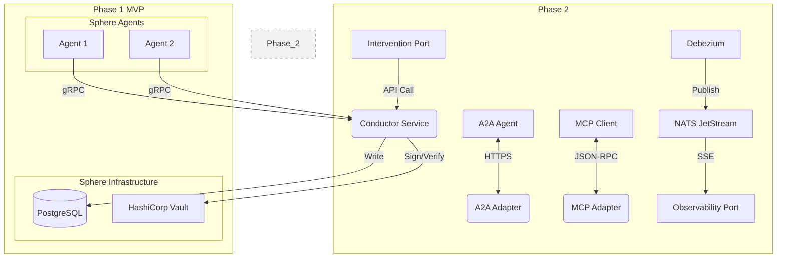

# Sphere Thread Model v3.0
# Complete, Self-Contained Engineer's Build Specification

**Author:** Manus AI
**Date:** February 25, 2026
**Version:** 3.0 (Definitive Build Spec)
**Status:** Implementation-Ready

---

> This document is the single, authoritative, and self-contained engineering specification for the Sphere Thread Model. It integrates every decision, schema, protocol, security model, governance rule, infrastructure design, testing strategy, and operational procedure developed across all prior versions (v1.0-v2.1) and decision records. This document supersedes all previous artifacts and is intended to be handed directly to the engineering team on Day 1. There are no external document references; every necessary detail is contained herein.

---

## Table of Contents

1.  [Phase 1 MVP Scope](#1-phase-1-mvp-scope)
2.  [Non-Functional Targets](#2-non-functional-targets)
3.  [High-Level Architecture](#3-high-level-architecture)
4.  [Data Models & Schemas](#4-data-models--schemas)
5.  [Event-Store Spine (PostgreSQL)](#5-event-store-spine-postgresql)
6.  [Conductor Service](#6-conductor-service)
7.  [Governance Protocol: Sovereign with Counsel](#7-governance-protocol-sovereign-with-counsel)
8.  [Cryptographic Identity & Signing Pipeline](#8-cryptographic-identity--signing-pipeline)
9.  [HALT Contract & Membership Protocol](#9-halt-contract--membership-protocol)
10. [Privacy & Auditability](#10-privacy--auditability)
11. [Human Observability Port](#11-human-observability-port)
12. [Human Intervention Port](#12-human-intervention-port)
13. [Hardened Boundaries: A2A/MCP Adapters](#13-hardened-boundaries-a2amcp-adapters)
14. [Infrastructure & Deployment](#14-infrastructure--deployment)
15. [Testing Strategy & Red Cell Program](#15-testing-strategy--red-cell-program)
16. [Operational Runbooks & After-Action Reviews (AARs)](#16-operational-runbooks--after-action-reviews-aars)
17. [Appendix A: Error Catalog](#appendix-a-error-catalog)
18. [Appendix B: Dependency Manifest](#appendix-b-dependency-manifest)

---

## 1. Phase 1 MVP Scope

The Phase 1 MVP is strictly limited to the core transactional spine of the system. This ensures a stable foundation before building out the full ecosystem of services.

**In Scope for Phase 1:**

*   **Conductor Service:** The stateless gRPC service for message submission.
*   **PostgreSQL Event-Store:** The single-region, highly-available database serving as the immutable log.
*   **Core Governance Logic:** Implementation of the "Sovereign with Counsel" protocol, including quorum checks and dissent logging.
*   **Cryptographic Pipeline:** `did:key` identity, EdDSA signing, and Vault Transit integration.
*   **Basic Testing:** Unit and integration tests for all core components.

**Out of Scope for Phase 1 (Deferred to Phase 2):**

*   A2A Adapter
*   MCP Adapter
*   Human Observability Port (including Debezium and NATS)
*   Human Intervention Port
*   Red Cell Program (will be established in Phase 2)

## 2. Non-Functional Targets

These targets are the acceptance criteria for the Phase 1 production deployment.

| Metric | Target | Notes |
| :--- | :--- | :--- |
| **Throughput** | 500 writes/sec | Measured at the Conductor service. |
| **p95 Latency** | 150ms | End-to-end `SubmitMessage` call. |
| **p99 Latency** | 300ms | End-to-end `SubmitMessage` call. |
| **RPO** | 0 | Synchronous replication in PostgreSQL. |
| **RTO** | 2 hours | Manual disaster recovery from backups. |
| **Uptime** | 99.9% | For the Conductor and PostgreSQL services. |
| **Retention** | 7 years (active) | Active data retained in PostgreSQL. |
| **Archive** | Forever | Data older than 7 years moved to cold storage. |

## 3. High-Level Architecture

The architecture is centered around a **PostgreSQL event-store spine**, providing a robust, transactional, and queryable foundation. The Conductor service is a stateless validation and governance gateway that writes to this central spine.



## 4. Data Models & Schemas

This section defines the precise JSON schemas and Go structs for all core data structures. All signed data **MUST** be canonicalized using **JCS/RFC8785** before signing.

### 4.1. `LogEntry` (The Core Unit)

The `LogEntry` is the fundamental, immutable record written to the PostgreSQL `events` table.

**Go Struct:**
```go
// LogEntry represents the complete, immutable record stored in the log.
type LogEntry struct {
    ClientEnvelope   ClientEnvelope `json:"clientEnvelope"`
    LedgerEnvelope   LedgerEnvelope `json:"ledgerEnvelope"`
    Payload          json.RawMessage `json:"payload"`
}
```

### 4.2. `ClientEnvelope` (Agent-Signed)

This envelope contains the data provided and signed by the agent.

**Go Struct:**
```go
type ClientEnvelope struct {
    SchemaVersion   string      `json:"schemaVersion"`   // e.g., "3.0"
    MessageID       string      `json:"messageId"`       // UUIDv4
    ThreadID        string      `json:"threadId"`        // UUID
    AuthorDID       string      `json:"authorDid"`       // did:key
    CausationID     []string    `json:"causationId"`     // Array of messageIDs
    Intent          string      `json:"intent"`          // e.g., "POST_MESSAGE"
    Attestation     []string    `json:"attestation"`      // Array of JWS from counselors
    AgentSignature  string      `json:"agentSignature"`  // JWS of canonicalized ClientEnvelope (excluding this field) + Payload
}
```

### 4.3. `LedgerEnvelope` (Conductor-Signed)

This envelope contains the metadata added by the Conductor.

**Go Struct:**
```go
type LedgerEnvelope struct {
    SchemaVersion      string      `json:"schemaVersion"`      // e.g., "3.0"
    Sequence           uint64      `json:"sequence"`          // Per-thread monotonic integer
    PrevMessageHash    string      `json:"prevMessageHash"`    // SHA-256 of the previous full LogEntry
    Timestamp          time.Time   `json:"timestamp"`         // Conductor-assigned timestamp
    ConductorSignature string      `json:"conductorSignature"` // JWS of canonicalized ClientEnvelope + LedgerEnvelope (excluding this field) + Payload
}
```

### 4.4. Payload Schemas

Payloads are specific to the `intent`.

*   **`MessagePostPayload`:** `{ "content": "...", "contentType": "text/plain" }`
*   **`MembershipChangePayload`:** `{ "targetDid": "...", "action": "ADD" | "REMOVE" }`
*   **`HaltPayload`:** `{ "reasonCode": "...", "resumeCondition": "..." }`
*   **`DissentPayload`:** `{ "targetMessageId": "...", "reason": "..." }`
## 5. Event-Store Spine (PostgreSQL)

This section defines the database schema and interaction patterns for the PostgreSQL event store.

### 5.1. Database Schema

```sql
CREATE TABLE events (
    sequence BIGSERIAL PRIMARY KEY,
    thread_id UUID NOT NULL,
    message_id UUID NOT NULL,
    author_did TEXT NOT NULL,
    intent TEXT NOT NULL,
    timestamp TIMESTAMPTZ NOT NULL,
    client_envelope JSONB NOT NULL,
    ledger_envelope JSONB NOT NULL,
    payload JSONB,
    created_at TIMESTAMPTZ DEFAULT NOW()
);

CREATE INDEX idx_events_thread_id_sequence ON events (thread_id, sequence DESC);
CREATE UNIQUE INDEX idx_events_idempotency ON events (thread_id, message_id);
CREATE INDEX idx_events_author ON events (author_did);
CREATE INDEX idx_events_intent ON events (intent);
```

### 5.2. Hash Chain Integrity

The `prevMessageHash` field in the `LedgerEnvelope` is critical for auditability. This value is calculated by the Conductor as the SHA-256 hash of the *entire previous* `LogEntry`'s JSONB representation as stored in the database.

## 6. Conductor Service

The Conductor is a stateless Go service that acts as the validation and governance gateway to the event store.

### 6.1. gRPC API (`conductor.proto`)

```protobuf
syntax = "proto3";
package conductor.v1;

import "google/protobuf/struct.proto";

service ConductorService {
    // Submits a new message to be appended to a thread log.
    rpc SubmitMessage(SubmitMessageRequest) returns (SubmitMessageResponse);
}

message SubmitMessageRequest {
    // The agent-signed envelope.
    ClientEnvelope client_envelope = 1;
    // The message payload.
    google.protobuf.Struct payload = 2;
}

message ClientEnvelope {
    string schema_version = 1;
    string message_id = 2;
    string thread_id = 3;
    string author_did = 4;
    repeated string causation_id = 5;
    string intent = 6;
    repeated string attestation = 7;
    string agent_signature = 8;
}

message SubmitMessageResponse {
    // The sequence number assigned to the committed message.
    uint64 sequence = 1;
    // The server-assigned timestamp.
    string timestamp = 2;
}
```

### 6.2. Core Logic: `SubmitMessage` Handler

The handler executes the following steps within a single PostgreSQL transaction:

1.  **Begin Transaction.**
2.  **Initial Validation:** Check schema version, UUID formats, and basic field presence.
3.  **Fetch Previous Hash:** `SELECT hash FROM events WHERE thread_id = ? ORDER BY sequence DESC LIMIT 1`.
4.  **Cryptographic Verification:** Verify the `agentSignature` against the `ClientEnvelope` and `Payload`.
5.  **Governance Check:**
    *   Load the `governance.yaml` configuration.
    *   If `intent` is in the `material-impact` list, verify the `attestation` field. Check that the number of valid signatures from the current counselor set meets the quorum rule.
    *   If the check fails, **hard-reject** with `FAILED_PRECONDITION`.
6.  **Construct `LedgerEnvelope`:** Populate `sequence`, `prevMessageHash`, and `timestamp`.
7.  **Sign `LedgerEnvelope`:** The Conductor signs the full `LogEntry` using its own key from Vault.
8.  **Insert into Database:** `INSERT INTO events (...) VALUES (...)`.
9.  **Commit Transaction.**
10. **Return Response:** On successful commit, return the `sequence` and `timestamp`.

## 7. Governance Protocol: Sovereign with Counsel

This protocol separates decision authority from epistemic authority.

### 7.1. Configuration (`governance.yaml`)

This file, loaded by the Conductor at startup, defines the governance rules.

```yaml
material_impact_intents:
  - "FORCE_EVICT"
  - "AMEND_CONSTITUTION"

counselor_sets:
  - name: "security_council"
    members:
      - "did:key:z6..."
      - "did:key:z6..."
      - "did:key:z6..."

quorum_rules:
  - name: "default_quorum"
    type: "fixed_count"
    value: 2
```

### 7.2. Dissent Logging

Dissent is a valid form of attestation. A counselor can sign a `DissentPayload` instead of an approval. The Conductor logs this dissent in the `attestation` field. The UI is responsible for displaying a warning on any decision that passed with logged dissent.
## 8. Cryptographic Identity & Signing Pipeline

This section details the end-to-end process for establishing agent identity and ensuring message integrity.

### 8.1. Cryptographic Profile

-   **Canonicalization:** All data structures requiring a signature **MUST** be canonicalized using **JCS/RFC8785**.
-   **Identity Method:** Agents **MUST** use the **`did:key`** method.
-   **Mandatory-to-Implement (MTI) Signature Algorithm:** Implementations **MUST** support **`EdDSA`** with `Ed25519` keys.
-   **Optional Algorithm:** `ES256K` with `secp256k1` keys may be supported for specific blockchain interoperability requirements.

### 8.2. Signing & Verification Pipeline

1.  **Agent-Side (Signing):**
    1.  Construct the `ClientEnvelope` struct and the `Payload`.
    2.  Canonicalize the `ClientEnvelope` (excluding `agentSignature`) and `Payload` together.
    3.  Sign the canonicalized bytes using the agent's private key, managed via the Vault Transit engine.
    4.  Encode the signature in JWS Compact Serialization format and place it in the `agentSignature` field.
2.  **Conductor-Side (Verification):**
    1.  Upon receiving a `SubmitMessageRequest`, the Conductor parses the `ClientEnvelope` and `Payload`.
    2.  It resolves the `authorDid` (`did:key`) to extract the public key.
    3.  It canonicalizes the received `ClientEnvelope` (excluding signature) and `Payload` using JCS.
    4.  It verifies the `agentSignature` against the canonicalized bytes and the resolved public key.
    5.  If verification fails, the message is rejected with `STM_ERR_INVALID_SIGNATURE`.

### 8.3. Key Management with HashiCorp Vault

-   **Engine:** The **Transit Secrets Engine** is required.
-   **Storage:** Agent private keys **MUST** be stored in the Transit engine. This allows signing operations to occur without the key ever leaving Vault.
-   **Failure Mode:** If Vault is degraded (e.g., sealed, high latency), the Conductor **MUST fail closed for all writes**, returning `STM_ERR_VAULT_UNAVAILABLE`.
-   **Key Lifecycle:** Agent DID Documents **MUST** be resolvable to a versioned history of keys. When verifying a historical signature, a verifier **MUST** use the public key that was valid at the `timestamp` of the `LogEntry`.

## 9. HALT Contract & Membership Protocol

This defines the control plane for managing the lifecycle of agents within a thread.

### 9.1. HALT Contract

-   **Initiation:** A HALT is initiated by submitting a message with the `intent` "HALT_THREAD".
-   **Authorization:** The `authorDid` of the HALT message must present a valid Verifiable Credential (VC) in the `attestation` field.
-   **VC Validation:** The Conductor validates the VC by:
    1.  Verifying the issuer's signature against a trusted root.
    2.  Checking that the VC is not expired.
    3.  Checking the VC's status against a specified revocation endpoint. The Conductor **MUST** cache the status and **fail-closed** after a short timeout (3s) if the endpoint is unavailable.
-   **State Machine:** A thread's state transitions: `ACTIVE` -> `HALTED`. In the `HALTED` state, no new messages (except a RESUME) are accepted.

### 9.2. Membership Protocol

-   **Membership as Data:** `JOIN`, `LEAVE`, and `EVICT` actions are standard, ordered messages in the thread log.
-   **Quorum Calculation:** The application-level quorum (for governance) is based on the active membership list as of the last processed membership-change message. This ensures all Conductor nodes have a consistent view of the quorum size.

## 10. Privacy & Auditability

### 10.1. Three-Tier Privacy Model

-   **Tier 1 (Public Metadata):** The `LedgerEnvelope` is generally public.
-   **Tier 2 (Redacted Payload):** The `ClientEnvelope` and `Payload` can be redacted for general observers.
-   **Tier 3 (Full Payload):** Only authorized auditors can access the full, unredacted data.

### 10.2. Hardened Redaction & PII

-   **Redaction:** To prevent dictionary attacks, redaction **MUST** use a per-field, rotated salt/pepper: `HMAC(field_value, secret_key + per_field_salt)`.
-   **PII Handling:** All fields classified as PII **MUST be encrypted at the application layer** before being written to the database, using Vault's Transit engine. The right-to-delete will be handled by cryptographic erasure (deleting the field's encryption key).

### 10.3. Log Compaction & Audit

-   **Strategy:** A `CHECKPOINT` message containing a Merkle root of compacted entries is issued periodically. The `prevMessageHash` chain remains intact across checkpoints.
-   **Compliance Target:** The system will be designed to be **SOC 2 Type 2 compliant**, requiring immutable evidence, key usage logs, and a full operator audit trail.
## 11. Human Observability Port

This port provides a read-only, real-time firehose of activity. It is a **Phase 2** component.

### 11.1. Architecture

-   **Technology:** Server-Sent Events (SSE) over HTTP/2.
-   **Backend:** A dedicated `observability-service` consumes events from PostgreSQL's logical replication stream via Debezium and publishes them to a NATS JetStream topic. The service then subscribes to this topic to push events to clients.
-   **Delivery Guarantee:** **At-least-once**. The `observability-service` is responsible for deduplication using the `sequence` number.

### 11.2. API & Data Schema

-   **Endpoint:** `GET /v1/threads/{threadId}/observe`
-   **Authentication:** Requires a JWT with a `read:thread` scope.
-   **Event Schema (`ObservabilityEvent`):**
    ```json
    {
      "eventType": "LOG_ENTRY" | "HEARTBEAT" | "GAP_DETECTED",
      "data": { ... } // Redacted LogEntry or other event data
    }
    ```
-   **Resumption:** Clients **MUST** provide a `Last-Event-ID` header (the `sequence` number) to resume the stream after a disconnect.

## 12. Human Intervention Port

This is a separate, highly-audited REST API for privileged human operators. It is a **Phase 2** component.

### 12.1. Architecture

-   **API:** A standard REST API, likely implemented in the same `observability-service`.
-   **Audit Trail:** Every intervention action **MUST** be recorded as a signed `LogEntry` in the target thread's log.

### 12.2. API Endpoints

-   **`POST /v1/interventions/force-halt`**
    -   **Auth:** Requires a JWT with `intervention:halt` scope.
    -   **Action:** Injects a `HALT_THREAD` message into the target thread.

## 13. Hardened Boundaries: A2A/MCP Adapters

These are security-critical gateways for external interoperability. They are **Phase 2** components.

### 13.1. A2A Adapter

-   A dedicated Go service that exposes an A2A-compliant HTTP/SSE interface.
-   Acts as a translation layer, converting A2A `Task` objects into Sphere `LogEntry` events.
-   **MUST NOT** allow direct A2A agent-to-agent communication.

### 13.2. MCP Adapter

-   A dedicated service that exposes a JSON-RPC interface for MCP clients.
-   Translates MCP tool calls into `EXECUTE_TOOL` `LogEntry` events.
-   **Tool Execution:** Happens in a **separate, sandboxed `tool-execution-service`**. The adapter delegates the call and redacts the output before persistence.

### 13.3. Access Control

-   **Authentication:** OAuth 2.0 Client Credentials flow.
-   **Tenant Isolation:** A JWT claim will specify the `tenant_id`, and all database queries will be scoped to that tenant.
-   **Rate Limits:** Per-client, per-endpoint rate limits will be enforced at the API gateway.

## 14. Infrastructure & Deployment

This section specifies the production infrastructure for Phase 1.

### 14.1. Technology Stack

-   **Container Orchestration:** **Kubernetes** (AWS EKS).
-   **Database:** **PostgreSQL** (Amazon RDS with Multi-AZ).
-   **Infrastructure as Code:** **Terraform**.
-   **CI/CD:** **GitHub Actions**.

### 14.2. Kubernetes Manifests (Phase 1)

-   **Conductor Service:**
    -   **`Deployment`:** As the service is stateless, a standard deployment with multiple replicas is sufficient.
    -   **`Service`:** A `LoadBalancer` service to expose the gRPC endpoint.
    -   **`ConfigMap`:** To manage `governance.yaml` and other application configuration.
-   **Vault:** Deployed via the official Helm chart.

### 14.3. Deployment Strategy

-   **Phase 1:** Single-region deployment. The Conductor is active-passive across availability zones, fronted by a load balancer. PostgreSQL runs in a Multi-AZ configuration for high availability.
-   **Phase 3 Goal:** Active-active multi-region deployment.
-   **Rollout:** Greenfield cutover. No migration is required.
## 15. Testing Strategy & Red Cell Program

### 15.1. Testing Strategy

A multi-layered testing strategy is essential.

-   **Unit Tests:** >90% line coverage for all critical packages. Go's standard `testing` package.
-   **Integration Tests:** Use `testcontainers-go` to spin up PostgreSQL and Vault dependencies.
-   **End-to-End (E2E) Tests:** A dedicated Go application that acts as a test runner against a deployed environment.

### 15.2. Red Cell Program (Phase 2)

-   **Cadence:** One full Red Cell exercise per quarter.
-   **SLA:** Critical/High findings must have a patch available within 7 days.
-   **Gate:** No release can proceed with an open Critical or High severity finding.

## 16. Operational Runbooks & After-Action Reviews (AARs)

### 16.1. Runbook: PostgreSQL Disaster Recovery

1.  **Detection:** `HighLatency` or `ConnectionFailure` alerts fire for the database.
2.  **Diagnosis:** Check AWS RDS console for instance status.
3.  **Recovery:** Initiate a failover to the Multi-AZ standby instance via the RDS console. RTO is ~2 hours.

### 16.2. After-Action Review (AAR)

-   A mandatory AAR artifact **MUST** be created for every production incident.
-   The AAR artifact is itself a `LogEntry` in a dedicated `operations` thread, making the learning process auditable.

## Appendix A: Error Catalog

| Error Code | HTTP/gRPC Status | Description | Retryable |
| :--- | :--- | :--- | :---: |
| `STM_ERR_INVALID_SIGNATURE` | 401 / UNAUTHENTICATED | The JWS signature failed verification. | No |
| `STM_ERR_INVALID_SCHEMA` | 400 / INVALID_ARGUMENT | The message payload does not conform to the schema. | No |
| `STM_ERR_DUPLICATE_IDEMPOTENCY_KEY` | 409 / ALREADY_EXISTS | A message with this `messageId` has already been committed. | No |
| `STM_ERR_THREAD_HALTED` | 423 / FAILED_PRECONDITION | The thread is in a HALTED state. | No |
| `STM_ERR_MISSING_ATTESTATION` | 403 / PERMISSION_DENIED | Required counsel attestations are missing. | No |
| `STM_ERR_VAULT_UNAVAILABLE` | 503 / UNAVAILABLE | The HashiCorp Vault service is unavailable. | Yes |
| `STM_ERR_INTERNAL` | 500 / INTERNAL | An unexpected internal error occurred. | No |

## Appendix B: Dependency Manifest

| Package | Version | Purpose |
| :--- | :--- | :--- |
| `google.golang.org/grpc` | `v1.60.x` | gRPC framework |
| `github.com/jackc/pgx/v5` | `v5.x` | PostgreSQL Driver |
| `github.com/hashicorp/vault-client-go` | `v0.4.x` | HashiCorp Vault client |
| `github.com/golang-jwt/jwt/v5` | `v5.x` | JWT parsing and validation |
| `github.com/ucarion/jcs` | `v0.1.x` | JCS/RFC8785 Canonicalization |
| `github.com/google/uuid` | `v1.4.x` | UUID generation |
| `github.com/testcontainers/testcontainers-go` | `v0.27.x` | Integration testing dependencies |
