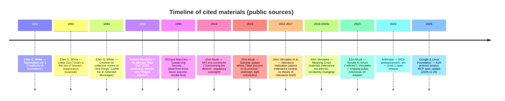

# How Four Thinkers Would Evaluate the Sovereign AI Constellation Posture

Your proposed posture—**a PostgreSQL event-store spine**, **constitution + sovereign sign-off governance**, **selective A2A interoperability via an adapter**, **MCP as the tool/context boundary**, and **limited direct agent messaging**—would likely be read less as “agent chat architecture” and more as a **governed, auditable cognitive system**. Across these four thinkers, the strongest shared endorsement would center on *accountability, disciplined coordination, and real-world adversarial testing*, while the sharpest disagreements would concentrate on *speed vs. deliberation*, *single-point authority vs. distributed counsel*, and *openness/interoperability vs. security exposure*. (Where a person is not directly writing about AI, I label inferences explicitly.)

## Executive summary

Elon Musk would press for **speed, simplicity, measurable iteration, and an externalized “referee” function**—and would generally like the event-store spine and a sovereignty concept, while warning against process bloat and latency. citeturn17view8turn25view5turn17view3 John Vervaeke would focus on **self-correction, relevance management, and wisdom-oriented governance**, endorsing your posture insofar as it institutionalizes ongoing correction and dialogical constraints, while warning that information plumbing is not wisdom. citeturn19view1turn19view2turn19view3 Richard Marcinko would see it through a **mission-first, results-first, red-team lens**: keep the architecture simple, but continuously “attack” it to reveal vulnerabilities—especially at the A2A/MCP boundaries. citeturn15view0turn13view0turn25view1 Ellen G. White would strongly endorse **order, counsel, and disciplined organization**, while explicitly rejecting “one-man mind” governance—supporting a sovereign only if it is bounded by counsel, transparency, and moral accountability. citeturn17view7turn17view6turn23view1turn23view0

## Comparison table

| Thinker | Likely priorities | Governance stance | Risk tolerance | Human-in-loop preference | Top 3 actions they’d push |
|---|---|---|---|---|---|
| Elon Musk | Speed/iteration; simplicity; first principles; safety “referee” | Pro strong oversight (referee), but anti-bureaucracy | Moderate-to-high (move fast, mitigate with engineering controls) citeturn17view8 | Prefer humans as final arbiters for high-stakes changes | Optimize for cycle time; add safety/regulatory gates; instrument everything citeturn26view0turn25view5 |
| John Vervaeke | Self-correction; relevance realization; “wisdom” practices; meaning | Governance as *meta-meaning constraint* that evolves | Low-to-moderate (risk managed via continuous correction) citeturn19view1turn19view3 | Strongly prefers reflective human oversight | Build self-correcting review loops; formalize dialogical audits; prevent relevance overload citeturn19view1turn19view2 |
| Richard Marcinko | Mission/results; “never assume”; train hard; red-team | Clear commander, simple rules; accountability by outcomes | High (assume hostile environment) citeturn15view0turn13view0 | Human leadership essential; “lead from the front” | Create permanent red cell; harden boundaries; run after-action reviews (AARs) citeturn15view0turn25view1 |
| Ellen G. White | Order; unity; counsel; moral guardrails; anti-confusion | Pro organization, anti “one-man criterion” | Low (emphasize caution, consultation) citeturn23view1turn23view0 | Strongly human-in-loop + communal counsel | Establish counsel processes; document decisions; tighten discipline & safeguards citeturn17view7turn17view6 |

## Evaluations by thinker

image_group{"layout":"carousel","aspect_ratio":"1:1","query":["Elon Musk portrait","John Vervaeke portrait","Richard Marcinko portrait","Ellen G. White portrait"],"num_per_query":1}

### Elon Musk

#### Likely perspective and priorities

- The architecture’s value is measured by **throughput, latency, correctness, and iteration speed**, not elegance. citeturn17view8turn26view0  
- Strong preference for **subtractive design**—delete unnecessary process, minimize complexity, shorten feedback cycles. citeturn17view8  
- Belief that AI is a **civilizational risk** requiring a **referee/regulator** function, even if regulation is often slow. citeturn17view3turn25view5  
- Preference for **first-principles reasoning** and “move quickly and fix things” iteration culture (inference: extendable from his explicit organizational principles to your architecture governance posture). citeturn26view0  
- A bias toward **interoperability and openness where strategic** (e.g., publishing model weights/architecture) but not at the expense of safety. citeturn25view3turn25view5

#### Supporting evidence from primary/authoritative sources

- AI risk framing: Musk likens AI to losing control over a powerful entity: “With artificial intelligence, we are summoning the demon.” citeturn17view3  
- Governance/referee concept: after a U.S. Senate AI forum, Musk says “it’s important for us to have a referee,” to ensure actions are “safe and in the interest of the general public.” citeturn25view5  
- Anti-bloat design ethos: “the best part is no part, the best process is no process… ‘What did you undesign?’” citeturn17view8  
- “Tight schedule” as correctness signal: “If a schedule’s long, it’s wrong… The tendency is to complicate things.” citeturn17view8  
- First principles + rapid iteration as explicit organizational principle (not merely biography): xAI states “Reasoning from First Principles” and “Move quickly and fix things… rapid development and iteration.” citeturn26view0turn25view4  

#### Concrete recommended actions Musk would advocate

- **Reduce latency and friction in the event-store spine**: add streaming consumption (or push-based notifications) and rigorous performance budgets so “governance” does not become time waste. (Inference, grounded in his anti-long-schedule and anti-process framing.) citeturn17view8turn26view0  
- **Turn “constitution/sovereign” into a referee with measurable criteria**: explicit go/no-go gates, defined safety metrics, and automated compliance checks; humans decide, but with dashboards. (Inference anchored to “referee” framing + iteration culture.) citeturn25view5turn26view0  
- **Keep A2A as an adapter only**: maintain your spine, but accept standardized tasks externally for modularity/vendor escape—then translate into your auditable events/artifacts. (Inference; consistent with A2A’s interoperability intent.) citeturn17view0turn25view0  
- **Treat MCP as a strict “tool firewall”**: implement least-privilege tool access and strong auth, because MCP exists to connect assistants to external systems and is a high-leverage boundary. citeturn17view1turn25view2  
- **Selective openness**: publish/standardize your “agent card” or capability summaries for integration, but keep internal sovereignty rules private and enforceable. (Inference; consistent with strategic openness like Grok-1 release.) citeturn25view3turn25view0  

#### Potential objections Musk would raise

- **Polling-heavy designs look slow**: if agents “wait” to coordinate, you’ll lose compounding gains; he’d expect push/stream or aggressive scheduling. (Inference, anchored to “schedule’s long, it’s wrong”.) citeturn17view8  
- **Over-constitutionalization risk**: governance can become “process for process’ sake,” violating his “best process is no process” bias. citeturn17view8  
- **Single sovereign bottleneck**: if everything funnels to one signer, you may throttle the system. He’d want delegation tiers that remain auditable. (Inference, consistent with his emphasis on scaling execution quickly.) citeturn26view0  

### John Vervaeke

#### Likely perspective and priorities

- The core problem isn’t just “coordination,” but **relevance**: what information gets selected, integrated, and acted on under uncertainty. citeturn19view3turn19view2  
- Intelligence without self-correction trends toward **self-deception**; governance should make **self-correcting recursion** structurally unavoidable. citeturn19view1turn19view3  
- Your constitution/sovereign layer would be evaluated as a **meta-meaning constraint** (Vervaeke often uses “religio”/meta-meaning framing) that should guide relevance realization without freezing it. citeturn19view1  
- Emphasis on **ecologies of practices**: not just rules, but repeated communal practices that cultivate wiser judgment. citeturn19view1  
- Caution that what “matters” is not stable and cannot be reduced to fixed feature detection; governance must remain adaptive. citeturn19view2turn19view3  

*(Inference note: Vervaeke is not primarily an AI governance writer; this section infers his evaluation of your posture from his work on relevance realization, self-correction, and wisdom.)* citeturn19view1turn19view2turn19view3  

#### Supporting evidence from primary/authoritative sources

- Relevance is dynamic, non-essentialized: “relevance is not intrinsic… no essence… not stable, it’s constantly changing.” citeturn19view2  
- Self-correction as defining feature: “relevance realization is an inherently self-correcting process… recursively functions upon itself.” citeturn19view1  
- Theoretical constraint: “there cannot be a scientific theory of relevance… [but] we can… pursue a theory of relevance realization.” citeturn19view3  
- Relevance as central to general intelligence: the paper argues the “problem of relevance” is central and ties relevance realization to general intelligence. citeturn19view3  
- Wisdom vs mere knowledge (widely cited Vervaeke line in a major interview write-up): “Knowledge is about overcoming ignorance. Wisdom is about overcoming foolishness.” citeturn19view4  

#### Concrete recommended actions Vervaeke would advocate

- **Install institutionalized self-correction loops**: every major artifact/decision should trigger an explicit “what would change my mind?” review cycle, using the event store for traceable revision history. (Inference grounded in self-correction emphasis.) citeturn19view1turn19view3  
- **Treat your constitution as an evolving “credo”**: version it, run controlled experiments, and revise based on observed failures (not only social preference). (Inference; aligns with his emphasis on adaptive relevance and correction.) citeturn19view2turn19view1  
- **Guard against relevance overload at the MCP boundary**: standard tool access is useful, but flooding agents with “everything” undermines relevance realization; add relevance filters, summarization discipline, and context budgets. (Inference; grounded in relevance dynamics.) citeturn19view2turn25view2turn17view1  
- **Add dialogical audits**: periodic structured dialogue (council/debate) that is logged into artifacts, not ephemeral chat, so wisdom is cultivated socially and preserved. (Inference.) citeturn19view1turn17view7  
- **Human formation practices for operators**: create a repeatable practice ecology (training, reflection, post-mortems) so the human layer doesn’t become the weakest link. (Inference.) citeturn19view1  

#### Potential objections Vervaeke would raise

- **Information plumbing ≠ wisdom**: an event store can preserve traces, but without practice-based correction it may only amplify noise. (Inference grounded in his knowledge/wisdom distinction.) citeturn19view4turn19view1  
- **Rigid constitutions become maladaptive**: if rules don’t evolve, they will mismatch changing relevance landscapes. citeturn19view2turn19view3  
- **Interoperability can dissolve coherence**: A2A-style cross-agent collaboration amplifies prompt injection and misalignment risks unless constrained by strong context boundaries and trust controls. (Inference, supported by A2A security discussion.) citeturn25view1turn25view0  

### Richard Marcinko

#### Likely perspective and priorities

- **Results over methods**: the system should be judged by whether it accomplishes mission objectives under stress, not whether it conforms to a fashionable protocol. citeturn15view0  
- **Never assume**: treat every interface and every agent message as potentially deceptive or mistaken until verified. citeturn15view0  
- **Lead-from-the-front governance**: leadership must be close to operations (hands-on review, direct accountability). citeturn15view0  
- **Red Cell mentality**: institutionalize adversarial testing to expose embarrassing vulnerabilities before real adversaries do. (Inference from Red Cell narrative and the fact the “Red Cell” work exposed security lapses.) citeturn13view0turn12view2  
- **Simplicity is survival**: avoid overcomplicated chains of custody that slow action; train hard, standardize the essentials, then execute. (Inference, but consistent with the blunt “commandment” framing and anti-assumption stance.) citeturn15view0  

*(Inference note: Marcinko did not write about AI governance directly; this section infers his likely posture from his leadership “commandments” and Red Cell context.)* citeturn15view0turn13view0turn12view2  

#### Supporting evidence from primary/authoritative sources

- “Lead from the front”: “I will always lead you from the front, not the rear.” citeturn15view0  
- “Never assume”: “Thou shalt never assume.” citeturn15view0  
- Results-first ethic: “thou art not paid for thy methods, but for thy results…” citeturn15view0  
- Offensive preemption mindset (from memoir description): Marcinko is described as a practitioner of “Let’s Do It to Them Before They Do It to Us.” citeturn12view1  
- Red Cell record: CBS summarizes the 60 Minutes segment as focusing on a mission that exposed security lapses; Marcinko says he was singled out because he embarrassed leadership. citeturn13view0turn12view2  

#### Concrete recommended actions Marcinko would advocate

- **Stand up a permanent “Red Cell” function immediately**: continuous adversarial testing of (a) MCP tool servers and (b) the A2A adapter perimeter, with publishable findings in artifacts. (Inference, supported by A2A security emphasis and Marcinko’s Red Cell legacy.) citeturn25view1turn13view0  
- **Define strict Rules of Engagement for inter-agent comms**: no “free chat” across agents unless it lands in auditable events; ban unauthenticated cross-boundary payloads; aggressively sanitize tool-call outputs. (Inference; consistent with “never assume.”) citeturn15view0turn25view1  
- **After-action review discipline**: every incident becomes an AAR artifact; the event log is not just history but training material and doctrine revision input. (Inference; consistent with results-first and training-for-performance mentality.) citeturn15view0  
- **Hard redundancy for the spine**: assume the central store is a target; implement backup, failover, and tamper-evident logging. (Inference; aligned with hostile-environment assumption.) citeturn15view0turn25view1  
- **KISS the integration story**: A2A/MCP are allowed only if they reduce friction without expanding attack surface beyond what you can test continuously. (Inference.) citeturn25view1turn25view0  

#### Potential objections Marcinko would raise

- **Protocols can become theater**: if A2A/MCP adoption is “checkbox compliance” rather than tested capability, it’s dangerous. (Inference.) citeturn15view0turn25view1  
- **A2A and MCP expand the perimeter**: shared-agent ecosystems increase prompt injection and boundary vulnerabilities; treat them as border crossings, not convenience APIs. citeturn25view1turn25view0  
- **Central governance must not stall execution**: “results” requires decisive command; sovereign sign-off must be fast, trained, and credible. (Inference.) citeturn15view0turn17view8  

### Ellen G. White

#### Likely perspective and priorities

- **Order and organization are moral necessities**, not optional bureaucracy, because disorder weakens collective action and invites failure. citeturn17view7  
- **Counsel is safety**: decisions should be made through structured consultation; isolated judgment is a known failure mode. citeturn17view6turn23view2  
- Explicit rejection of “one-man mind” control: “No one man’s mind or judgment is to be our criterion…” citeturn23view0  
- Strong preference for **disciplined unity of action**—a system where plans are opened, considered carefully, and documented. citeturn23view2turn17view7  
- Concern about fanaticism/unguarded novelty: “the greatest care” with “every new thing… introduced,” requiring counsel and evidence. citeturn23view1  

*(Inference note: Ellen G. White did not write about AI; this section infers her evaluation from her counsel on organization, consultation, and moral safeguarding when introducing “new things.”)* citeturn23view1turn17view7turn23view0  

#### Supporting evidence from primary/authoritative sources

- Organization is essential; order is “law of heaven”: she describes seeking understanding and concluding “organization was essential… Order is the law of heaven.” citeturn17view7  
- Safety in counsel: “in multitude of counselors there is safety.” citeturn17view6  
- Anti one-man criterion: “No one man’s mind or judgment is to be our criterion…” citeturn23view0  
- Governance process requirement: “need to counsel together… for no one man’s mind is to be left to judge… every new thing… introduced.” citeturn23view1  
- Open-plan expectation and consequences for non-consultation: “open your plans one to another… carefully and prayerfully considered;” those who don’t do this “stumble.” citeturn23view2  

#### Concrete recommended actions White would advocate

- **Formalize “multitude of counselors” governance**: keep sovereign sign-off, but require documented counsel from multiple roles before high-stakes changes—stored as artifacts for audit and later learning. (Inference.) citeturn17view6turn23view1turn23view0  
- **Treat the event-store spine as moral bookkeeping**: preserve accountability and guardrails by ensuring decisions, rationales, and dissent are recorded—not hidden in private direct messages. (Inference.) citeturn23view2turn17view7  
- **Apply heightened scrutiny to “new things”** (A2A adapter rollout, new MCP tool servers): require evidence, careful review, “close watching,” and staged deployment. (Inference grounded in her warning on novelty and fanaticism.) citeturn23view1  
- **Promote disciplined unity without coercive overreach**: insist on orderly processes that produce “order out of confusion,” while preventing chaos agents and “disorderly” contributors from steering the system. (Inference.) citeturn23view3turn17view7  
- **Explicit spiritual/moral alignment checks**: because she frames organization as enabling faithful mission and resisting destructive forces; translated into modern terms: ethics reviews, misuse prevention, and accountability structures. (Inference.) citeturn17view7turn23view0  

#### Potential objections White would raise

- **Sovereign without counsel is unacceptable**: she explicitly rejects governance driven by “one man’s mind,” so a sovereign must be bounded by consultative structure. citeturn23view0turn23view1  
- **Order can be misperceived as tyranny**: she notes people fear order/discipline as “a restriction of rightful liberty” and even “popery”—so governance must be transparent, principled, and not merely controlling. citeturn17view7  
- **Interoperability increases exposure to destabilizing influences**: opening boundaries (A2A/MCP) without discipline risks confusion and harm. (Inference.) citeturn17view7turn25view1turn17view1  

## Integrated analysis and collective plan

### Where they converge and diverge

Convergence is strongest on the claim that **auditable order beats opaque improvisation**. Musk’s emphasis on deleting waste and speeding iteration still presupposes a system that can measure, observe, and correct quickly; your event-store spine plus artifact records aligns with that. citeturn17view8turn26view0 Vervaeke, White, and Marcinko converge even more directly: each treats **self-correction through disciplined practice** as essential, whether framed as relevance-realization recursion, counsel, or mission-tested doctrine. citeturn19view1turn17view6turn15view0 All four would view **unbounded direct messaging** as a governance hazard: it dissolves traceability and increases the risk of drift, deception, and incoherent action (this is most explicit in White’s “open your plans” and Marcinko’s “never assume,” and implicit in Vervaeke’s self-correcting constraint view). citeturn23view2turn15view0turn19view1

Divergence is sharpest on **tempo and centralization**. Musk and Marcinko will tolerate more operational risk to maintain momentum (“tight schedule,” results-first), pushing you to ensure sovereign governance does not become “slow process.” citeturn17view8turn15view0 Vervaeke and White would slow you down intentionally at key choke points to preserve wisdom, counsel, and moral safety—insisting the system be able to say “no” to speed when it undermines self-correction or unity. citeturn19view1turn17view6turn23view1

### Irreducible tensions among values and priors

- **Speed vs. scrutiny**: Musk’s “move quickly and fix things” ethos conflicts with White’s and Vervaeke’s insistence that novelty demands careful counsel and self-correcting constraint, not only iteration. citeturn26view0turn23view1turn19view1  
- **Single authority vs. distributed counsel**: Marcinko wants clarity of command; White rejects “one-man criterion.” The irreducible tension is resolved only by separating *final authority* from *epistemic authority*: one signer, many counselors. citeturn15view0turn23view0turn17view6  
- **Openness/interoperability vs. attack surface**: A2A and MCP amplify composability, but Red Hat’s A2A security discussion highlights cross-agent prompt injection and the need for strong authentication and least privilege; real-world MCP server vulnerabilities underscore the same risk. citeturn25view1turn17view1turn5news38  
- **Information accumulation vs. relevance/wisdom**: event stores can hoard data; Vervaeke’s core claim is that relevance is not static and must be realized, not detected—so governance requires relevance curation, not merely retention. citeturn19view2turn19view3  
- **Mission success vs. moral/teleological constraints**: Marcinko’s “results” framing can clash with White’s moral orientation; a shared minimum is preventing harm and avoiding “fanaticism” or reckless novelty, but “success” is not defined the same way across them. citeturn15view0turn23view1turn23view0  

### Collective prioritized implementation plan they would likely agree on now

Below is the most plausible “lowest common denominator” plan that captures what all four could endorse immediately, with brief rationale and risk mitigations.

1) **Harden the event-store spine into a tamper-evident, operational “source of truth.”**  
Rationale: Musk needs measurement and cycle-time visibility; Marcinko needs an AAR substrate; White and Vervaeke need transparent records for counsel and self-correction. citeturn17view8turn15view0turn17view6turn19view1  
Risk mitigations: replication/failover; signed artifacts; explicit logging policy that forbids “side-channel governance” outside the sphere except for bounded emergencies. (Inference.) citeturn15view0  

2) **Formalize governance as “one signer, many counselors,” with documented dissent.**  
Rationale: satisfies Marcinko’s need for decisive command while meeting White’s explicit rejection of “one-man criterion” and emphasis on counsel. citeturn15view0turn23view0turn17view6  
Risk mitigations: define escalation classes; require a minimum counsel quorum for high-risk changes; time-box counsel windows to preserve Musk/Marcinko tempo. (Inference.) citeturn17view8turn23view2  

3) **Make self-correction explicit: adopt recurring “relevance and wisdom” reviews that revise the constitution.**  
Rationale: Vervaeke’s core claim is that relevance realization is self-correcting and relevance itself is dynamic; White warns against unguarded novelty and endorses careful consideration; this becomes a periodic governance ritual supported by the event store. citeturn19view1turn19view2turn23view1turn17view7  
Risk mitigations: versioning + rollback; pre-registration of what success/failure looks like for new governance rules; keep summaries short to avoid relevance overload. (Inference.) citeturn19view2turn25view2  

4) **Adopt MCP as the tool boundary with least privilege and strong authentication from day one.**  
Rationale: MCP is explicitly intended to connect AI assistants to external systems; that boundary must be hardened because tool access is leverage. citeturn17view1turn25view2  
Risk mitigations: allowlist tools; per-tool scoped credentials; sandboxing; continuous patching and security review, informed by real MCP server vulnerability learnings. citeturn5news38turn25view2  

5) **Implement an A2A adapter as a demilitarized interoperability layer, not a control plane.**  
Rationale: A2A is designed for cross-agent interoperability and complements MCP; Linux Foundation governance suggests neutrality and ecosystem support, but your posture keeps sovereignty internal. citeturn25view0turn17view0  
Risk mitigations: treat Agent Cards and inbound tasks as untrusted; follow security guidance (TLS, authentication, mTLS/network restrictions, least privilege), and specifically mitigate cross-agent prompt injection. citeturn25view1turn25view0  

6) **Stand up a permanent “Red Cell” security and misuse team.**  
Rationale: Marcinko’s legacy is that embarrassing vulnerabilities must be found by insiders first; Red Hat’s A2A analysis emphasizes that agent interconnection expands prompt-injection risk and requires layered controls. citeturn13view0turn25view1  
Risk mitigations: publish findings as artifacts; track fixes as constitutional amendments; run live-fire simulations against MCP servers and the A2A adapter; require re-certification before expanding tool permissions. (Inference.) citeturn23view1turn17view7turn25view1  

To situate the referenced materials in time, here is a compact timeline of the key cited publications/speeches/documents:

