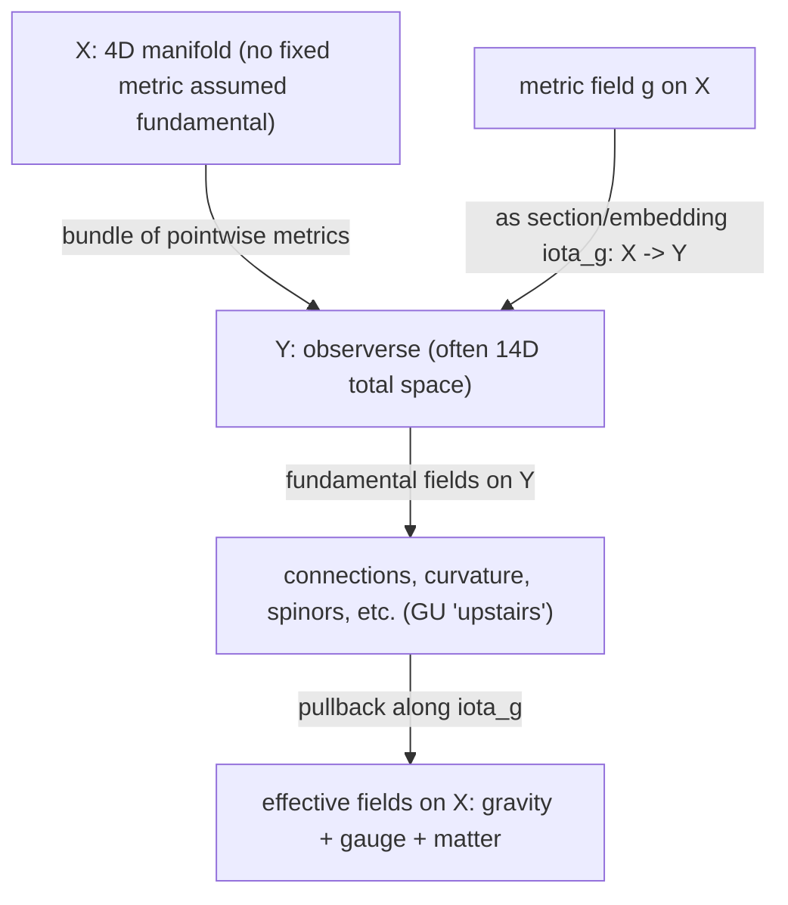

# Geometric Unity: A Rigorous Analytical Report on Eric Weinstein’s Unification Proposal

## Executive summary

Geometric Unity (GU) is Eric Weinstein’s proposal for a **geometric unification framework** intended to recover (at least at the classical level) the core structural components of modern fundamental physics—**Einstein-type gravity, Yang–Mills gauge dynamics, and Dirac-type fermions**—from a single higher-level geometric setup. The central maneuver is **not** “extra spatial dimensions” in the usual Kaluza–Klein sense, but (in its most emphasized version) a 14‑dimensional **“observerse”** built from the **bundle of all pointwise metrics** over a 4‑manifold, so that a 4D spacetime metric becomes a **section/embedding** into a 14D total space. The 10 additional directions correspond to the local degrees of freedom of a symmetric metric tensor in 4D (10 components), and GU attempts to treat “physics on spacetime” as a **pullback** of more fundamental objects living on the observerse. citeturn7view1turn29view0turn17view0

The **primary written source** is a self-published document titled “Geometric Unity: Author’s Working Draft, v 1.0” (April 1, 2021). It explicitly frames itself as a **draft/work in progress** and includes a restrictive copyright notice. citeturn31search3 This draft contains a significant amount of differential-geometric and gauge-theoretic formalism (definitions of the observerse, an “inhomogeneous gauge group,” candidate Lagrangians, and proposed field equations), but it also contains explicit signs of incompleteness (e.g., the author notes that a key decomposition was taken from an old file and “should be checked,” and the broader program does not provide a settled quantization scheme). citeturn28view0turn11view0

The most important **public presentations with timestamped transcripts** are:
- the “2013 Oxford Lecture” video (released publicly in 2020) hosted on the GU site with a time-coded transcript, citeturn3view0 and  
- the April 1, 2021 longform discussion on entity["podcast","Into the Impossible","Brian Keating podcast"] (also hosted with a time-coded transcript on the Portal Group site). citeturn12view3turn29view0  

The most detailed **technical critique** in the public record is by entity["people","Timothy Nguyen","mathematician"] and entity["people","Theo Polya","physicist"] (preprint + associated guest post). Their core objections include: (i) GU lacks a quantum theory, (ii) a “shiab” operator step appears mathematically inconsistent unless complexified (but complexification brings physical problems), (iii) the gauge-group choice would lead to quantum anomalies, (iv) SUSY constraints in 14D strongly restrict the allowed structure, and (v) key technical details are omitted. citeturn11view0turn10search0

Empirically, GU has *suggestive* claims (e.g., novel matter sectors, a chirality-based reframing of what appears as dark matter, and dark-energy/cosmological-constant reinterpretations), but **public GU materials generally do not supply a quantitative, parameter-fixed prediction set** (masses, couplings, cross sections, cosmological observables) sufficient for clean falsification; in at least one major interview, Weinstein asserts there are “predictions” but cannot specify the relevant energy scale. citeturn17view2turn29view2

The net, evidence-based assessment from the public record is that GU is an **interesting geometric research program sketch** with partial classical formalism and ambitious representation-theoretic goals, but it remains **incomplete**, **non-standard in its use of non-compact groups and mixed signatures**, largely **non-peer-reviewed**, and subject to **substantial technical criticism** that has not been publicly resolved in a revised, detailed, community-checkable manuscript. citeturn11view0turn22view2turn20search4

## Primary-source corpus and timestamped map of Weinstein’s public claims

This section prioritizes **Weinstein-authored** material and “closest-to-primary” public artifacts (videos with transcripts). URLs are provided in inline code (per your request). Timestamps are given as **hh:mm:ss** (or **mm:ss**) as rendered in the host transcripts.

### Core primary sources table

| Item | Type | Where it exists publicly | What it contains (high-level) | Direct link |
|---|---|---|---|---|
| *Geometric Unity: Author’s Working Draft, v 1.0* (Apr 1, 2021) | Self-published manuscript (PDF) | Public PDF (mirrors exist) | Formal definitions (observerse; bundles), non-compact structure groups tied to spinors, “inhomogeneous gauge group,” candidate bosonic action principles and “GU equations,” representation-theory pathway sketches toward Standard Model quantum numbers, plus speculative “imposter generation” / “dark sectors.” citeturn7view1turn7view2turn7view3turn26view2turn28view1 | `https://geometricunity.nyc3.digitaloceanspaces.com/Geometric_Unity-Draft-April-1st-2021.pdf` |
| “2013 Oxford Lecture” (released publicly via GU community, 2020) | Video + time-coded transcript page | GU website page with embedded transcript | Weinstein’s early public description of the observerse idea and the unification target; repeated emphasis that key physics should be “seen from the lecture.” citeturn3view0 | `https://geometricunity.org/2013-oxford-lecture/` |
| “Geometric Unity…REVEALED!” (Apr 1, 2021) | Longform interview + time-coded transcript | Portal Group transcript page | A guided walkthrough of “14D observerse,” pullback physics, “ship-in-a-bottle / shiab” intuition, spinor factorization, and links to Pati–Salam‑like group structure; also an explicit admission he cannot currently locate his preferred “shiab” construction notes. citeturn12view3turn29view0turn29view2 | `https://theportal.group/into-the-impossible-eric-weinstein-geometric-unity-revealed/` |
| “Pull That Up, Jamie” collection | Curated concept-video index | GU website page | A set of short visual aids plus explanatory text framing GU’s “ship in a bottle” and gauge-theory-as-calculus metaphors and how they motivate the draft. citeturn30view0 | `https://geometricunity.org/pull-that-up-jamie/` |
| “The Joe Rogan Experience #1628” (Apr 2021) | Interview episode announcement page | Portal Group post referencing release | Used as a public release/PR moment for the draft; provides an anchor date and positioning (“Eric releases… Geometric Unity”). citeturn12view2 | `https://theportal.group/the-joe-rogan-experience-1628/` |
| “Geometric Unity and Rational Physics” (Jun 2021, Marseille) | Talk (recording unavailable) | Portal Wiki metadata | Described as a GU talk at the Centre de Physique Théorique; the page explicitly notes “Recording unavailable” and no edited transcript. citeturn19view0 | (Recording not public per source) |

### Key video claims with timestamps and “what is being claimed”

The best timestamp coverage is in the Portal Group transcripts and the GU Oxford transcript page.

**On the observerse dimension count and interpretation**
- In the Keating interview transcript, Weinstein explicitly frames the conversation as a “pullback of a 14-dimensional conversation,” describes a 14D space with a \((7,7)\) metric, and motivates “4 rulers + 6 protractors” as degrees of freedom for fields on that space (**00:48:19–00:49:30**). citeturn29view0  
  Timestamp link: `https://youtu.be/` (use the transcript’s timestamp anchors; the Portal Group page provides clickable timestamp links). citeturn29view0

- He continues by asserting that we perceive 4D because we only observe **pullbacks** along a metric/section embedding a 4D “filament” into the 14D world (**00:49:30–00:53:21**). citeturn29view0

**On the “space of metrics almost has a metric,” and the role of a connection**
- He claims the bundle of all metrics provides metrics on vertical and dual-horizontal pieces, and “the only piece of data you’re missing for a metric… is a connection” (**00:51:09–00:53:21**). citeturn29view0

**On spinors and the quantum-gravity motivation**
- He claims (in interview form) that once the metric is “quantized,” spin‑½ bundles become problematic because the “medium” for matter excitations “doesn’t really exist in the absence of a metric choice,” and says one should be “freaked out” by this (framed as motivation for GU). (**00:53:21–00:54:49**). citeturn29view0

**On the “ship in a bottle / shiab” mechanism as a geometric compatibility fix**
- In the Keating transcript, he explains curvature decomposition (Weyl / traceless Ricci / Ricci scalar) and frames the “ship in a bottle” as the mismatch between GR’s curvature handling and gauge-theory curvature as a form-valued object; the transcript labels “Ship in a Bottle Animations” around **01:11:19** onward. citeturn29view0turn30view0

**On incomplete recall of a key operator**
- Weinstein openly states he is “still… trying to locate [his] favorite version” of the “Shiab operator,” and that he cannot find old notes that contained the exact projections (**~01:42:44**). citeturn29view2  
This matters because the “shiab” operator is not just explanatory metaphor; it is a formal ingredient in the draft’s proposed bosonic action/operator setup. citeturn7view3turn29view2

**On claimed predictive content but missing energy scale**
- In a transcript of his conversation on entity["podcast","Lex Fridman Podcast","podcast"], he states GU makes falsifiable predictions about “the matter that you should be seeing next” but cannot say “what energy scale it would happen at” (**~01:31:02–01:31:20**). citeturn17view2  
This is a central empiric-status issue: particle-physics testability usually requires at least an estimated scale or coupling regime. citeturn17view2

## Technical reconstruction of GU from the working draft and talks

This section reconstructs GU as a *mathematical proposal*, using the 2021 working draft and the timestamped transcripts as authoritative for “what is actually claimed publicly.” It is intentionally explicit about what is **defined** vs **asserted** vs **missing**.

### Foundational geometry: the observerse and pulled-back spacetime

In the draft’s opening, GU poses a stylized “data recovery” question: can one start from a very bland geometric substrate and recover the observed “field-theoretic universe” structure (gravity + gauge + fermions + Higgs/Yukawa content + symmetry groups + family structure)? The draft displays, as a target, a schematic mapping from a 4‑manifold \(X^4\) to a list of familiar ingredients (Einstein scalar curvature term, Yang–Mills term, Dirac term, Higgs potential sector, Yukawa couplings; Lorentz group \(SL(2,\mathbb{C})\); internal symmetries \(SU(3)\times SU(2)\times U(1)\); family quantum-number structures; three families; CKM matrix). citeturn7view0

GU then explicitly starts from a smooth 4‑manifold \(X^4\) with minimal structure (orientation and spin structure), while *de-emphasizing a fixed spacetime metric as fundamental*. citeturn7view0turn7view1

A central definition is the **observerse**, defined in the draft as a triple \((X^n, Y^d, \{\iota\})\) where local neighborhoods of \(X\) embed into a higher-dimensional manifold \(Y\), inducing a pullback metric \(g_X=\iota^{*}(g_Y)\) and a normal bundle \(N^{d-n}\). The draft highlights special cases, including an “Einsteinian” case where the higher space is the **bundle of pointwise metric tensors over \(X\)** and the map corresponds to a metric field regarded as a section. citeturn7view1

This is exactly the mechanism described in the 2021 interview: our “4D physics” is treated as **pullback information** from a more fundamental 14D space, where the missing piece to promote the bundle-of-metrics into a full 14D metric is an **Ehresmann connection** (a choice of horizontal complement to vertical “metric-variation” directions). citeturn29view0

Conceptually (without committing to every notational choice in the draft), the GU ontology can be summarized as:

### The 14-dimensional structure and mixed signature

The public narrative repeatedly ties “14 dimensions” to “4 base + 10 complement,” with the complement interpreted as the fiber directions of the **metric bundle** (10 components of a symmetric bilinear form in 4D). This is described explicitly in interviews (4 + 4 + 6 counting, and then “10 plus 4 equals 14” language), and is also reflected in the draft’s treatment of tangent/normal decompositions. citeturn17view0turn29view0turn28view1

The draft and the Keating transcript also discuss a **\((7,7)\)** mixed signature on the 14D observerse as a plausible (or “more likely”) choice. citeturn29view0turn7view3

A key mathematical theme is that GU emphasizes **spinors on the observerse**, with the claim that what appears as “internal quantum numbers” in 4D arises from the structure of spinors associated with the **normal bundle** directions and representation-theoretic branching under pullback. citeturn26view2turn28view1turn17view2

### Gauge structure: Spin groups, unitary representations, and the inhomogeneous gauge group

The draft builds a substantial part of GU using **Clifford algebra / spin representation** language. It explicitly displays a chain of structure groups and representations in which a Spin group is embedded into a unitary group acting on Dirac spinors, with a named gauge group \(H\) identified as \(U(64,64)\) (i.e., **non-compact unitary group with indefinite form**). citeturn28view0

From there the draft defines an **inhomogeneous gauge group** (explicitly stated to be “in analogy to the Poincaré group”) as a semidirect product
\[
\mathcal{G} = \mathcal{H}\ltimes \mathcal{N},
\]
where \(\mathcal{N}\) is built from ad-valued one-forms (so the group includes affine “translations” in the space of gauge potentials). The draft gives explicit multiplication rules and shows how \(\mathcal{G}\) acts on the affine space of connections \(A\) by \(A\cdot(\epsilon,\varpi)=A\cdot\epsilon+\varpi\). citeturn7view2

This move is central because it provides the mechanism for GU’s “curvature + torsion-like” coupled equations in a gauge-theoretic language, rather than being ordinary Riemannian geometry only on \(X\). citeturn7view2turn7view4

### Candidate action principles and the “shiab” operator

The most explicit “dynamics” in the draft appears in its “Lagrangians” section. It introduces a bosonic action functional and defines an operator (the “shiab” operator) schematically as a map from ad-valued 2‑forms on \(Y\) to \((d-1)\)-forms, in a way designed to parallel Einstein’s contraction of curvature into Ricci components. A displayed formula decomposes the operator into pieces labeled “Ricci-like,” “\(g_{\mu\nu}\)-like,” and “Ricci scalar-like.” citeturn7view3

Varying the action yields a displayed relation that the draft labels as connecting “swervature” and “displaced torsion,” and it explicitly suggests how one might read off an “Einstein-field-equation-like” structure from a GU equation:
\[
\Upsilon_\omega = S_\omega - T_\omega = 0,
\]
presented alongside an annotated “\(S_{\mu\nu} = T_{\mu\nu}\)”‑style analogy. citeturn7view4

A second-order bosonic functional is also proposed as a norm-square of a bosonic “\(\Upsilon\)” object, leading to a displayed Yang–Mills–Maxwell-like equation \(D^{*}F = J\) (in the draft’s notation), again explicitly cast as a unification attempt between Einstein/Dirac/Yang–Mills structures. citeturn7view4

Critically, the public interview record includes Weinstein saying he cannot locate his preferred explicit “shiab operator” notes and projections. citeturn29view2 This is an unusually direct admission of a missing or unsettled formal ingredient, given that the operator is not merely pedagogical but used in the draft’s Lagrangian construction. citeturn7view3turn29view2

### Field content and Standard Model recovery claims: group-reduction pathway and “imposter” generation

The draft provides a diagrammatic group pathway from observerse structure toward Standard Model-like symmetry, explicitly mentioning a chain that passes through a Pati–Salam-like structure (\(SU(4)\times SU(2)\times SU(2)\) via low-dimensional isomorphisms from spin groups) and then toward a Standard Model-like \(SU(3)\times SU(2)\times U(1)\) factor. citeturn28view1turn26view1

It also sketches an “intersection”-style argument: the Standard Model group appears within the intersection of certain simultaneous reductions (maximal compact subgroup selection and complex-structure–type reduction on the normal-bundle side). citeturn28view1

On *fermion generations*, the draft makes an explicit, distinctive claim: it proposes that “three generations” should be replaced by a “2+1 model” in which the “third generation” is an **effective imposter** arising from branching rules under pullback from the observerse, rather than a true generation differing only by mass. citeturn26view2turn17view2

The draft further presents “explicit values” tables framed as predictions of internal quantum numbers, and labels certain items explicitly as “Imposter Quarks,” “Imposter Leptons,” etc. citeturn26view1turn26view0

Finally, the draft explicitly sketches a linkage between a cosmological-constant-like quantity, a spinless gauge field, and fermion mass, presenting it as a “three way linkage” GU would use to attack fine-tuning issues by “having the same fields do multiple service.” citeturn26view2

### Precisely identified incompletenesses and gaps in the public formalism

From the primary sources alone (before any secondary critique), several gaps are clearly documentable:

1. **Status and licensing posture**: The working draft self-describes as entertainment/work-in-progress and includes a nonstandard “may not be built upon” restriction. citeturn31search3turn10search16  
   Even if legally limited in scope (as discussed in academic forums), it signals that GU is not being released as a conventional open scientific preprint for iterative community development. citeturn10search16turn31search11

2. **Key operator uncertainty**: Weinstein publicly states difficulty locating his preferred “shiab operator” projections, despite “shiab” being central to the action formulation. citeturn29view2turn7view3

3. **Quantization is not provided**: A core advertised motivation is compatibility with quantum theory and gravity, but neither the draft nor the core talks provide a complete quantization procedure for the full GU system (path integral measure, Hilbert space, renormalization story, anomaly cancellation, etc.). This is also explicitly raised as a “most glaring deficiency” by critics. citeturn11view0

4. **Non-compact groups and indefinite metrics**: GU’s public formalism uses non-compact unitary groups and mixed signatures, which typically force very careful treatment of unitarity/positivity at the quantum level. The critical literature directly flags quantum-consistency issues in this neighborhood. citeturn28view0turn11view0

## Comparison to mainstream unification approaches

This section benchmarks GU against major mainstream programs: 4D GUTs, supersymmetric extensions, string theory, and loop quantum gravity, plus “extra-dimension” and effective-field-theory approaches.

### Comparative table

| Approach | Fundamental arena | Core unification mechanism | Quantization status | Typical “new stuff” | Prediction style | Mathematical maturity | Empirical status |
|---|---|---|---|---|---|---|---|
| Geometric Unity (Weinstein) | 4D manifold \(X\) plus 14D “observerse” \(Y\) (often bundle of metrics); mixed signatures | “Physics on \(X\)” as pullback from fields on \(Y\); inhomogeneous gauge group; “shiab” curvature projection; representation-branching to recover SM-like content citeturn7view1turn7view2turn7view3turn28view1turn29view0 | No complete quantum formulation publicly specified; critics emphasize this deficit citeturn11view0 | Extra matter sectors (“dark/looking-glass”), “imposter generation,” potentially many undiscovered states citeturn22view1turn26view1turn26view2 | Qualitative + partial tables of charges; energy scales often not fixed publicly citeturn17view2turn26view0 | Partial classical formalism; key operator choices unfinished/contested in public record citeturn29view2turn11view0 | No dedicated experimental confirmation; testability limited by missing scales/parameters in public versions citeturn17view2turn11view0 |
| 4D GUTs (e.g., SU(5), SO(10)) | 4D QFT (+ gravity usually separate) | Embed SM gauge group into a simple unified group; symmetry breaking yields SM | Standard QFT quantization | Proton decay channels; heavy gauge bosons; sometimes neutrino mass mechanisms | Often sharp qualitative predictions (e.g., baryon violation), but scale-dependent | Very mature mathematically as QFT | Strong experimental constraints; classic signatures searched extensively (see PDG) citeturn32search0turn7view0 |
| Supersymmetric extensions (SUSY, SUSY GUTs) | 4D QFT (+ gravity separate unless supergravity) | Introduce superpartners; can improve coupling unification; address hierarchy issues | Standard QFT quantization (perturbative) | Superpartners, extended Higgs sectors | Collider + precision constraints in model families | Mature, but model space huge | No superpartners observed; mass bounds summarized in PDG search tables citeturn32search24turn32search1 |
| String theory (critical) | Higher-dimensional string background; critical dimensions (26 bosonic, 10 superstrings) | Particles as string modes; gravity included automatically; gauge sectors from compactification/branes | Quantum theory defined perturbatively; nonperturbative program partial | Extra dimensions, branes, moduli, rich vacuum landscape | Indirect/structural; often hard to isolate unique low-energy predictions | Highly developed mathematical physics | No definitive experimental signature; unification is structural rather than parameter-fixing in practice citeturn32search3turn32search18 |
| Loop quantum gravity | Background-independent quantization of GR geometry | Quantize geometry itself (holonomies/fluxes); matter couplings possible | Nonperturbative quantization program | Discrete spectra of area/volume; quantum spacetime microstructure | Planck-scale and strong-gravity-regime effects | Substantial rigor in kinematics; dynamics debated | No direct empirical confirmation; active phenomenology attempts citeturn32search2turn32search5turn32search9 |

GU is unusual among these in that it (a) treats **metric choice as emergent/secondary** via observerse embeddings, (b) puts heavy weight on **representation-theoretic branching of high-dimensional spinors** to recover internal quantum numbers, and (c) introduces an **inhomogeneous gauge group** that acts affinely on connections. citeturn7view1turn7view2turn28view1

## Critiques, peer review status, and credibility-weighted synthesis

### Peer review status

There is no evidence in the public record that GU has appeared as a **peer-reviewed physics paper** in a standard venue. The widely circulated text is explicitly a “working draft” released independently. citeturn31search3turn22view3

A large part of the controversy since 2013 has centered on communication strategy (“colloquium + media” rather than a paper), which was flagged at the time by entity["people","Peter Woit","mathematician"] and entity["people","Jennifer Ouellette","science writer"] as a reason the community could not evaluate the claims. citeturn20search4turn22view2

### High-credibility technical critique: Nguyen & Polya

The most concrete technical objections in a single place are:  
- the Nguyen & Polya preprint (A Response to Geometric Unity), citeturn10search0 and  
- Nguyen’s guest post on entity["people","Sabine Hossenfelder","theoretical physicist"]’s Backreaction blog (archived). citeturn11view0

Their critique is unusually specific: it identifies particular operator choices (the “shiab” step), anomaly problems tied to gauge-group choice, and SUSY constraints implied by the dimensionality, and it asserts that “essential technical details” are omitted such that central claims are not verifiable from public materials. citeturn11view0

This critique also points out a definitional tension: **including** a complexification step may resolve a mathematical inconsistency but makes the quantum theory physically problematic, while **omitting** it creates a mathematical error—meaning the public version is squeezed between “invalid math” and “bad physics.” citeturn11view0

### Medium-credibility scientific commentary and journalism

Two early 2013 media pieces in entity["organization","The Guardian","uk newspaper"] framed GU as an outsider unification attempt centered on a 14D observerse and connected it to claims about dark matter/dark energy and large numbers of new particles. citeturn22view0turn22view1 The enthusiasm was accompanied by immediate pushback from science writers and physicists emphasizing that “elegant math” is insufficient without checkable details. citeturn22view2turn20search4

A later journalistic recap by entity["organization","VICE","news outlet"] emphasized the nonstandard communication path, the 2021 paper drop, and the subsequent scientific criticism. citeturn22view3

### Low-credibility / noisy discussion pools

Forum and social-media discussions (e.g., Hacker News items, Reddit threads, StackExchange questions) contain a mixture of useful clarifications and substantial heat/noise. They can be helpful to identify what parts of GU confuse technically literate readers (e.g., “bundle of metrics gives 10 extra dimensions”), but they should not be treated as reliable arbiters of correctness. citeturn9search4turn9search15turn10search16

### Third-party attempts to “repair” or extend GU

There exist post-2021 third-party documents attempting to formalize missing pieces and move GU toward testability (e.g., a 2025 “Geometric Unity I: From Heuristic Proposal to Testable Framework…” style preprint on ResearchGate/Zenodo). These are **not Weinstein-authored** and are typically **not peer reviewed**; they are best read as community extrapolations rather than confirmations. citeturn18search14

## Empirical status and proposed tests

### What GU publicly claims could be testable

Across the draft and the major interviews, GU is associated with several categories of putative empirical consequences:

1. **New matter sectors / “dark” sectors**  
   The draft explicitly talks about additional matter (including “dark/looking-glass” matter) emerging from the observerse spinor content and branching rules under pullback. citeturn24view2turn26view2  
   The Guardian framing in 2013 also connects GU to “dark” matter-like effects through symmetry breaking/decoupling language. citeturn22view0turn22view1

2. **Nonstandard generation structure (“2+1” with an imposter third generation)**  
   This is one of the most explicit distinctive claims in the working draft and is echoed in interview language about “two generations plus an impostor third generation.” citeturn26view2turn17view2

3. **Dark energy / cosmological-constant reinterpretations**  
   The Guardian’s 2013 article claims GU yields a rationale for a cosmological-constant-like term and suggests it “varies with curvature.” citeturn22view0turn22view1  
   The 2021 working draft links a “cosmological ‘constant’” to gauge fields and fermion mass in a schematic “three way linkage.” citeturn26view2

4. **Large numbers of undiscovered particles**  
   The Guardian 2013 coverage reports a claim of “more than 150” new subatomic particles with exotic properties. citeturn22view1  
   In later talk, the “predictive” content is discussed more as predicted **quantum-number patterns** and matter sectors than as a fixed mass spectrum. citeturn26view0turn29view2

### Why GU’s public version is difficult to confront with data

Two constraints appear consistently in the public record:

- **Energy-scale indeterminacy**: Weinstein states that GU predicts “what matter you should be seeing next,” but cannot specify the energy scale at which it should appear. citeturn17view2

- **Dependence on symmetry breaking / VEV structure not computed**: In the Keating transcript, the discussion of “predictions” is explicitly conditioned on knowing “what fields have acquired VEVs” and where we sit in relevant parameter/anthropic spaces. citeturn29view2

Without a specified scale and a worked-out effective 4D Lagrangian (with couplings), most standard experimental pipelines (collider searches, flavor constraints, cosmology fits) cannot be cleanly applied.

### Current observational context relevant to one GU theme: dark energy variability

Because the 2013 GU narrative included a varying cosmological-constant idea, it is worth situating that against present cosmology. The entity["organization","Particle Data Group","rpp collaboration"] 2025 “Cosmological Parameters” review states (as of its review cutoff) that data show **no evidence for dark-energy dynamics** and are consistent with a cosmological constant \(w=-1\). citeturn33search1turn32search0

However, more recent reporting and analyses (e.g., DESI-related discussions) have circulated claims of **increased preference for evolving dark energy** in some combined-data fits, though interpretation can be dataset/model dependent and remains an active research question. citeturn33search14turn33search10turn33news43

For GU specifically, the key point is methodological: even if cosmology were to prefer evolving dark energy, GU would still need to provide **a quantitative mapping** from its geometric fields to an effective \(w(z)\) (or equivalent) to count as an empirical success.

## Open technical questions and research directions

The public GU record supports a clear list of concrete problems that must be solved for GU to become a community-assessable physical theory (or to be decisively ruled out):

**Definitional and mathematical completion**
- Provide a fully explicit, reproducible definition of the “shiab operator” (or its replacement) that is internally consistent and gauge covariant, and document its uniqueness or selection principle. The operator currently sits at the center of the proposed bosonic action, while simultaneously being described as difficult to “locate” in preferred form. citeturn7view3turn29view2
- Clarify the precise geometric data on \(Y\) (metric, connection, Hodge star) required to define the action globally, and specify under what conditions it exists (topology, spin structures, global hyperbolicity if relevant for physics). citeturn7view1turn29view0

**Quantum consistency**
- Supply a quantization map (canonical or path-integral), identify the physical Hilbert space structure, and address the anomaly and unitarity problems highlighted by critics. citeturn11view0turn28view0
- Resolve the tension flagged by Nguyen’s guest post: the apparent need for complexification to repair a mathematical issue vs the physical consequences of that complexification for quantum theory. citeturn11view0

**Recovery of established physics**
- Derive, from the GU action/equations, a precise low-energy effective 4D field theory on \(X\) and show that it reproduces the Standard Model + GR to the required precision (including chirality structure, anomaly cancellation in the effective theory, and the observed generational pattern). citeturn26view1turn11view0
- Make the “2+1 imposter generation” claim precise enough to compare against the very well-measured properties of third-generation fermions and their gauge/Yukawa structures. citeturn26view2turn26view1

**Predictive closure**
- Convert the “internal quantum number prediction tables” into testable statements: determine the masses/couplings/production modes of predicted states, and specify which existing searches constrain them. citeturn26view0turn17view2turn32search24
- If GU aims to address cosmological-constant/dark-energy structure, produce an explicit cosmological sector and compute the implied expansion history parameters (e.g., effective \(w(z)\)); compare to the current cosmological constraints landscape. citeturn22view0turn33search1turn33search14

**Process and scientific integration**
- Release a revised manuscript (or sequence of papers) in a form that permits systematic community checking: definitions, sign conventions, gauge-fixing choices, and explicit worked examples. The absence of such detail was a main driver of 2013–2021 criticism and remains central in the most technical critique. citeturn20search4turn11view0