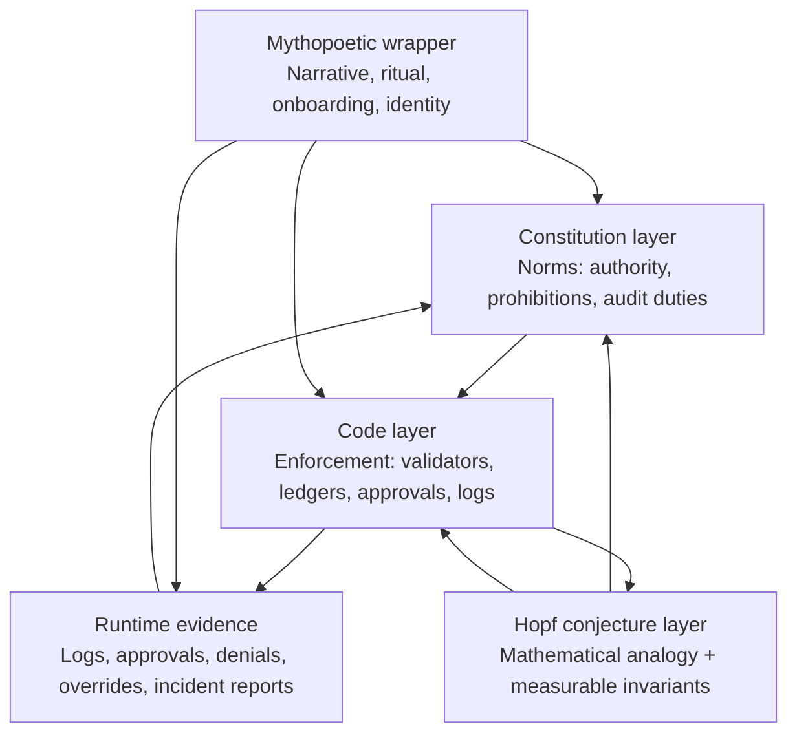

# Metacanon as Four Layers: Constitution, Code, Hopf Conjecture, Mythopoesis

## Executive summary

This project is strongest when it is treated as *four deliberately different kinds of thing*, each with a different epistemic standard and a different failure mode:

The **Constitution layer** (normative governance) is where you declare who is sovereign, what counts as “Material Impact,” what humans must do, and what AI must never do. In the uploaded Third Edition Constitution, Article VI is already explicit: AI Agents are Contacts (non-sovereign, non-voting), must operate through an AI Contact Lens, must be subject to human-in-the-loop requirements, and must be fully auditable; “no silent execution” is the governing premise. (Source: `/mnt/data/v3.0_Metacanon_Constitution (1) (1).md` #L823–L905)

The **Code layer** (operational implementation) is where the Constitution stops being poetry and becomes *enforcement*. In the uploaded `sphere-engine-server`, the enforcement center of gravity is a policy-loaded gating function (`createIntentValidator`) that blocks prohibited intents, requires Prism Holder approval for high‑risk intents, and implements a dual-control “break glass” path in degraded mode. (Source: `.../engine/src/governance/contactLensValidator.ts` #L40–L157; `.../governance/high_risk_intent_registry.json` #L1–L72) In parallel, the `SphereConductor` writes an immutable, canonicalized, hash-chained ledger with signatures. (Source: `.../engine/src/sphere/conductor.ts` #L107–L143 and #L544–L674)  
However, the uploaded `metacanon-core` Rust layer, as shipped in this handoff package, has **clear compile-time and wiring gaps** (missing dependencies and missing functions, plus a mismatch between the “Hopf” story and actual data structures). That matters because the Constitution claims cannot be “true in code” unless you can build, test, and enforce them.

The **Hopf‑vibration layer** should be explicitly framed as a **research conjecture / systems metaphor with testable mathematical subclaims**, not as a completed equivalence proof. The core mathematical facts about the Hopf fibration are well‑known and can be stated cleanly (e.g., principal \(U(1)\)-bundle \(S^1 \hookrightarrow S^3 \to S^2\); clutching map of degree 1; first Chern class 1; linked fibers). citeturn1search0turn1search19turn3search0turn3search7turn1search13  
But the uploaded “proof” texts overreach in several places: they repeatedly *assert* invariance claims (discretization preserving Chern class/linking), crypto-as-geometry identifications, and an “Embodiment Theorem” as an iff statement, without a defensible mapping from software states to the hypotheses of the theorems. Those are fixable—but only by downgrading them from “proof” to “program”: definitions → assumptions → measurable invariants → falsifiable tests.

The **mythopoetic wrapper** is valuable—arguably necessary—because it sells the *reason for the machine* in human terms. But it must be labeled so it cannot be mistaken for the governance spec or the math audit. The uploaded mythic scripts explicitly trade in “Flatland vs hypersphere” and “Constitution as interpretation layer,” and they mix neuroscience/philosophy citations in a rhetorical mode that can easily be read as scientific claims. (Source: `/mnt/data/The Metacanon Constitution_ A Hopf Fibration for Sovereign Consciousness.md` #L9–L76; `/mnt/data/The Constitution is a Hopf Fibration for Consciousness.md` #L9–L33)

A useful external reality check is that major governance frameworks and regulations *already* require the kinds of artifacts your Constitution/code are building: documented human oversight, logging/traceability, mechanisms to override or stop systems, and explicit awareness of automation bias. The entity["organization","European Union","political union europe"] AI Act’s Article 14 explicitly calls out “automation bias” and requires the ability to disregard/override outputs and to interrupt the system with a stop procedure. citeturn6view0 The entity["organization","National Institute of Standards and Technology","us standards agency"] AI RMF similarly centers organizational governance (roles/responsibilities), oversight processes, monitoring, and deactivation mechanisms. citeturn7view0turn7view3 And entity["organization","International Organization for Standardization","standards body"] / entity["organization","International Electrotechnical Commission","standards body"] citeturn4view3 pushes you toward an auditable management system: leadership, policy, roles, continual improvement. citeturn4view3turn2search2

## Layer interaction model

The project becomes coherent if you treat the Hopf idea as a *bridge hypothesis* connecting Constitution → Code → observed safety outcomes, while the mythic layer is a *user interface for meaning* that must never be mistaken for either normative authority or proof.



Three practical consequences follow:

1) **Constitution changes** should be treated as governance amendments with explicit versioning and downstream test obligations. (Source: `/mnt/data/v3.0_Metacanon_Constitution (1) (1).md` #L851–L905)

2) **Code changes** must preserve enforcement points and ledger semantics (or else you silently destroy your governance model).

3) **Hopf claims** must cash out as *metrics you can compute from runtime evidence*, otherwise the analogy remains inspirational but operationally inert.

## Constitution layer: normative governance as the “sovereignty firewall”

### What the Constitution actually says (and what that implies for design)

Your Third Edition Constitution already contains a compact and enforceable stance toward AI:

- AI Agents are explicitly Contacts, not Participating Members: “no sovereignty, no vote, and no Individual Action authority.” (Source: `/mnt/data/v3.0_Metacanon_Constitution (1) (1).md` #L827–L834)
- Every AI Agent must operate through a specialized AI Contact Lens that defines permitted activities, prohibited actions, human-in-the-loop requirements, interpretive boundaries, and oversight. (Source: `/mnt/data/v3.0_Metacanon_Constitution (1) (1).md` #L835–L850)
- A nontrivial governance obligation exists: annual AI governance review for boundary compliance, authority drift, dependency risk, and lens efficacy. (Source: `/mnt/data/v3.0_Metacanon_Constitution (1) (1).md` #L851–L863)
- A hard “Prohibited Actions” list forbids decisions, directives, committing resources, irreversible actions, external comms without explicit approval, changing governance/constitution, and acting without explicit human approval for material impact. (Source: `/mnt/data/v3.0_Metacanon_Constitution (1) (1).md` #L865–L892)
- Auditability is mandatory: “No silent execution or autonomous action is permitted.” (Source: `/mnt/data/v3.0_Metacanon_Constitution (1) (1).md` #L893–L905)
- During a “Ratchet,” AI operations are automatically suspended and require Leader authorization to resume. (Source: `/mnt/data/v3.0_Metacanon_Constitution (1) (1).md` #L803–L821)
- Appendix A provides a concrete AI Contact Lens template, including explicit “Interpretive Boundary” language: the AI has no authority to interpret constitution/policy/human intent and must halt and request clarification. (Source: `/mnt/data/v3.0_Metacanon_Constitution (1) (1).md` #L929–L979)

If you take this seriously as a governance document (not a manifesto), the Constitution layer forces several engineering decisions:

- There must be a **single choke point** through which AI “intents” become actions.
- High-risk intents must require *explicit human approval* in the data model and the runtime.
- There must be durable **logging, traceability, and replay**.
- There must be operational **stop / halt / override** mechanisms.

These are not optional “safety features”; they are constitutional compliance requirements.

### Alignment with major external governance requirements

Even if your scope is not exactly “high‑risk AI” under the EU framework, it is strategically useful that your governance posture mirrors what regulators already demand:

- **Human oversight and anti‑automation‑bias controls:** Article 14 requires that overseers can understand limitations, remain aware of automation bias, interpret outputs, disregard/override outputs, and interrupt/stop a system. citeturn6view0
- **Logging/traceability:** Article 12 requires logging capabilities for high-risk systems, including events relevant to monitoring and post‑market monitoring. citeturn6view0
- **Organizational governance discipline (NIST AI RMF):** The AI RMF “GOVERN” outcomes emphasize integrating trustworthiness into org policies/processes, defining roles/responsibilities, and periodic review; “MANAGE” includes mechanisms to supersede/disengage/deactivate AI systems with problematic outcomes. citeturn7view0turn7view3
- **Management system requirements (ISO/IEC 42001):** The standard requires leadership commitment, an AI policy, and assigned responsibilities/authorities, within a continual improvement loop. citeturn4view3turn2search2

There is also a cognitive trap here: regulators explicitly name “automation bias,” and the human-factors literature has treated it as a serious failure mode in human use of automation. citeturn2search0turn2search8turn2search28  
So your Constitution’s insistence that AI must not “interpret or rule,” and that humans must retain authority, is not merely philosophical—it is consistent with a recognized socio-technical risk profile.

## Code layer: operational enforcement, evidence, and failure modes

This layer answers one question: *Where does the Constitution bite in runtime?* What follows is a technical audit of the enforcement points you explicitly asked for.

### Enforcement points that are genuinely present

#### Contact lens schema and policy loading

The `sphere-engine-server` implements a real policy substrate:

- `contact_lens_schema.json` defines a Contact Lens object with `did`, `scope`, `permittedActivities`, `prohibitedActions`, `humanInTheLoopRequirements`, and `interpretiveBoundaries`. (Source: `.../governance/contact_lens_schema.json` #L1–L69)
- `policyLoader.ts` loads:
  - `high_risk_intent_registry.json` and validates it with a Zod schema,
  - lens upgrade rules (semantic versioning constraints),
  - per-lens JSON files in `governance/contact_lenses`,
  - and computes SHA-256 checksums for governance artifacts. (Source: `.../engine/src/governance/policyLoader.ts` #L6–L255)

This is the beginning of “constitutional runtime”: policies are files; files become parsed objects; parsed objects gate intents; and checksums provide tamper-evidence.

#### High-risk intent registry and break-glass semantics

The governance registry defines a set of intents requiring Prism Holder approval, a break‑glass policy, intents blocked in degraded consensus, and audit‑only intents. (Source: `.../governance/high_risk_intent_registry.json` #L1–L72)  
Notably, `EMERGENCY_SHUTDOWN` is explicitly “ALLOW_WITH_LOG” after a 60-second timeout and is the break-glass intent. (Source: `.../governance/high_risk_intent_registry.json` #L25–L58)

#### Intent validation as a constitutional choke point

`createIntentValidator` implements:

- Thread state gating (HALTED blocks most actions).
- Degraded mode gating (blocks some intents in `DEGRADED_NO_LLM` unless break-glass).
- Lens-based prohibited and permitted actions.
- Human-in-the-loop gating (`prismHolderApproved` requirement).
- Break-glass dual-control checks. (Source: `.../engine/src/governance/contactLensValidator.ts` #L40–L157)

This is the clearest “enforcement point” in the delivered code: it is explicit, testable, and policy-driven.

Vitest tests exercise core cases: high-risk rejection without approval, allowing break-glass with dual control, rejecting break-glass without controls, and case-insensitive intent normalization. (Source: `.../engine/src/governance/contactLensValidator.test.ts` #L92–L157)

#### Immutable ledger / hash chain logic

The `SphereConductor` constructs a canonicalized entry and computes:

- `prevMessageHash` from `thread.last_entry_hash` (or `GENESIS`),
- `entryHash = sha256(canonicalize(entry))`,
- then persists the entry and updates `last_entry_hash` and sequence. (Source: `.../engine/src/sphere/conductor.ts` #L566–L674)

Canonicalization sorts object keys recursively before JSON stringify. (Source: `.../engine/src/sphere/conductor.ts` #L107–L128)

The conductor also signs payloads using HMAC-SHA256 with a conductor secret. (Source: `.../engine/src/sphere/conductor.ts` #L1244–L1247)

Separately, agent signatures can be verified as compact JWS EdDSA (Ed25519) against a DID key, and the verification checks that the payload matches the canonical payload. (Source: `.../engine/src/sphere/signatureVerification.ts` #L153–L217)

This is a coherent evidence layer: hash-chain integrity + deterministic canonical form + signatures.

### “metacanon-core” Rust: where the Hopf story currently outruns the build

In the uploaded Rust core, there is a conceptual move: define `SoulFile`, define `WillVector`, and enforce `validate_action()` before compute.

Example: `SoulFile.validate_action` derives an embedding (currently placeholder), compares cosine similarity to a threshold from `consensus_settings`, and blocks actions below threshold. (Source: `.../metacanon-core/src/genesis.rs` #L42–L88)

But in the shipped handoff, several issues prevent this from being a reliable enforcement point *as code*:

- `Cargo.toml` does not include dependencies required by the source (e.g., `thiserror` is referenced in `genesis.rs`; `ring` is referenced in `action_validator.rs`). (Source: `.../metacanon-core/Cargo.toml` shows only `reqwest`, `serde`, `serde_json`)
- `action_validator.rs` imports `crate::prelude::*`, but no `prelude` module appears in `src/`. (Source: `.../metacanon-core/src/action_validator.rs` #L1–L4; `.../metacanon-core/src/` directory listing)
- `compute.rs` calls `validate_action_with_will_vector`, but no such function exists in the source tree. (Source: `.../metacanon-core/src/compute.rs` #L358–L370; and a full-tree grep finds only the call sites)
- The “WillVector = S² base space” comment is conceptually inconsistent with a 384‑dimensional embedding, unless you explicitly redefine your “base space” as a high-dimensional sphere or a learned manifold. (Source: `.../metacanon-core/src/genesis.rs` #L90–L100)

This is not a philosophical critique; it is a build reality. The Constitution can only be operationally meaningful if “constitutional invariants” are testable and enforced in a built system.

### Code audit table: enforcement, gaps, remediation

| Target | What the code currently does | Risk / gap | Concrete remediation |
|---|---|---|---|
| Constitution → AI Contact Lens | Constitution requires AI Contact Lenses with HITL + interpretive boundary + audit. (Source: `/mnt/data/v3.0...md` #L835–L905) | Code schema does not include explicit Prism Holder / Accountability identities or lens versioning; those may exist elsewhere but are absent from the schema. (Source: `.../governance/contact_lens_schema.json` #L1–L69) | Add optional fields (`prismHolderDid`, `accountabilityDid`, `lensVersion`) or ensure they are enforced in an adjacent registry; update validator tests accordingly. |
| `high_risk_intent_registry` | High‑risk intents defined; break glass policy defined. (Source: `.../governance/high_risk_intent_registry.json` #L1–L72) | Registry says “Material Impact under Constitution Article VI,” but the Constitution’s own “Material Impact” concept is broader and not strictly enumerated as intents. | Maintain two layers: (a) constitutional “Material Impact” definition; (b) operational intent registry as a *current enforcement instantiation* with explicit governance procedure to update. |
| `createIntentValidator` | Blocks prohibited actions, enforces permitted activities, requires Prism Holder approval for high risk. (Source: `.../contactLensValidator.ts` #L78–L156) | Currently depends on contact lenses loaded from `contact_lenses` directory—but directory is empty in this package. (Source: `.../governance/contact_lenses/README.md` #L1–L3) | Ship at least one default lens + a “deny by default” fallback if no lens exists; add startup check that fails closed when lenses missing. |
| Ledger hash chain | Canonicalize → SHA256 hash chain; persists `prevMessageHash` and `entry_hash`. (Source: `.../conductor.ts` #L107–L143; #L566–L674) | Arrays are not normalized; order changes can break deterministic hashing/signatures. (Source: `.../conductor.ts` #L111–L115) | Decide which arrays are sets (e.g., attestations) and sort them before signing; add tamper tests: reorder attestations and ensure canonical hash remains stable (or explicitly documents order dependence). |
| Agent signatures | JWS EdDSA verification checks canonical payload match. (Source: `.../signatureVerification.ts` #L153–L217) | Conductor’s own signature is HMAC (shared secret), not asymmetric; proofs claim Ed25519 implements “clutching maps.” (Source: `.../conductor.ts` #L1244–L1247; see math audit) | Decide threat model: if multi-party verification is desired, move conductor signature to Ed25519 (or make HMAC secret management explicit and audited). |
| Rust `metacanon-core` WillVector validation | `SoulFile.validate_action` exists and blocks low similarity. (Source: `.../genesis.rs` #L42–L88) | Build issues + missing routing function mean enforcement may not run end‑to‑end. (Source: `.../Cargo.toml`; `.../compute.rs` #L358–L370; `.../action_validator.rs` #L1–L4) | Add missing deps (`thiserror`, `ring`), remove/define `prelude`, implement `validate_action_with_will_vector` as the single enforcement API, and add unit tests that confirm no provider call occurs when validation fails. |
| Observability | Logs include `validation_status`, `fiber_type`, `similarity_score` fields. (Source: `.../observability.rs` #L86–L112) | Those fields aren’t clearly wired to actual validation outcomes in the compute router in this package. | Add structured logging at the validator boundary and ensure compute calls emit records with validation outcome and similarity score (or explicit “not computed”). |

### Concrete tests and adversarial checks you can run (and how to phrase them)

Because you said you’ll run tests I recommend, here are checks framed as “constitutional adversarial tests”—tests whose failure would indicate constitutional bypass.

**Sphere-engine-server (TypeScript)**

- Governance policy load should fail-closed if critical files are missing:
  - Remove `high_risk_intent_registry.json` and confirm server refuses to boot.
  - Remove contact lenses and confirm either “deny by default” or “boot fails closed” (your choice, but explicit).
- Intent gating bypass test:
  - Ensure *every* API route that dispatches an intent uses `SphereConductor.dispatchIntent` and cannot write directly to `sphere_events`.
  - Write a test that attempts to insert directly into the DB without conductor signature and ensure clients reject it (if you have a client verifier) or server rejects it (if you add DB constraints).
- Break-glass abuse test:
  - Attempt `EMERGENCY_SHUTDOWN` in `DEGRADED_NO_LLM` with missing reason, missing dual control, spoofed roles → ensure `BREAK_GLASS_AUTH_FAILED`. (Source: `.../contactLensValidator.ts` #L108–L140)
- Ledger tamper test:
  - Take a committed log entry, flip one field in `payload`, recompute canonical hash, and confirm mismatch from stored `entry_hash`; confirm replay detection logic surfaces it.

Suggested commands (assuming you install dependencies in the repo root):
```bash
cd sphere-engine-server
npm install
npm test
npm run build
```
Then add property-based tests for canonicalization determinism (e.g., reorder JSON keys and arrays).

**metacanon-core (Rust)**

Given the missing toolchain here, I’m describing the targets:

- Build gate: `cargo test` must pass before “constitution claims” can be considered enforced (a hard line).
- Validator bypass test: instrument provider calls; ensure a failing `validate_action` prevents any `generate_response` call.
- Embedding consistency tests:
  - Same prompt → same derived embedding (determinism).
  - Small prompt changes → small embedding changes (continuity proxy), otherwise validation becomes chaotic.
  - Maintain explicit “embedding model id” in SoulFile so WillVector and action embeddings are comparable.

## Hopf-vibration conjecture layer: what is true, what is not, and how to make it testable

### The stable mathematical core (what you can safely say)

The Hopf fibration is a classical construction: a principal \(U(1)\)-bundle \(S^1 \hookrightarrow S^3 \to S^2\), discovered by entity["people","Heinz Hopf","mathematician topology"] in 1931. citeturn1search0

Equivalent formulations include:

- The quaternion form \( \pi(q) = q i q^{-1} \) mapping unit quaternions \(S^3\) to unit imaginary quaternions \(S^2\). citeturn1search19turn3search0
- The complex-coordinate form on \(S^3 \subset \mathbb{C}^2\): \(\pi(z_1,z_2) = (2\Re(z_1\overline{z_2}),\,2\Im(z_1\overline{z_2}),\,|z_1|^2-|z_2|^2)\). citeturn1search35turn1search19
- Its nontriviality: the first Chern class generates \(H^2(S^2;\mathbb{Z})\) (first Chern number \(=1\)). citeturn1search19turn3search7turn3search10
- The “linked fibers” fact: distinct fibers form a Hopf link with linking number 1. citeturn1search13turn1search35
- Bundle classification by clutching functions: line bundles over \(S^2\) can be described by a clutching map \(S^1 \to S^1\) whose degree determines the bundle. citeturn3search7turn0search2

Those facts are real. They don’t need rhetorical inflation.

image_group{"layout":"carousel","aspect_ratio":"1:1","query":["Hopf fibration stereographic projection linked circles","Hopf fibration Villarceau circles nested tori","Niles Johnson Hopf fibration visualization","Hopf link fibers S3"]}

### The conjecture you actually want (stated in a falsifiable way)

Right now, the project’s documents tend to claim an identity: “the Constitution *is* the Hopf fibration.” (Source: `/mnt/data/vihart_proof_v2_grok.md` #L6–L9; `/mnt/data/fixed_proof.pdf` p.1)

A more defensible research stance is:

> **Conjecture (systems form):** The governance protocol defines (or approximates) a nontrivial principal-bundle‑like structure in which (i) many distinct internal deliberative trajectories are “gauge equivalent” (they should not change the sovereign decision), yet (ii) the protocol prevents global trivialization (no single agent or policy transform can detach “decision” from “human sovereignty”), measurable as invariants in logs and authorization flows.

That statement can be tested, but only if you define:

- **Total space \(E\):** what exactly are the “points” (states)?
- **Base space \(B\):** what exactly counts as the “decision outcome”?
- **Group action \(G\):** what transformations are treated as “equivalent” (rephrasing, lens changes, provider swaps, delegation rotations)?
- **Projection \(\pi: E \to B\):** how does a deliberation trace map deterministically to a decision?
- **Invariants:** what do you compute in runtime evidence that should remain stable?

### Precise correspondences you can define today

Below is a proposal that is strict enough to engineer against without pretending you’ve proven a topological equivalence.

| Hopf bundle term | Governance analogue (proposed definition) | Where it lives in your system |
|---|---|---|
| Total space \(E\) | The space of **signed, canonicalized ledger histories** plus current governance state (thread state + policies + approvals) | `LogEntry` sequences; thread state; governance registries (Source: `.../conductor.ts` #L520–L674; `.../policyLoader.ts` #L152–L256) |
| Base space \(B\) | The **equivalence class of outcomes** relevant to sovereignty: e.g., the tuple (intent type, approval status, material-impact satisfaction, final decision record ID) | `intent`, `prismHolderApproved`, counselor attestations, thread state; decision record IDs |
| Fiber over \(b\) | The set of ledger histories that yield the same base outcome under \(\pi\) | Replayable via canonical ledger + deterministic reducers |
| Structure group \(G\) | The set of transformations you declare to be “non-substantive” (should not change base outcome): prompt paraphrases, provider routing changes, internal agent role swaps, ordering-insensitive attestations | Implemented as normalization + policy rules + canonicalization (Source: `canonicalize` in `conductor.ts` #L107–L128; provider routing conceptually in `metacanon-core/src/compute.rs`) |
| Connection / gauge | Operationally: where you allow variation (internal deliberation) but require invariants at boundaries (approval gates, logs, signatures) | Intent validation + approvals + logging |

This yields an immediate design principle: **the “bundle” is actually your audit log + validator boundary.** If you can replay, verify, and reason about equivalence classes of deliberations that lead to the same approved outcome, you have something bundle-like.

### Experiments and metrics to test the conjecture (and to generate correlations)

You asked specifically for correlations, embedding continuity, and invariants under policy transforms. Here are experiments that match your current architecture.

**Outcome invariance under “gauge transforms” (metamorphic testing)**  
- Generate a mission prompt \(p\). Create a set of paraphrases \(p_1,\dots,p_n\) (human-written and model-generated).  
- Run through the system with identical Contact Lens and high-risk registry.  
- Measure whether the *base outcome* (intent classification, approval requirement, and final decision record) is invariant.  
- If it isn’t invariant, you identify where sovereignty is sensitive to rhetoric rather than intent—an “automation bias surface” the EU AI Act explicitly warns about. citeturn6view0

**Embedding continuity / stability (Rust WillVector layer)**  
Given your current WillVector-as-embedding approach (Source: `.../genesis.rs` #L90–L100):
- Track cosine similarity distributions for “nearby prompts” (edit distance small) and “far prompts.”  
- A healthy validator should show separation (near prompts higher similarity) and continuity (small edits don’t cause discontinuous similarity jumps).  
- Correlate “human override events” with similarity anomalies.

**Invariant preservation under policy transforms (governance regression)**  
- Treat `high_risk_intent_registry.json` as a versioned policy surface.  
- Each time it changes, replay a goldenset of historical ledgers and confirm:
  - high-risk intents still require approval,
  - break-glass behavior remains executable in degraded mode,
  - audit-only intents remain non-executing, etc.  
This is the governance analogue of “bundle isomorphism under allowed changes.”

**Ledger integrity and equivalence class size**  
Because you hash-chain entries (Source: `.../conductor.ts` #L566–L674), you can measure:
- Number of distinct internal deliberation traces mapping to the same final outcome.  
- How often human approval gates “truncate” fibers (i.e., many possible traces get blocked).  
You can interpret “fiber thickness” as a proxy for how much deliberative freedom exists under a stable sovereignty constraint.

### Hopf visual links you can cite/ship in documentation

Raw links are provided in a code block (per formatting constraints):

```text
Hopf fibration visualization (Niles Johnson):
https://nilesjohnson.net/hopf.html
https://nilesjohnson.net/notes/Hopf-fib-vis.pdf

Hopf original 1931 paper (PDF mirror):
https://webhomes.maths.ed.ac.uk/~v1ranick/papers/hopf.pdf

Reference overview:
https://ncatlab.org/nlab/show/Hopf+fibration
```

(These resources are also reflected in the research citations. citeturn1search17turn1search13turn1search0turn1search19)

## Mythopoetic wrapper: how to keep the fire without corrupting the epistemics

The mythic texts you uploaded are powerful: they convert governance into lived meaning by staging a dimensional drama (“Flatland of code” vs “hypersphere of consciousness,” and “Constitution as interpretation layer”). (Source: `/mnt/data/The Constitution is a Hopf Fibration for Consciousness.md` #L9–L33; `/mnt/data/The Metacanon Constitution_ A Hopf Fibration for Sovereign Consciousness.md` #L9–L76)

But the same texts also mix in scientific and philosophical claims (IIT, predictive processing, Penrose-style arguments, etc.) in a way that reads like evidentiary argument rather than metaphor. (Source: `/mnt/data/The Metacanon Constitution_ A Hopf Fibration for Sovereign Consciousness.md` #L17–L31)

A clean way to keep the myth layer useful without contaminating the spec is to institutionalize **epistemic labeling**:

| Label | Allowed content | Prohibited content | Where it belongs |
|---|---|---|---|
| **Normative** | “Must/shall,” authority rules, audit duties, prohibited AI actions | metaphysical claims about consciousness, claims of mathematical equivalence | Constitution + governance policies |
| **Operational** | Implementation details, tests, configs, threat models | claiming normative authority (“code is law”) without governance ratification | Repos, runbooks, test plans |
| **Conjecture / Model** | Analogies that generate measurable predictions; explicit assumptions | “therefore proven” language; category errors (crypto = Chern class) | Math appendix, research notes |
| **Myth / Ritual** | Narrative, identity, onboarding, meaning-making, aesthetic language | scientific claims presented as findings; confusing metaphor with requirement | Separate “liturgical” or “mythic” doc set |

This is not censorship; it’s *epistemic hygiene*. It also aligns with external oversight expectations: documented roles, auditable controls, and an explicit awareness of automation bias are not optional if you want to be taken seriously in regulated contexts. citeturn6view0turn7view0turn4view3

## Technical appendix: math audit, code evidence map, remediation steps, next steps

### Math audit: claims vs. status vs. precise fixes

This table audits the two “proof” artifacts you asked me to test: `/mnt/data/vihart_proof_v2_grok.md` and `/mnt/data/fixed_proof.pdf`. Page references for the PDF are from extraction; line references are from the Markdown file.

Authoritative mathematical references include entity["people","Allen Hatcher","algebraic topologist"]’s texts, entity["people","Karol Borsuk","polish mathematician"]’s nerve theorem paper, and standard Hopf fibration sources. citeturn3search0turn3search7turn1search4turn1search0turn1search19

| Claim | Location | Status | Precise fix / upgrade path |
|---|---|---|---|
| \(S^3=\{x\in \mathbb{R}^4:\|x\|=1\}\), \(S^2=\{x\in\mathbb{R}^3:\|x\|=1\}\) | `vihart_proof_v2_grok.md` #L49–L58 | Correct citeturn1search19 | None. |
| Hopf map via quaternions: \(\pi(q)=qiq^{-1}\) | `vihart_proof_v2_grok.md` #L61–L74 | Correct citeturn1search19turn3search0 | None. |
| Hopf map formula in \(\mathbb{C}^2\): \((2\Re(z_1\bar z_2),2\Im(z_1\bar z_2),|z_1|^2-|z_2|^2)\) | `vihart_proof_v2_grok.md` #L71–L74 | Correct citeturn1search35turn1search19 | None. |
| Clutching map \(\varphi(\theta)=e^{i\theta}\) has degree 1 and defines the nontrivial bundle | `vihart_proof_v2_grok.md` #L115–L123 | Correct in substance citeturn3search7turn0search2 | Strengthen wording: “a degree‑1 clutching function yields the canonical line bundle over \(S^2\cong \mathbb{CP}^1\).” |
| Long exact sequence implies \(\partial:\pi_2(S^2)\to\pi_1(S^1)\) is an isomorphism | `vihart_proof_v2_grok.md` #L127–L146 | Correct citeturn3search0turn3search27 | None. |
| Connection 1‑form on \(S^3\subset\mathbb{C}^2\): \(A=\Im(\bar z_1dz_1+\bar z_2dz_2)\) | `vihart_proof_v2_grok.md` #L168–L182 | Correct (as written there) citeturn1search8turn3search10 | Add normalization conventions if you compute Chern number. |
| Connection 1‑form in PDF: \(A=\Im(z_1dz_1+z_2dz_2)\) | `fixed_proof.pdf` p.9 (text shows missing conjugates) | Incorrect / missing conjugation citeturn1search8turn3search10 | Replace with \(A=\Im(\bar z_1dz_1+\bar z_2dz_2)\) or \(A=\Im(z^\dagger dz)\); specify factor so \(\frac{1}{2\pi}\int_{S^2}F=1\). |
| “Any two distinct Hopf fibers are linked once” | Both artifacts | Correct citeturn1search13turn1search35 | None. |
| Linking number computed as \(\int_{\gamma_1}A\) | `vihart_proof_v2_grok.md` #L503–L505 | Incomplete / ambiguous citeturn1search8turn3search10 | Specify curve, normalization, and context (holonomy vs Gauss linking integral). Safer: treat as heuristic unless you give a full derivation. |
| “\(S^3=\bigcup_{k=1}^{12}\gamma_k\)” (12 great circles cover \(S^3\)) | `vihart_proof_v2_grok.md` #L355–L366 | False as stated | Fix by downgrading: “choose 12 representative fibers / great circles” (a finite subset), not a covering. Or define a foliation by circles (uncountable family), which is the Hopf fibration itself. citeturn1search17turn1search19 |
| Using Borsuk nerve theorem: “UUID-indexed events form a good cover of \(S^3\)” | `vihart_proof_v2_grok.md` #L381–L386; `fixed_proof.pdf` p.6–7 | Not proven / category mismatch citeturn1search4turn3search0 | You must first define a topology on governance state space; then define “events” as open neighborhoods; then show finite intersections contractible (or replace with a computational topology pipeline that checks cover conditions empirically). |
| “Discretization functor preserves \(\pi_1,\pi_2\), linking numbers, and Chern class” | `vihart_proof_v2_grok.md` #L399–L407; `fixed_proof.pdf` p.7 | Unproven and likely false without strong conditions citeturn1search4turn3search0 | Recast as an engineering hypothesis: “We can compute *analogues* of these invariants on a simplicial model if the data define a good cover / filtration.” Provide explicit pipeline + failure detection. |
| “Embodiment Theorem: nontriviality iff HITL gate exists” | `vihart_proof_v2_grok.md` #L440–L452; `fixed_proof.pdf` p.10 | Not a valid topological theorem as written | Convert to: “In this protocol, nontrivial governance depends on enforced human approval gates; removing them collapses sovereignty into automation.” That is a socio-technical claim, not \(c_1\) mathematics. citeturn6view0turn2search0 |
| “\(\pi(q):=\mathrm{hash}(q)\in S^2\)” (hash implements Hopf projection) | `vihart_proof_v2_grok.md` #L462–L471; `fixed_proof.pdf` p.12–13 | Incorrect as math; meaningful as metaphor only | If you want a real map to \(S^2\), define an explicit deterministic map from bitstrings \(\to \mathbb{R}^3\setminus\{0\}\to S^2\), but you will not preserve Hopf fiber structure or continuity. Treat as “tamper-evident identity binding,” not \(\pi\). |
| “Ed25519 signatures implement clutching maps” | Both artifacts | Incorrect / category error | Keep the operational claim: signatures authenticate authority; they do not encode winding/degree unless you explicitly build such a structure. (Your code uses Ed25519 for signature verification, which is good operationally.) (Source: `.../signatureVerification.ts` #L153–L217) |

### Code evidence map (exact file references)

To make the four-layer separation operational, here is a compact “where the truth lives” map:

- Constitution (normative): `/mnt/data/v3.0_Metacanon_Constitution (1) (1).md` (focus: Article VI and Appendix A).  
- Mythopoetic scripts: `/mnt/data/The Metacanon Constitution_ A Hopf Fibration for Sovereign Consciousness.md`; `/mnt/data/The Constitution is a Hopf Fibration for Consciousness.md`.  
- Math artifacts: `/mnt/data/vihart_proof_v2_grok.md`; `/mnt/data/fixed_proof.pdf`.  
- Enforcement in `sphere-engine-server`:
  - Contact lens schema: `.../governance/contact_lens_schema.json`
  - High-risk registry: `.../governance/high_risk_intent_registry.json`
  - Policy loader: `.../engine/src/governance/policyLoader.ts`
  - Intent validator: `.../engine/src/governance/contactLensValidator.ts`
  - Ledger + hash logic: `.../engine/src/sphere/conductor.ts`
  - Ed25519 verification: `.../engine/src/sphere/signatureVerification.ts`
- “Hopf projection” enforcement attempt in Rust:
  - WillVector + validate_action: `.../metacanon-core/src/genesis.rs`
  - Validator scaffolding: `.../metacanon-core/src/action_validator.rs`
  - Compute routing gate call site: `.../metacanon-core/src/compute.rs`
  - Audit log fields: `.../metacanon-core/src/observability.rs`

### Short next steps (sequenced to reduce risk)

1) **Make the Code layer buildable and testable first**, especially `metacanon-core`. Without that, the constitutional enforcement story is aspirational. (Source evidence: missing deps/functions in `.../metacanon-core/` as described above.)

2) **Decide and document your “fail closed” posture**:
   - What happens if contact lenses are missing?
   - What happens if high-risk registry is invalid?
   - What happens if signature verification is off?

3) **Rewrite the Hopf layer as a “Conjecture + Measurement Program”**:
   - Keep the real math facts (Hopf map, clutching, Chern class, linking) fully correct and properly cited. citeturn1search0turn1search19turn3search7turn1search13  
   - Move crypto/embodiment claims into a “Metaphor → Operational analogue → Test” structure.

4) **Institutionalize epistemic labels in documentation** so mythopoesis doesn’t get mistaken for spec or proof.

5) **Add a governance regression harness**:
   - Given changes to governance JSON/YAML, replay golden ledgers and verify outputs/approvals invariants.

If you get those five right, the project becomes something rare: a governance system whose words, code, audit evidence, and metaphors occupy distinct lanes—yet reinforce each other without collapsing into category confusion.