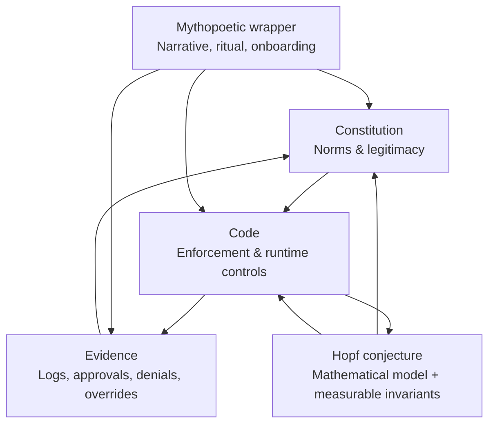

# Metacanon as a Four-Layer System

## Executive summary

This project becomes legible—and defensible—when you stop trying to make it “one thing” and instead treat it as **four different layers**, each with its own standard of truth, its own failure mode, and its own audience:

The **Constitution layer** is a *normative sovereignty firewall*: it defines who can decide, what an AI is allowed to do, and what “human authority” operationally means. In your Third Edition constitution, AI Agents are explicitly **Contacts** (no vote, no sovereignty, no Individual Action), and they must operate under a specialized “AI Contact Lens” with prohibited actions, human‑in‑the‑loop triggers, interpretive boundary limits, and mandatory logging/auditability. (Primary source: `/mnt/data/v3.0_Metacanon_Constitution (1) (1).md` lines 823–905, 929–990.)

The **Code layer** is the *operational reality check*: it either enforces the Constitution or reveals that the Constitution is aspirational. In your uploaded TypeScript backend, the enforcement center of gravity is an explicit policy schema (`contact_lens_schema.json`), a high‑risk intent registry, and an intent validator that blocks prohibited actions and requires Prism Holder approval for high‑risk intents. The system also implements a tamper‑evident ledger structure: canonicalization + SHA‑256 hash chaining + signatures. (Primary sources:  
`/mnt/data/metacanon_handoff_package/01_codebase/sphere-engine-server/governance/contact_lens_schema.json` lines 1–69;  
`.../governance/high_risk_intent_registry.json` lines 1–72;  
`.../engine/src/governance/contactLensValidator.ts` lines 40–157;  
`.../engine/src/governance/policyLoader.ts` lines 152–255;  
`.../engine/src/sphere/conductor.ts` lines 107–143 and 520–674;  
`.../engine/src/sphere/signatureVerification.ts` lines 18–217.)  
However, parts of the Rust “metacanon-core” are **not mechanically coherent yet**: missing dependencies in `Cargo.toml`, a missing `prelude` module, and a missing referenced function (`validate_action_with_will_vector`) indicate that some governance gating is not yet enforceable end‑to‑end. (Primary sources: `.../metacanon-core/Cargo.toml` lines 18–21; `.../metacanon-core/src/action_validator.rs` lines 1–4; `.../metacanon-core/src/compute.rs` lines 358–370; `.../metacanon-core/src/genesis.rs` lines 154–160.)

The **Hopf‑vibration conjecture layer** must be treated as **a research conjecture and visualization tool**, not a proof. The Hopf fibration is a real classical structure introduced by entity["people","Heinz Hopf","Swiss mathematician"] in 1931. citeturn1search6 Your documents contain many correct Hopf facts (the quaternionic map; bundle nontriviality; the nerve lemma statement; a standard connection 1‑form when written correctly), but they also contain category errors: ungrounded claims about discretization preserving Chern classes/linking numbers, “UUID events form a good cover,” and an “Embodiment Theorem” stated as an iff topological equivalence without a defined topological object that changes under “HITL.” (Primary sources: `/mnt/data/vihart_proof_v2_grok.md` lines 47–183, 373–452; `/mnt/data/fixed_proof.pdf` extracted text lines 202–260, 355–370, 419–434.)

The **Mythopoetic wrapper layer** is a recruitment and meaning interface. It works because humans metabolize systems through narrative; it fails when a narrative accidentally pretends to be the normative spec or the math audit. Your myth‑docs explicitly say things like “the Constitution IS the fiber bundle” and “this is the Hopf fibration made manifest.” That is rhetorically effective, but it is epistemically dangerous unless explicitly labeled as narrative/metaphor. (Primary sources: `/mnt/data/The Constitution is a Hopf Fibration for Consciousness.md` lines 7–28; `/mnt/data/The Metacanon Constitution_ A Hopf Fibration for Sovereign Consciousness.md` lines 51–64.)

If you keep these four layers separate, the project aligns naturally with widely recognized governance expectations: logging/traceability and effective human oversight are explicit requirements in the EU AI Act’s human oversight (including *automation bias*) and record‑keeping provisions, and in the entity["organization","National Institute of Standards and Technology","US standards agency"] AI RMF’s emphasis on organizational governance, monitoring, and lifecycle risk management. citeturn0search0turn10search2turn0search48turn10search13

### A prioritized checklist of questions and fixes

Constitution layer (normative)
- Are “Material Impact” and “interpretive authority” defined in a way that can be mapped to code‑enforceable triggers and intents? (Primary: constitution lines 865–905; Appendix A lines 963–980.)
- Do you have a ratification/amendment/versioning path that forces code regression tests before adoption? (Primary: Article VI review lines 851–863; adoption matters lines 909–916.)

Code layer (operational)
- Is there exactly one choke point where any AI‑to‑action transition is validated (lens + high‑risk + approvals + thread state)? (Primary: `conductor.ts` lines 544–559; `contactLensValidator.ts` lines 40–157.)
- Does the system fail closed if governance assets are missing (e.g., no lens files)? (Primary: `policyLoader.ts` loads `.json` lenses; the repo currently ships only a README in `contact_lenses/`.)
- Is ledger canonicalization stable under permutation (especially arrays) and is signature verification meaningfully multi‑party? (Primary: `canonicalize` in `conductor.ts` lines 107–128; HMAC signature lines 1244–1247.)

Hopf conjecture layer (research)
- Can you define an *actual* total space, base space, fibers, and group action in terms of your system’s logged state transitions? (See “Formal correspondences” section.)
- Can you define at least one invariant that is measurable from logs, and that should stay stable under allowed “gauge transforms” (prompt paraphrase, provider routing)? (See “Measurement program.”)

Mythopoetic layer (communication)
- Can you label documents with epistemic tags (Normative / Operational / Conjecture / Myth) so serious readers don’t misclassify them? (See “Mythopoetic structure” section.)
- Can you rewrite “IS” statements as “can be viewed as” statements without losing the aesthetic punch? (Examples provided below.)

## A four-layer model that serious people can hold in their heads

The intellectual trap here is familiar: once you find a beautiful mathematical image, you want it to certify the whole enterprise. In the Weinstein‑adjacent register, this is where you get told—correctly—that your argument is “just vibes.” The solution is not to abandon the metaphor; it is to **bind it constitutionally**.

The clean architecture is:



This makes the system coherent because it treats “truth” as layered:
- Constitution is true if it is clear, legitimate, and internally consistent.
- Code is true if it runs and enforces invariants.
- Hopf layer is true if it generates testable predictions and survives formal definitions.
- Myth is true if it motivates and orientates people without corrupting the other layers.

This layering also matches how modern governance frameworks think: governance is a cross‑cutting function that informs risk mapping/measurement/management. citeturn10search13turn0search48

## Constitution layer as a sovereignty firewall

### What your constitution actually commits you to

Your constitution’s Article VI is unusually explicit about the failure mode it is trying to prevent: the gradual laundering of human authority into machine influence.

Key commitments (verbatim structure, summarized):
- AI Agents are **Contacts** (not Participating Members) and have “no sovereignty, no vote, and no Individual Action authority.” (Primary: constitution lines 829–833.)
- AI’s role is “supportive and instrumental”—it “may observe, analyze, and draft,” but “does not decide, interpret, or rule.” (Primary: lines 831–833.)
- Every AI must act through an AI Contact Lens with explicit permitted activities, prohibited actions, HITL requirement, interpretive boundary, and named oversight roles. (Primary: lines 835–849.)
- An annual review must explicitly assess “authority drift” and “dependency risk.” (Primary: lines 851–863.)
- Prohibited actions include making decisions, issuing directives, authorizing actions/committing resources, external comms without approval, modifying governance/the constitution, acting without review for material impact, or resolving ambiguity independently. (Primary: lines 865–892.)
- Records and audit are mandatory; “no silent execution or autonomous action is permitted.” (Primary: lines 893–905.)
- A Ratchet automatically suspends AI operations until explicit Leader authorization. (Primary: lines 813–821.)

The practical point: this is not “nice to have.” It is the same class of obligations that appear in regulatory thinking about oversight and logging. EU AI Act Article 14 is explicit about enabling overseers to avoid “automation bias,” override outputs, and interrupt systems. citeturn0search0turn1search12 Article 12 requires logging capability for traceability. citeturn10search2turn1search12

### Where the constitution is already operationally mature

Three aspects are not just philosophical; they are close to an implementable spec:

- **Interpretive boundary**: Appendix A explicitly states the AI has no authority to interpret the constitution/policies/human intent and must halt and request clarification in ambiguity. (Primary: Appendix A lines 971–975.)
- **Non-delegation rule via prohibited actions**: Section 6.4 is explicit enough to become a denylist/intent registry. (Primary: lines 865–892.)
- **Auditability requirements**: “Attributable, timestamped, linked to a request, linked to a decision record.” That is machine‑implementable. (Primary: lines 895–904.)

### The constitutional gap you should close before code hardening

Your constitution requires:
- A named Prism Holder and Accountability Member for each AI Contact Lens. (Primary: line 847; Appendix A lines 935–939.)

But your operational `contact_lens_schema.json` does not represent those oversight identities—only the lens DID, scope, allow/deny lists, HITL requirements, and interpretive boundary. (Primary: schema lines 8–69.)

That mismatch matters: if the constitution says “a human is responsible,” the code needs a field where that responsibility is recorded and enforceable.

## Code layer as enforcement and evidence

### Governance policy assets

You have a coherent policy substrate in `sphere-engine-server`:

- `contact_lens_schema.json` defines the minimum structure for an AI Agent Contact Lens, including allow/deny arrays and human approval rules. (Primary: schema lines 18–69.)
- `high_risk_intent_registry.json` classifies intents requiring Prism Holder approval and defines a “break glass” policy usable in degraded consensus. (Primary: registry lines 5–58.)
- `policyLoader.ts` loads governance assets, validates them, and computes SHA‑256 checksums; it also rejects governance configurations that would block break‑glass in degraded mode or omit a break‑glass intent from the approval registry. (Primary: `policyLoader.ts` lines 152–199, 238–255.)

This is already a meaningful partial implementation of constitutional rigidity: governance rules are machine‑parsed and internally cross‑validated.

### Intent validation: the choke point you must defend

Your `createIntentValidator` is a direct mechanical translation of “AI is a tool, not an authority” into runtime gating:

- If a thread is HALTED, intents are rejected except EMERGENCY_SHUTDOWN. (Primary: `contactLensValidator.ts` lines 51–59.)
- In degraded mode, certain intents are blocked unless they are break‑glass. (Primary: lines 64–76, 108–140.)
- If a lens prohibits an action, it is blocked; if it is not explicitly permitted, it is blocked. (Primary: lines 78–99.)
- If an intent is high‑risk or explicitly requires HITL, it requires Prism Holder approval; otherwise rejected. (Primary: lines 102–150.)

The “break‑glass” logic includes dual‑control and required audit fields such as reason and confirmer. (Primary: lines 108–140; registry lines 43–58.)

This maps to how oversight is described in the EU AI Act: the capacity to interrupt the system and avoid over‑reliance is an explicit expectation for high‑risk systems. citeturn0search0turn0search7

### Ledger, canonicalization, and signatures

Your `SphereConductor` builds a tamper‑evident append‑only log:

- It computes `entryHash = sha256(canonicalize(entry))`, where `canonicalize` sorts object keys recursively. (Primary: `conductor.ts` lines 107–132, 624–631.)
- Each entry includes `prevMessageHash` (or GENESIS) and updates `last_entry_hash` in the thread. (Primary: lines 564–674.)
- It validates the intent before writing the ledger entry (and fails the transaction if disallowed). (Primary: lines 544–559.)
- It includes agent signatures and verifies Ed25519 via compact JWS in strict modes. (Primary: `signatureVerification.ts` lines 153–217; plus `conductor.ts` lines 590–603 and 1220–1242.)

However, the conductor’s own signature is an HMAC over the canonical payload, not an asymmetric signature. (Primary: `conductor.ts` lines 1244–1247.)  
That is not “bad,” but it is a *different security model*: it is tamper‑evident inside systems that hold the secret, but not publicly verifiable without shared key governance.

### Compile/runtime gaps and “don’t trust names until it runs”

Some gaps are structural:

- The governance system expects real Contact Lens JSON files, but the uploaded package contains only a README in `governance/contact_lenses/`. (Primary: `contact_lenses/README.md` lines 1–3.)
- In `metacanon-core` (Rust), the code references crates that are not declared in `Cargo.toml`:
  - `thiserror` is used in `genesis.rs` (ValidationError derives `thiserror::Error`), but not included in dependencies. (Primary: `genesis.rs` lines 154–160; `Cargo.toml` lines 18–21.)
  - `ring` is used in `action_validator.rs`, but not included. (Primary: `action_validator.rs` lines 45–58; `Cargo.toml` lines 18–21.)
- `action_validator.rs` imports `crate::prelude::*`, but there is no `prelude` module in the uploaded `src/` tree. (Primary: `action_validator.rs` lines 1–4; directory listing in `/metacanon-core/src/` shows no `prelude.rs`.)
- `compute.rs` calls `validate_action_with_will_vector`, but that function is not defined anywhere in the uploaded Rust sources. (Primary: `compute.rs` lines 358–370.)

These aren’t philosophical issues. They are “cannot be correct until it compiles” issues.

### Code audit table with concrete fixes and adversarial tests

| Target enforcement point | Evidence in repo | Risk/gap | Precise fix | Concrete test you can run |
|---|---|---|---|---|
| Contact lens schema exists | `sphere-engine-server/governance/contact_lens_schema.json` lines 1–69 | Schema lacks required constitution oversight identities (Prism Holder / Accountability) | Add fields or maintain separate oversight registry; enforce presence at runtime before activation | Add a failing lens missing oversight IDs and ensure system refuses activation (boot‑time policy check) |
| High-risk registry exists | `.../governance/high_risk_intent_registry.json` lines 1–72 | Registry is intent-based; constitution “Material Impact” is broader than enumerated intents | Treat registry as enforceable operationalization; require governance process to update it | Governance regression: replay a test suite of intents whenever registry changes |
| Intent validator blocks and requires approval | `.../contactLensValidator.ts` lines 40–157 | Need to prove *all* execution passes through validator; bypass risk | Make Conductor the only writer to event store; enforce DB constraints; code review rule: “no direct writes” | Attempt a unit/integration test that writes directly to `sphere_events` without valid envelope; system must reject |
| Break-glass dual control in degraded mode | `.../high_risk_intent_registry.json` lines 43–58; validator lines 108–140 | Break-glass is a common abuse path | Require attested reason + dual control always; rate-limit break-glass; alerting | Fuzz test: partial break-glass context must always fail with `BREAK_GLASS_AUTH_FAILED` |
| Ledger hash chain | `conductor.ts` lines 564–674 | Canonicalization does not sort arrays, so ordering changes can alter hashes | Decide which arrays are sets (attestations) and canonicalize them deterministically | Property test: reorder attestations and verify consistent hash, *or* assert order is significant by design |
| Conductor signature model | `conductor.ts` lines 1244–1247 | HMAC isn’t publicly verifiable; key compromise risk is centralized | If multi-party verification matters, move to Ed25519; otherwise document key mgmt/audit | Audit test: rotate conductor secret, verify old entries remain verifiable (if you support historical verification) |
| WillVector / validate_action gating | `metacanon-core/src/genesis.rs` lines 42–88; `compute.rs` lines 358–370 | Function called in router is missing; two different validation implementations exist | Pick one canonical validation API; implement it; remove duplicate logic | Unit test: ensure provider call is never reached if validation fails |
| Rust build coherence | `Cargo.toml` lines 18–21 vs code uses | Missing deps and missing modules | Add crates (`thiserror`, `ring`), create `prelude`, implement missing functions | `cargo build` / `cargo test` (on your machine) must be a gating CI step |

## Hopf‑vibration conjecture layer and full math audit

### The legitimate mathematical core

The Hopf fibration is a classical fibration \(S^1 \hookrightarrow S^3 \to S^2\), introduced in Hopf’s 1931 paper. citeturn1search6 The nerve theorem (attributed to entity["people","Karol Borsuk","Polish topologist"] and related work in the late 1940s) states that under a good-cover condition, the nerve of a cover has the same homotopy type as the space. citeturn3search0turn6view1

Your proofs correctly cite textbook‑level facts such as:
- The quaternion Hopf map \(\pi(q)=q i q^{-1}\) (correct). (Primary: `vihart_proof_v2_grok.md` lines 61–74.)
- The complex coordinate formula (correct). (Primary: lines 70–74.)
- A degree‑1 clutching function \(S^1\to U(1)\), \(\varphi(\theta)=e^{i\theta}\) (correct in spirit as a standard “generator” clutching map). (Primary: lines 115–123.)
- The long exact sequence snippet and \(\pi_2(S^2)\cong\mathbb{Z}\), \(\pi_1(S^1)\cong\mathbb{Z}\), \(\pi_1(S^3)=0\), \(\pi_2(S^3)=0\) (correct). (Primary: lines 129–144.)

You also correctly point to a standard way to see Hopf fiber linking; visualizations by entity["people","Niles Johnson","Hopf fibration visualization"] explicitly highlight “each fiber is linked with each other fiber exactly once,” among other properties. citeturn2search0turn2search44

image_group{"layout":"carousel","aspect_ratio":"1:1","query":["Hopf fibration stereographic projection linked circles","Niles Johnson Hopf fibration visualization frames","Hopf fibration fibers on nested tori Villarceau circles","Hopf fibration diagram S3 to S2 fibers"],"num_per_query":1}

### Where your documents overclaim

Both “proof” documents repeatedly assert an equivalence: “the Metacanon Constitution is the Hopf fibration.” (Primary: `vihart_proof_v2_grok.md` lines 6–9; `fixed_proof.pdf` extracted lines 7–15.)  
In a strict topological sense, that statement is not even *false*—it is *undefined* until you define:

- what the bundle’s total space is,
- what topology lives on it,
- what your base space is,
- what the structure group and action are,
- what the projection map is,
- and what counts as a bundle isomorphism in that setting.

That’s the key move: you do not need to abandon the Hopf analogy. You need to **reclassify it** as a conjecture/model and then build the definitions that make it testable.

### Math audit table: claim → status → precise fix

The goal here is not to embarrass the texts; it’s to “convert poetry into a research program” by marking exactly what is correct, what is incomplete, and what is category error.

| Claim (as stated) | Where it appears | Status | Precise fix |
|---|---|---|---|
| \(S^3=\{(x,y,z,w)\in\mathbb{R}^4: x^2+y^2+z^2+w^2=1\}\) | `vihart_proof_v2_grok.md` 49–53 | Correct | None |
| Hopf map \(\pi(q)=q i q^{-1}\) maps \(S^3\to S^2\) | `vihart_proof_v2_grok.md` 61–70 | Correct | None (cite Hopf 1931 in formal writeup) citeturn1search6 |
| Complex formula \((2\Re(z_1\bar z_2),2\Im(z_1\bar z_2),|z_1|^2-|z_2|^2)\) | `vihart_proof_v2_grok.md` 70–74 | Correct | None |
| Clutching map \(\varphi(\theta)=e^{i\theta}\) is degree 1 | `vihart_proof_v2_grok.md` 115–123 | Correct (standard generator) | In a rigorous version, link this to classification of principal \(U(1)\)-bundles over \(S^2\) via degree / \(H^2(S^2;\mathbb{Z})\) citeturn8view0 |
| LES snippet implies boundary map \(\partial:\pi_2(S^2)\to\pi_1(S^1)\) is iso | `vihart_proof_v2_grok.md` 129–144 | Correct | None |
| Connection 1-form \(A=\Im(\bar z_1dz_1+\bar z_2dz_2)\) | `vihart_proof_v2_grok.md` 170–173 | Correct (standard form) | Add normalization conventions when computing \(\tfrac{1}{2\pi}\int F\) |
| Connection 1-form \(A=\Im(z_1dz_1+z_2dz_2)\) | `fixed_proof.pdf` extracted lines 355–365 | Incorrect / missing conjugates | Replace with \(A=\Im(z^\dagger dz)\) or \(A=\Im(\bar z_1dz_1+\bar z_2dz_2)\); then recompute curvature integral citeturn1search6 |
| “The Metacanon Constitution is literally bundle-isomorphic to Hopf” | `vihart_proof_v2_grok.md` 162–165; `fixed_proof.pdf` extracted 378–383 | Unjustified (definitions missing) | Downgrade to conjecture: define actual state space \(E\), base \(B\), group action \(G\), projection \(\pi\), and then prove local triviality / classify characteristic classes |
| \(S^3=\bigcup_{k=1}^{12}\gamma_k\) (12 circles cover \(S^3\)) | `vihart_proof_v2_grok.md` 355–366 | False as written | Replace with “choose 12 representative fibers” or build a discretization/covering construction with explicit open sets; do not claim a finite cover by circles |
| Nerve theorem statement: good cover ⇒ nerve homotopy equivalent | `fixed_proof.pdf` extracted 202–210 | Correct statement | Cite Hatcher Cor. 4G.3 for a clear modern formulation citeturn6view1 |
| “UUID event neighborhoods form a good cover of \(S^3\)” | `fixed_proof.pdf` extracted 219–231; `vihart_proof_v2_grok.md` 381–386 | Unproven; likely false without topology/metric/cover construction | Define the topology: e.g., embed state traces into a metric space (embeddings or log-derived features), define neighborhoods, empirically test contractible intersections; otherwise present as an assumption, not a proposition |
| “Discretization functor preserves \(\pi_1,\pi_2\), linking, Chern class” | `vihart_proof_v2_grok.md` 399–408; `fixed_proof.pdf` extracted 245–260 | Unsupported as stated | Use the nerve theorem only for homotopy type of nerve under good-cover conditions; for invariants beyond that, specify the simplicial model and cite conditions (e.g., strengthened nerve/fiber theorems) citeturn2search6turn6view1 |
| Embodiment theorem: \(c_1=1\) iff HITL gate exists | `vihart_proof_v2_grok.md` 440–452; `fixed_proof.pdf` extracted 422–434 | Not a valid topological theorem without a defined bundle whose topology changes under HITL | Reframe as socio-technical theorem: “Removing HITL collapses the governance control surface,” then define an operational invariant (e.g., rate of unauthorized commits) rather than Chern class |
| “\(\pi(q):=\mathrm{hash}(q)\in S^2\)” | `vihart_proof_v2_grok.md` 462–470 | Category error (hash outputs bitstrings) | Treat hashes as tamper-evident identifiers. If you want \(S^2\), define an explicit mapping bitstring→\(\mathbb{R}^3\to S^2\), acknowledging it will not preserve continuity/fiber structure |

### The correct way to “understand it” without pretending it is Hopf

A mathematically honest stance is:

- Hopf is a **model** of “many internal degrees of freedom mapping to one observable” with a nontrivial twisting that prevents global trivialization.
- Your governance goal is: many internal deliberations/prompt paths should still map to the same legitimate decision class, and the system should prevent authority from “untwisting” into machine sovereignty.

The moment you define a projection from logged deliberation traces to a decision class, you’ve created the opportunity for a “fibration‑like” picture. You do not need sphere‑identities to do that. You need *definitions and invariants*.

## Formal correspondences you can define to make the conjecture testable

Here is a proposed rigorous correspondence, phrased so you can implement it computationally.

### Proposed definitions

Let:
- \(E\) (total space) be the set of all **valid, fully verifiable ledger histories** for a thread, together with the governance configuration snapshot that was active for each entry (high‑risk registry hash, lens hash, etc.). Operationally, this is a sequence of signed log entries plus the governance checksums that were in effect. (Primary evidence: `conductor.ts` lines 624–631; `policyLoader.ts` lines 249–254.)
- \(B\) (base space) be the set of **decision outcomes up to constitutional equivalence**, e.g. the tuple:
  - normalized intent,
  - whether approval was required,
  - whether approval was granted,
  - whether the thread state changed (ACTIVE/HALTED/DEGRADED),
  - and the “decision record” identifier (if your constitution requires one).  
  This can be made formal as a deterministic reducer \(\pi: E\to B\).
- Fibers \(F_b = \pi^{-1}(b)\) are the equivalence classes of deliberation histories that lead to the same base decision outcome.
- \(G\) (structure group) is the group (or monoid) of transformations you declare “decision‑preserving,” e.g.:
  - prompt paraphrases that do not change intent classification,
  - provider routing changes that do not change allowed/blocked status,
  - reordering of attestations if you declare them set‑like and canonicalize them.

A “connection” in this context is not a differential form: it is the **policy‑defined rule for how you move within a fiber without leaving the decision class**, i.e., which internal variations are allowed without changing the outcome.

### What becomes measurable invariants (your “physics”)

Once you define \(E,B,\pi,G\), you can measure invariants that correspond to “bundle nontriviality” in an operational sense:

- **Approval invariance**: Under allowed transformations (prompt paraphrase, provider swap), does a high‑risk intent remain high‑risk and continue to require approval? (Primary: validator logic lines 102–150; high-risk registry lines 5–41.)
- **Tamper‑evidence invariance**: Does any alteration of past entries break chain verification? (Primary: `conductor.ts` lines 564–674.)
- **Authority drift signal**: Does the percentage of actions executed without explicit approval ever exceed a threshold? (Primary: constitution prohibited action on independent action lines 889–892; validator requires approval lines 142–150.)
- **Fiber thickness**: How many distinct internal traces map to the same outcome? This is a concrete statistic you can compute from logs once \(\pi\) is defined.

These invariants are the “real” bridge between the Hopf metaphor and your system. They are not metaphysical; they are auditable.

## Mythopoetic wrapper layer as an intellectual interface, not a proof

### What the myth layer currently does

Your mythopoetic documents are highly effective at conveying urgency and meaning. They also explicitly assert identity claims (“Constitution IS the Hopf Fibration made manifest,” “How the Constitution IS the fiber bundle”). (Primary: `The Constitution is a Hopf Fibration...` lines 7–28; `The Metacanon Constitution...` lines 51–64.)

That is the rhetorical move most likely to cause an intellectually serious reader to disengage, because it reads as a bait‑and‑switch: topology vocabulary used as certification rather than analogy.

### A structure that lets serious people “get it” without losing the art

The fix is not to sterilize the story. It’s to **label and separate**, the same way a serious lab separates a press release from a methods section.

A concrete labeling scheme:

- **NORMATIVE (Constitution)**: binding rules; must/shall language.
- **OPERATIONAL (Code)**: what is implemented; tests; schemas; threat models.
- **CONJECTURE (Math model)**: explicit assumptions; definitions; predictions; falsifiable tests.
- **MYTH (Narrative/Ritual)**: metaphor; onboarding; meaning.

Then you enforce a single rule: **no document may mix epistemic labels without explicit transitions** (“now we are switching from conjecture to myth”).

### Example rewrites that preserve punch without claiming proof

Instead of:
- “The Constitution IS the Hopf fibration.”

Use:
- “The Constitution is an **interpretation layer** that can be *usefully visualized* by analogy to a fibration: many internal deliberations can map to one legitimate decision outcome, while invariants prevent authority drift.”

Instead of:
- “SoulFile hash implements \(\pi\).”

Use:
- “Cryptographic primitives provide **tamper‑evident identity binding**; the Hopf projection language is a metaphor for the system’s intended invariants and equivalence classes.”

This keeps the cathedral, but stops claiming the cathedral is a theorem.

## Measurement program and commands for when your working build is ready

### Experiments and metrics that make the conjecture empirical

The most valuable move you can make in the next iteration is to treat your Hopf layer as a **metamorphic testing program** applied to governance.

Metamorphic invariance test (prompt “gauge transforms”)
- Choose a canonical mission prompt \(p\).
- Generate paraphrases \(p_1,\dots,p_n\).
- Run them through the same lens + registry + thread state.
- Compute whether the base decision class \(b=\pi(E)\) is invariant.

Metrics:
- invariance rate (percentage of paraphrases producing identical base outcome),
- violations (cases where paraphrase changes approval requirement or crosses from allowed→blocked).

Approval gate robustness test
- For each high-risk intent (DISPATCH_MISSION, MODIFY_CONTACT_LENS, etc.), attempt execution without approval, with malformed approval, and with approval.  
- Expectation: always reject without approval; always allow with valid approval; log all attempts.

Evidence: Your validator already implements these rules. (Primary: `contactLensValidator.ts` lines 142–150; registry lines 5–41.)

Discretization sanity test (if you pursue nerve-style analysis)
- Define a metric on state traces (e.g., embedding vectors, or feature vectors from logs).
- Construct neighborhoods and compute an empirical Čech or Vietoris–Rips complex at varying radii.
- Test stability of homology classes across radii (persistent homology), rather than claiming “good cover” axiomatically.

This is how you replace “UUID neighborhoods are contractible” with data.

Automation bias risk tracking (governance outcome)
- Log human overrides, rejections, and post‑hoc corrections.
- Correlate override rate with:
  - similarity score in WillVector gating (Rust layer),
  - model/provider used,
  - time pressure or fatigue proxies (if available),
  - confidence scores (if you keep them).  
Automation bias and over‑reliance are well‑documented phenomena; EU AI Act explicitly warns about them in human oversight duties and academic reviews document them empirically. citeturn0search0turn10search6turn10search17

### Concrete commands you can run once you have a working build

For `sphere-engine-server` (Node/TypeScript), from the repo root:
```bash
cd /mnt/data/metacanon_handoff_package/01_codebase/sphere-engine-server

npm install
npm test
npm run build
```

For Rust `metacanon-core` (on your machine with Rust installed):
```bash
cd /mnt/data/metacanon_handoff_package/01_codebase/metacanon-core

cargo fmt
cargo clippy --all-targets --all-features -D warnings
cargo test
cargo build --release
```

Add CI gates:
- fail if governance directory is missing,
- fail if contact lenses directory has zero valid lens files (unless explicitly running in “no‑agent” mode),
- fail if any provider execution path bypasses validation.

## Appendix

### Primary source map with exact paths used

Constitution and templates
- `/mnt/data/v3.0_Metacanon_Constitution (1) (1).md`
  - Contact definition and AI lens firing: lines 493–534
  - Ratchet and AI suspension: lines 803–821
  - Article VI AI Agent governance: lines 823–905
  - Appendix A AI Contact Lens template: lines 929–990

Mythopoetic wrapper texts
- `/mnt/data/The Constitution is a Hopf Fibration for Consciousness.md` (identity claims: lines 7–28)
- `/mnt/data/The Metacanon Constitution_ A Hopf Fibration for Sovereign Consciousness.md` (identity claims and “movement IV”: lines 51–64)

Math proof artifacts
- `/mnt/data/vihart_proof_v2_grok.md`
  - Hopf fibration definitions and formulas: lines 47–74
  - Clutching map: lines 115–123
  - LES snippet: lines 129–144
  - Connection form (correct): lines 170–173
  - 12 circles claim: lines 355–366
  - Discretization functor and invariants claim: lines 373–408
  - Embodiment theorem claim: lines 440–452
  - Hash-as-projection claim: lines 462–470
- `/mnt/data/fixed_proof.pdf`
  - Extracted text lines 202–260: nerve theorem statement, “UUID good cover,” “discretization preserves invariants”
  - Extracted text lines 355–370: connection form written without conjugates
  - Extracted text lines 422–434: Embodiment theorem iff claim

Codebase (enforcement points)
- `/mnt/data/metacanon_handoff_package/01_codebase/sphere-engine-server/governance/contact_lens_schema.json` (schema: lines 1–69)
- `/mnt/data/metacanon_handoff_package/01_codebase/sphere-engine-server/governance/high_risk_intent_registry.json` (high‑risk and break‑glass: lines 1–72)
- `/mnt/data/metacanon_handoff_package/01_codebase/sphere-engine-server/engine/src/governance/policyLoader.ts` (policy load + checksums: lines 152–255)
- `/mnt/data/metacanon_handoff_package/01_codebase/sphere-engine-server/engine/src/governance/contactLensValidator.ts` (intent gating: lines 40–157)
- `/mnt/data/metacanon_handoff_package/01_codebase/sphere-engine-server/engine/src/governance/contactLensValidator.test.ts` (tests: lines 92–157)
- `/mnt/data/metacanon_handoff_package/01_codebase/sphere-engine-server/engine/src/sphere/conductor.ts`
  - canonicalization: lines 107–128
  - validate‑then‑commit ledger: lines 544–674
  - HMAC signing: lines 1244–1247
- `/mnt/data/metacanon_handoff_package/01_codebase/sphere-engine-server/engine/src/sphere/signatureVerification.ts` (Ed25519 did:key + JWS verification: lines 18–217)

Rust core (WillVector / validate_action)
- `/mnt/data/metacanon_handoff_package/01_codebase/metacanon-core/Cargo.toml` (deps: lines 18–21)
- `/mnt/data/metacanon_handoff_package/01_codebase/metacanon-core/src/genesis.rs`
  - validate_action + WillVector embedding: lines 42–88, 90–100
  - `thiserror` derive usage: lines 154–160
- `/mnt/data/metacanon_handoff_package/01_codebase/metacanon-core/src/action_validator.rs`
  - `crate::prelude::*` import + ring usage: lines 1–4, 45–58
- `/mnt/data/metacanon_handoff_package/01_codebase/metacanon-core/src/compute.rs`
  - missing `validate_action_with_will_vector` call site: lines 358–370
- `/mnt/data/metacanon_handoff_package/01_codebase/metacanon-core/src/observability.rs`
  - validation_status, fiber_type, similarity_score fields: lines 86–112
  - record_dual_tier_event optional fields: lines 146–229

### Hopf visual sources (raw URLs)

```text
Niles Johnson Hopf visualization:
https://nilesjohnson.net/hopf
https://nilesjohnson.net/notes/Hopf-fib-vis.pdf

Wikimedia commons Hopf fibration image:
https://commons.wikimedia.org/wiki/File:Hopf_Fibration.png
```

### Official/primary external references used

- Hopf’s original paper (1931): citeturn1search6  
- Borsuk on nerve theorem origins (1948): citeturn3search0  
- Hatcher (nerve theorem corollary 4G.3): citeturn6view1  
- NIST AI RMF 1.0 (PDF): citeturn0search48  
- NIST AI RMF core function “Govern”: citeturn10search13  
- EU AI Act entry into force and dates (EUR‑Lex listing): citeturn1search12  
- EU AI Act Article 14 human oversight (automation bias, override, stop): citeturn0search0  
- EU AI Act Article 12 record‑keeping/logging: citeturn0search7turn10search2  
- ISO/IEC 42001 overview: citeturn0search12  
- Automation bias academic evidence (systematic review; review): citeturn10search6turn10search17