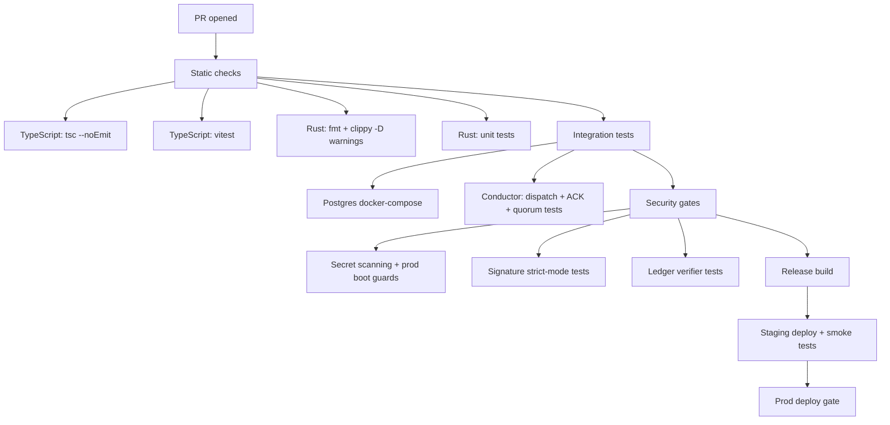

# Metacanon Code Layer Enterprise Readiness Report

## Executive summary

This report evaluates **only** the code layer of the uploaded snapshot (local time zone America/Denver; current date March 7, 2026): the **TypeScript/Node** backend in `sphere-engine-server` and the **Rust** core in `metacanon-core`.

The enterprise-readiness question is not “does it look principled?” but:

> Can this code reliably enforce governance constraints, produce audit-grade evidence, resist adversarial attempts to bypass controls, and operate as a maintainable system under a secure SDLC?

### Key findings

**sphere-engine-server has a real governance enforcement spine**, centered on:
- an explicit policy surface (`high_risk_intent_registry.json`, contact lens schema + loader),
- a runtime validator (`createIntentValidator`) that gates intents by lens allow/deny, degraded mode constraints, and Prism Holder approval,
- a commit boundary (`SphereConductor.dispatchIntent`) that validates **before** writing append-only events into Postgres,
- an immutable-ish audit log structure (canonicalization + hash chaining + signature verification framework).  
Primary sources: `policyLoader.ts` L152–L255; `contactLensValidator.ts` L40–L157; `conductor.ts` L510–L721; `signatureVerification.ts` L153–L218.

However, this snapshot contains **enterprise-blocking issues** in the same system:

1) **Fail-open governance when a Contact Lens is missing**  
`policyLoader.ts` allows the contact lens directory to be empty, and `contactLensValidator.ts` skips allow/deny checks when `lens` is absent; only high-risk approval checks remain. That means low/medium intents could be accepted without any contact-lens boundary.  
Primary sources: `policyLoader.ts` L218–L236; `contactLensValidator.ts` L49–L106.

2) **“Material impact quorum” is forgeable in current form**  
The counsel quorum check for material-impact intents uses an *input-provided* `attestation` list of counselor DIDs. Because the list is not itself a set of signed counselor approvals, a malicious caller can include active counselor DIDs and satisfy quorum without any actual counselor action. The codebase already has a signed ACK subsystem (`acknowledgeEntry`), but the quorum enforcement does not use it.  
Primary sources: `conductor.ts` L560–L563; `conductor.ts` L1127–L1152; `conductor.ts` L835–L1003.

3) **Production secret hygiene and signature strictness are not enforced**  
`env.ts` provides default “dev” secrets (notably `CONDUCTOR_PRIVATE_KEY`), and defaults signature verification to `did_key`, not `strict`. Only one production guard exists (stub fallback).  
Primary source: `env.ts` L19–L36; L97–L101.

**metacanon-core is not enterprise-ready as a codebase in this snapshot**, because it is not mechanically coherent:

- `Cargo.toml` is missing multiple crates already used by the code (`thiserror`, `ring`, `aes-gcm`, `rand`, and `uuid` for tests).  
Primary sources: `Cargo.toml` L18–L21; `genesis.rs` L154; `action_validator.rs` L51; `secrets.rs` L1–L4; `storage.rs` L6, L58.

- There are missing symbols/modules and API mismatches that imply compilation failure:
  - `crate::prelude::*` is referenced in multiple modules but no such module exists.  
    Primary sources: `action_validator.rs` L3; `compute_router.rs` L1.
  - `validate_action_with_will_vector` is imported and called but not defined in the visible module graph.  
    Primary source: `compute.rs` L6, L368–L370.
  - test suites depend on absent “deliverables/” files and placeholder provider code, implying tests will fail even after compilation.  
    Primary sources: `constitutional-invariants.contract.test.js` L6–L10; `observability-retention.contract.test.js` L6–L9; `providers/morpheus.rs` L1.

### Why these matter to enterprise readiness

Enterprise-grade AI governance requires **auditability** and **effective oversight**. The **EU AI Act** requires high-risk systems to allow automatic recording of events/logs (Article 12) and human oversight that includes awareness of automation bias and the ability to override/stop the system (Article 14). citeturn4view0turn4view3

The primitives you’ve built (validators + logs + signatures) are in the right family. But until the system is fail-closed, non-bypassable, and cryptographically/verifiably attributable, it can’t credibly claim enterprise readiness.

### Readiness rating for this snapshot

| Component | Current maturity (snapshot) | Enterprise blockers that must be cleared |
|---|---|---|
| sphere-engine-server | **Staging prototype** (strong architecture; real validation boundary) | fail-open lens handling; forgeable quorum attestations; prod secret defaults; canonicalization semantics; strict signature enforcement |
| metacanon-core | **Non-buildable prototype** (conceptual scaffolding; incomplete integration) | missing crates/modules; missing functions; conflicting router types; tests tied to missing deliverables; placeholder providers |

This posture is consistent with a governance-first, lifecycle risk framing: the **National Institute of Standards and Technology AI RMF** emphasizes operationalization, governance, measurement, and robustness across deployment lifecycles. citeturn0search0

## Codebase scope and enterprise-relevant architecture

This report focuses on two roots:

- `.../01_codebase/sphere-engine-server/`  
- `.../01_codebase/metacanon-core/`

### sphere-engine-server: the governance enforcement loop

The core loop is:

1) Load governance policies (`loadGovernancePolicies`) → build normalized maps and checksums.  
Primary source: `engine/src/governance/policyLoader.ts` L152–L255.

2) Validate any intent against thread state + degraded mode + lens allow/deny + approval requirements + break-glass controls.  
Primary source: `engine/src/governance/contactLensValidator.ts` L40–L157.

3) Commit an event only after validation; chain entries via hashes; attach signatures; store in Postgres in a transaction.  
Primary source: `engine/src/sphere/conductor.ts` L510–L721.

This closely resembles what external governance regimes demand at a systems level: **logging** and **human oversight** are explicitly technical requirements for high-risk systems in EU AI Act Articles 12 and 14. citeturn4view0turn4view1turn4view3

### metacanon-core: intended enforcement point

The intended invariants in Rust are:
- **pre-validation before provider execution** (WillVector gating),
- provider routing with “fiber types,”
- dual-tier observability concepts.

However, the codebase currently contains parallel implementations and missing compilation targets, so the invariant is not reliably enforceable yet.  
Primary sources: `genesis.rs` L43–L88; `compute.rs` L358–L402; `action_validator.rs` L1–L42; `lib.rs` L4–L22.

## Detailed code audit mapping enforcement points

The table below maps “enterprise governance enforcement points” to exact file paths and line ranges, and specifies the primary risk and hardening requirement.

### Enforcement map table

| Enforcement point | What it currently does | Primary source (path + lines) | Severity | Enterprise hardening requirement |
|---|---|---|---|---|
| Contact lens schema | Defines lens structure fields; does **not** bind oversight identities or issuer signature | `sphere-engine-server/governance/contact_lens_schema.json` L1–L69 | High | Add lens version, issuer identity, and signature (or registry binding); enforce at load time |
| High-risk registry | Defines intents requiring approval; defines break-glass policy and degraded-mode blocked intents | `sphere-engine-server/governance/high_risk_intent_registry.json` L1–L72 | Medium | Version/sign registry and embed registry hash into every event |
| Policy loader | Loads registries; validates break-glass coherence; loads lens JSON files; hashes artifacts | `engine/src/governance/policyLoader.ts` L152–L255 | **Critical** | Fail closed when no lenses exist (or explicit no-agent mode); require minimum policy artifacts |
| Intent validator | Enforces HALTED/degraded; enforces lens allow/deny if lens present; enforces approval for high-risk/HITL; enforces break-glass controls in degraded | `engine/src/governance/contactLensValidator.ts` L40–L157 | **Critical** | Reject intents when lens missing; reject “permit all” lens unless explicitly allowed; unify break-glass semantics |
| Validator tests | Tests high-risk approval and degraded-mode break-glass dual control | `engine/src/governance/contactLensValidator.test.ts` L92–L157 | High | Add tests for missing lens and empty allowlist; add fuzz/property tests |
| Commit boundary (Conductor) | Validates intent before commit; writes hash-chained events; updates thread head; uses transactions | `engine/src/sphere/conductor.ts` L510–L721 | High | Prove no bypass writes; embed governance hash snapshot into entry |
| Canonicalization | Sorts object keys recursively, **does not sort arrays** | `engine/src/sphere/conductor.ts` L107–L128 | High | Decide which arrays are sets; canonicalize accordingly; add property tests |
| Material impact config | Parses governance.yaml (manual parser) and defines material-impact intents + quorum count | `governance/governance.yaml` L1–L7; `engine/src/governance/governanceConfig.ts` L31–L81; L110–L121 | Medium | Version/sign governance.yaml; embed hash in ledger; add parser robustness tests |
| Counsel quorum enforcement | Intersects input attestation DIDs with active counselors; does not verify counselors signed anything | `engine/src/sphere/conductor.ts` L1127–L1152 | **Critical** | Replace with signed ACK-based quorum (actor-signed approvals) |
| Signed acknowledgements | Allows signed ACK entries stored in `sphere_acks` table; uses signature verification pipeline | `engine/src/sphere/conductor.ts` L835–L1003 | Medium | Make material-impact approval reference ACKs, not free-form strings |
| Agent signature verification | Verifies compact JWS EdDSA and enforces canonical payload match; supports did:key | `engine/src/sphere/signatureVerification.ts` L18–L218 | Medium | Require strict mode in production; add key rotation and DID key registry policies |
| Conductor signing | Uses HMAC-SHA256 with a “conductor secret” | `engine/src/sphere/conductor.ts` L1244–L1247 | High | Decide if non-repudiation is required; if yes, migrate to Ed25519 signature with key IDs |
| Production secrets | Provides default dev secrets and does not enforce strong production constraints | `engine/src/config/env.ts` L19–L36; L97–L101 | **Critical** | Production boot must fail on default secrets; require strict sig verification in prod |
| WillVector pre-validation (Rust) | Implements `SoulFile.validate_action` gating; placeholder embeddings | `metacanon-core/src/genesis.rs` L43–L88 | Medium | Consolidate into one validator API and ensure all provider calls depend on it |
| Provider routing pre-validation (Rust) | Calls `validate_action_with_will_vector` before provider chain | `metacanon-core/src/compute.rs` L358–L402 | **Critical** | Implement the referenced function and prove no bypass paths exist |
| Missing prelude module | Multiple modules import `crate::prelude::*` but it doesn’t exist | `metacanon-core/src/action_validator.rs` L3; `metacanon-core/src/compute_router.rs` L1 | **Critical** | Add `prelude.rs` or remove imports; consolidate types |
| Missing dependencies (Rust) | Missing crates used in code (`thiserror`, `ring`, `aes-gcm`, `rand`, `uuid`) | `metacanon-core/Cargo.toml` L18–L21 vs `genesis.rs` L154; `action_validator.rs` L51; `secrets.rs` L1–L4; `storage.rs` L6, L58 | **Critical** | Add the required dependencies; implement CI build gate |
| Contract tests depend on missing deliverables | Tests read `deliverables/` files that do not exist in snapshot | `metacanon-core/tests/constitutional-invariants.contract.test.js` L6–L10; `observability-retention.contract.test.js` L6–L9 | High | Either include deliverables in repo or refactor tests to behavioral assertions |

## Compile/runtime gaps and precise fixes

This section is pragmatic: “here is what will break, and how to patch it.”

### sphere-engine-server fixes

#### Fail closed when a lens is missing (critical)

**Problem:** `lens` is optional and allow/deny checks are skipped when absent; `policyLoader` allows empty lens directory.  
Primary sources: `policyLoader.ts` L218–L236; `contactLensValidator.ts` L49–L106.

**Fix (suggested edit):** enforce lens existence for non-breakglass intents.

```ts
// engine/src/governance/contactLensValidator.ts
// Add 'LENS_NOT_FOUND' to result code union and enforce fail-closed.

const lens = policies.contactLensesByDid.get(input.agentDid);

const isBreakGlassIntent =
  normalize(policies.highRiskRegistry.breakGlassPolicy.intent) === normalizedIntent;

if (!lens && !isBreakGlassIntent) {
  return {
    allowed: false,
    code: 'LENS_NOT_FOUND',
    message: `No contact lens configured for agent ${input.agentDid}.`,
    requiresApproval: false,
    highRisk
  };
}
```

**Acceptance test:** a vitest that dispatches any normal intent for an unknown agent DID must be rejected with `LENS_NOT_FOUND`.

#### Deny-by-default on empty `permittedActivities` (critical)

**Problem:** if `permittedActivities` is empty, the validator treats it as “permit all” (because it only checks membership when length > 0).  
Primary source: `contactLensValidator.ts` L90–L99.

**Fix:** either require `permittedActivities` to be `.min(1)` in the loader schema, or treat empty as deny-all unless explicitly configured.

Loader-side hardening (preferred):
```ts
// policyLoader.ts - tighten contactLensSchema
permittedActivities: z.array(z.string().min(1)).min(1),
prohibitedActions: z.array(z.string().min(1)),
```

**Acceptance test:** lens file with empty permittedActivities must fail load.

#### Production boot must fail on default secrets and non-strict signature verification (critical)

**Problem:** `CONDUCTOR_PRIVATE_KEY` defaults to `dev-conductor-secret`; signature verification defaults to `did_key`. Only stub fallback is prevented in production.  
Primary source: `env.ts` L19–L36; L97–L101.

**Fix:** production guard.

```ts
// engine/src/config/env.ts
if (parsedEnv.RUNTIME_ENV === 'production') {
  if (parsedEnv.CONDUCTOR_PRIVATE_KEY === 'dev-conductor-secret') {
    throw new Error('CONDUCTOR_PRIVATE_KEY must be set (non-default) in production.');
  }
  if (parsedEnv.SPHERE_SIGNATURE_VERIFICATION !== 'strict') {
    throw new Error('SPHERE_SIGNATURE_VERIFICATION must be strict in production.');
  }
}
```

This is the simplest way to align with rigorous key-handling expectations from **NIST key management guidance**. citeturn1search5turn1search3

#### Replace forgeable quorum attestations with signed ACK quorum (critical)

**Problem:** `enforceCounselQuorum` uses the caller-provided attestation array of DIDs and checks only that those DIDs are active counselors.  
Primary source: `conductor.ts` L1127–L1152.

**Fix:** require signed approvals via the ACK subsystem. You already have:
- a signed `acknowledgeEntry` pipeline with signature verification (actor DID may be did:key or registered), and a uniqueness constraint per actor/target.  
Primary source: `conductor.ts` L835–L1003.

**Design sketch:**
- For any material-impact intent message ID `M`, query `sphere_acks` for target `M`, filter actor_did ∈ active counselor set, verify signatures, and require quorumCount unique counselor actors.

This eliminates “self-asserted attestations” and replaces them with “attestable signed approvals.”

**Acceptance test:** attempt material-impact dispatch with no corresponding counselor ACKs must fail; with quorum ACKs must pass.

#### Bind governance policy hashes into the ledger entry (high)

**Problem:** `policyLoader` computes checksums, but the ledger entry does not include a snapshot of those checksums.  
Primary source: `policyLoader.ts` L238–L255; `conductor.ts` L624–L632.

**Fix:** include `governanceHash` fields in `ledgerEnvelope` or payload (preferred in ledger envelope to keep payload app-level).

```ts
type LedgerEnvelope = {
  schemaVersion: string;
  sequence: number;
  prevMessageHash: string;
  timestamp: string;
  conductorSignature: string;
  governance: {
    highRiskRegistryHash: string;
    lensPackHash: string; // e.g. combined of contact lenses
    governanceYamlHash: string;
  };
};
```

Then update `entryHash = sha256(canonicalize(entry))` to cover it.

This aligns with the EU AI Act’s emphasis on logs enabling traceability and post-hoc interpretation. citeturn4view0turn4view2

#### Canonicalization semantics for arrays (high)

**Problem:** `canonicalize` sorts object keys but preserves array order.  
Primary source: `conductor.ts` L107–L128.

If arrays are semantically sets (e.g., `attestation`), this produces hash instability and audit disputes.

**Fix:** define canonicalization rules:
- set-like arrays: sort lexicographically.
- ordered arrays: preserve order but document it as meaningful.

Add tests accordingly (see “property tests”).

### metacanon-core fixes

#### Make the crate buildable (critical dependency patch)

**Problem:** `Cargo.toml` lacks dependencies used in code.  
Primary sources: `Cargo.toml` L18–L21; `genesis.rs` L154; `action_validator.rs` L51; `secrets.rs` L1–L4; `storage.rs` L6, L58.

**Suggested `Cargo.toml` patch:**

```toml
[dependencies]
reqwest = { version = "0.12", default-features = false, features = ["blocking", "json", "rustls-tls"] }
serde = { version = "1", features = ["derive"] }
serde_json = "1"

thiserror = "1"
ring = "0.17"
aes-gcm = "0.10"
rand = "0.8"

[dev-dependencies]
uuid = { version = "1", features = ["v4"] }
```

#### Add `prelude.rs` or remove `crate::prelude::*` imports (critical)

**Problem:** `crate::prelude::*` is referenced but no module exists.  
Primary sources: `action_validator.rs` L3; `compute_router.rs` L1.

**Fix option A (simplest):** create `src/prelude.rs` to re-export shared types.

```rust
// src/prelude.rs
pub use crate::genesis::{ActionSpace, WillVector, ValidationError, SoulFile};
```

Then add to `lib.rs`:

```rust
pub mod prelude;
```

**Fix option B:** remove these imports and import required symbols directly.

#### Implement `validate_action_with_will_vector` and re-export it (critical)

**Problem:** referenced and called but missing.  
Primary source: `compute.rs` L6; L368–L370.

**Fix:** implement a single source of truth in `genesis.rs` (or a new `validation.rs`) and re-export from crate root.

Example skeleton (engineering-first):
```rust
// src/validation.rs
use crate::genesis::{ActionSpace, WillVector};

#[derive(Debug, thiserror::Error)]
pub enum ValidationError {
    #[error("Prompt cannot be empty.")]
    EmptyPrompt,
    #[error("Action blocked by WillVector: {0}")]
    BlockedByWillVector(String),
}

pub fn validate_action_with_will_vector(action: &ActionSpace, will_vector: &WillVector) -> Result<f32, ValidationError> {
    if action.content.trim().is_empty() {
        return Err(ValidationError::EmptyPrompt);
    }
    // TODO: replace with embedding-model call and ensure space compatibility
    let action_embedding = derive_action_embedding(&action.content);
    let similarity = cosine_similarity(&will_vector.embedding, &action_embedding);
    if similarity >= 0.8 { Ok(similarity) } else { Err(ValidationError::BlockedByWillVector(format!("{similarity}"))) }
}
```

Then update the crate root export path.

#### Fix broken tests and “deliverables contract” tests (high)

The Node contract tests in `metacanon-core/tests/` unconditionally read files under `deliverables/`, which do not exist in the snapshot.  
Primary sources: `constitutional-invariants.contract.test.js` L6–L10; `observability-retention.contract.test.js` L6–L9; directory absence implied by error.

**Fix:** either:
- include the referenced deliverables files in the repository; or
- rewrite contract tests as behavioral/structural tests that assert actual code behavior, not the presence of external markdown.

Additionally, `storage.rs` unit test constructs a `SoulFile` without the `consensus_settings` field now required by the struct.  
Primary sources: `genesis.rs` L39–L40; `storage.rs` L67–L80.

Patch `storage.rs` test to include `consensus_settings: ConsensusSettings::default()`.

## Persona-driven enterprise-quality demand lists

This section uses three archetypes—Steve Jobs, Elon Musk, Eric Weinstein—to apply three different lenses on “enterprise quality.” This is not impersonation; it’s a structured review style.

### Steve Jobs archetype: product clarity, trustworthiness, and “no surprises”

**Prioritized implementation items**
- **Fail-closed defaults** everywhere: no lens → no action; empty allowlist → no action; default secrets → boot fails.
- A “one-way door” UI/SDK contract: every intent produces an auditable result code, and error messages are human-readable.
- A coherent configuration story: one governance root, one environment schema, one place to see policy versions and hashes.

**Required tests**
- End-to-end “golden path”: load governance → dispatch allowed intent → verify ledger chain advances.
- “Cold start safety”: start with missing lenses and ensure system refuses all non-breakglass execution.
- “Operator comprehension”: snapshot test of returned error payloads (stable codes + messages).

**CI gating rules**
- No merges if:
  - prod boot guards aren’t enforced,
  - governance assets aren’t present and validated,
  - high-risk approval tests fail.

**Threat model focus**
- Misconfiguration is the primary enemy: enterprise outages often come from “it started with defaults.”

**Acceptance criteria**
- A new operator can deploy with a single “known good policy pack” and can explain the audit trail after the first incident.

### Elon Musk archetype: ship it, harden it, survive partial failure

**Prioritized implementation items**
- Replace forgeable quorum attestations with signed ACK-based quorum.
- Enforce that **no DB writes** to `sphere_events` can occur except via conductor (DB role separation).
- Deterministic canonicalization policy (arrays/sets) to prevent audit disputes.
- Concurrency correctness: sequence monotonicity and idempotency under contention.

**Required tests**
- Integration tests against real Postgres:
  - 100 concurrent `dispatchIntent` calls to the same thread: verify no holes, no duplicates, no chain corruption.
- Chaos tests:
  - DB timeout mid-transaction must rollback cleanly.
- Load tests:
  - measure p95 latency for `dispatchIntent` and ensure it stays within SLA under typical throughput.

**CI gating rules**
- PR cannot merge without:
  - integration tests (docker-compose Postgres),
  - “no bypass writes” static scan rule,
  - signature verification strict-mode tests.

**Threat model focus**
- The adversary is reality: partial outages, concurrency, and operational drift.

**Acceptance criteria**
- Under simulated 1% random faults (timeouts, provider failures), the system never commits an unvalidated intent and never corrupts the ledger.

### Eric Weinstein archetype: invariants, formal interfaces, and audit semantics

**Prioritized implementation items**
- Make the governance boundary an explicit theorem:
  - all commits are validated,
  - every validation has a logged code,
  - every commit is replayable and verifiable.
- Bind governance policy hashes into ledger entries (the “which rules applied?” problem).
- Unify signature semantics:
  - what does a conductor signature mean,
  - what does agent signature mean,
  - what is the trust boundary.

**Required tests**
- Property tests:
  - canonicalization invariance under JSON key ordering;
  - if attestations are sets, invariance under permutation.
- Metamorphic tests for validator:
  - casing/whitespace changes must not change allow/deny for intents.
- Non-bypass proofs-by-test:
  - runtime asserts + DB permissions + static code search gates.

**CI gating rules**
- Code cannot merge if:
  - governance hashes are not included in ledger,
  - signature verification is not strict in production configuration,
  - canonicalization tests fail.

**Threat model focus**
- The adversary is category drift: governance collapses into informal behavior if the invariants aren’t mechanically enforced.

**Acceptance criteria**
- A third party can pick up a ledger entry and verify:
  - chain integrity,
  - signature validity,
  - and the governance policy version that applied at the time.

These demands align naturally with the governance and lifecycle framing of the NIST AI RMF (operationalizing trustworthy practices) and with management-system expectations like ISO/IEC 42001. citeturn0search0turn0search4

## Concrete test commands and minimal harness snippets

### Baseline commands

TypeScript (sphere-engine-server):
```bash
cd metacanon_handoff_package/01_codebase/sphere-engine-server
npm ci
npm test
npm run build
```

Rust (metacanon-core):
```bash
cd metacanon_handoff_package/01_codebase/metacanon-core
cargo fmt
cargo clippy --all-targets --all-features -D warnings
cargo test
cargo build --release
```

### Vitest examples you should add immediately

#### Missing lens must fail closed
```ts
import { describe, it, expect } from 'vitest';
import { createIntentValidator } from './contactLensValidator.js';

describe('governance: lens presence', () => {
  it('rejects non-breakglass intents when lens is missing', () => {
    const policies = makePoliciesWithNoLenses(); // your helper
    const validate = createIntentValidator(policies);

    const r = validate({
      intent: 'MISSION_REPORT',
      agentDid: 'did:test:no-lens',
      threadState: 'ACTIVE',
      prismHolderApproved: false
    });

    expect(r.allowed).toBe(false);
    expect(r.code).toBe('LENS_NOT_FOUND');
  });
});
```

#### Empty allowlist must deny (if you adopt deny-by-default)
```ts
it('rejects intents if permittedActivities is empty (deny-by-default)', () => {
  const policies = makePoliciesWithLens({
    did: 'did:test:alpha',
    scope: 'test',
    permittedActivities: [],
    prohibitedActions: [],
    humanInTheLoopRequirements: [],
    interpretiveBoundaries: 'none'
  });

  const validate = createIntentValidator(policies);

  const r = validate({
    intent: 'MISSION_REPORT',
    agentDid: 'did:test:alpha',
    threadState: 'ACTIVE',
    prismHolderApproved: false
  });

  expect(r.allowed).toBe(false);
  expect(r.code).toBe('LENS_ACTION_NOT_PERMITTED');
});
```

### Rust unit test skeleton: “no provider call if validation fails”

This is the single most important invariant test for metacanon-core.

```rust
#[cfg(test)]
mod tests {
    use super::*;
    use std::sync::{Arc, atomic::{AtomicBool, Ordering}};

    struct DummyProvider { called: Arc<AtomicBool> }
    impl ComputeProvider for DummyProvider {
        fn provider_id(&self) -> &'static str { "dummy" }
        fn kind(&self) -> ProviderKind { ProviderKind::Cloud }
        fn health_check(&self) -> ComputeResult<ProviderHealth> {
            Ok(ProviderHealth::healthy("dummy", ProviderKind::Cloud, None))
        }
        fn get_embedding(&self, _text: &str) -> ComputeResult<Vec<f64>> { Ok(vec![0.0]) }
        fn generate_response(&self, _req: GenerateRequest) -> ComputeResult<GenerateResponse> {
            self.called.store(true, Ordering::SeqCst);
            Err(ComputeError::invalid_request("should not be called"))
        }
    }

    #[test]
    fn route_generate_blocks_before_provider_is_called() {
        let called = Arc::new(AtomicBool::new(false));
        let mut router = ComputeRouter::new("dummy");
        router.register_provider(Arc::new(DummyProvider { called: called.clone() }));

        let will_vector = WillVector { embedding: [0.0; 384], directives: vec![] };
        let req = GenerateRequest::new("");

        let res = router.route_generate(req, &will_vector);
        assert!(matches!(res, Err(e) if e.kind == ComputeErrorKind::ValidationBlocked));
        assert!(!called.load(Ordering::SeqCst));
    }
}
```

### Property and fuzz testing ideas (high leverage)

For TypeScript:
- Property test: `normalize(intent)` invariance under casing/whitespace (already partly tested) should preserve allow/deny results for all registered intents.
- Fuzz break-glass context: random missing/malformed fields must **never** allow `EMERGENCY_SHUTDOWN` in degraded mode.

For Rust:
- Property test: `cosine_similarity` symmetrical and bounded [0,1] for normalized vectors.
- Fuzz `derive_action_embedding` (if you keep hash-based placeholder) to avoid panics on arbitrary UTF-8 and large inputs.

## Adversarial attack suite, detection, and mitigations

This section translates “enterprise readiness” into “what will an attacker try?”

### Validator bypass (direct DB write)

**Attack:** insert into `sphere_events` directly, bypassing `dispatchIntent`.  
**Current evidence:** the system validates before insert inside `dispatchIntent`.  
Primary source: `conductor.ts` L544–L559; L633–L674.

**Mitigation:**
- DB role separation: only a restricted DB role can INSERT into `sphere_events`.
- Move writes into a stored procedure owned by that role.
- In CI, scan code for direct SQL inserts into `sphere_events` outside `conductor.ts`.

**Detection:** periodic ledger verifier job: recompute chain and verify signatures; alert on mismatch.

### Break-glass abuse

**Attack:** spoof roles or omit dual control fields to force emergency shutdown.  
**Current check:** degraded-mode break-glass requires authorized role, dual control or credential, and reason.  
Primary source: `contactLensValidator.ts` L108–L140.

**Mitigation:**
- Require break-glass to always create a dedicated control entry with required audit fields (you partially do this via `haltAllThreads`).  
Primary source: `conductor.ts` L723–L833.
- Rate-limit break-glass attempts; alert.

**Detection:** counter + alert on `BREAK_GLASS_AUTH_FAILED` spikes.

### Ledger tamper / replay

**Attack:** alter a prior entry and recompute only local hash; or reorder arrays to create audit ambiguity.  
**Current behavior:** hash uses canonicalized JSON with sorted keys but preserves array order.  
Primary source: `conductor.ts` L107–L128; L630–L632.

**Mitigation:**
- Define array canonicalization semantics.
- Add “verify ledger chain” tool that recomputes `entry_hash` and validates `prevMessageHash` linkage.

**Detection:** scheduled verification plus on-read verification for high-value queries.

### Signature/key compromise

**Attack:** leak `CONDUCTOR_PRIVATE_KEY` (HMAC secret) and forge entries.  
**Current risk:** env defaults include dev secret; HMAC implies shared-secret verification.  
Primary sources: `env.ts` L29–L35; `conductor.ts` L1244–L1247.

**Mitigation:** adopt NIST key lifecycle practices:
- secrets manager, rotation, key inventory, incident handling. citeturn1search5turn1search3
- migrate conductor signing to asymmetric signatures (Ed25519) with key IDs.

### “Fake quorum” material-impact approvals

**Attack:** include active counselor DIDs in `attestation` without any counselor approval.  
**Current behavior:** quorum is computed purely from intersection with active counselors.  
Primary source: `conductor.ts` L1127–L1152.

**Mitigation:** require signed ACKs from counselors and compute quorum from `sphere_acks`.

**Detection:** forbid dispatch that references counselor attestations unless corresponding signed ACK entries exist.

## Observability, metrics, and alerting triggers

Enterprise readiness demands that governance decisions and their justifications are measurable and retrievable. The EU AI Act’s record-keeping requirement explicitly states that high-risk systems must allow automatic recording of logs over the lifetime of the system, and that logs should enable traceability appropriate to purpose. citeturn4view0turn4view2  
It also requires effective human oversight, including awareness of automation bias and an ability to override/stop. citeturn4view1turn4view3

### Required log fields for every attempted intent

Emit a structured log event on every validation and every commit:

- `trace_id` (already in client envelope)  
- `thread_id`, `message_id`, `sequence`  
- `actor_did` (authorAgentId)  
- `intent_raw`, `intent_normalized`  
- `thread_state_effective`  
- `validation_allowed`, `validation_code`, `validation_message`  
- `high_risk`, `requires_approval`, `prism_holder_approved`  
- `lens_did` (or `lens_missing=true`)  
- `governance_hashes`: `{ high_risk_registry, lens_pack, governance_yaml }`  
- `signature_mode` (`off`/`did_key`/`strict`) and `signature_verified`  
- `entry_hash`, `prev_hash` (on commit)

### Metrics (counters/histograms)

Minimum viable set:
- Counter: `intent_attempt_total{intent, allowed}`  
- Counter: `intent_denied_total{code}`  
- Counter: `break_glass_attempt_total{allowed}`  
- Counter: `signature_verification_failure_total{mode}`  
- Counter: `ledger_verify_failure_total`  
- Histogram: `dispatch_intent_latency_ms`  
- Histogram: `db_transaction_latency_ms`

### Alerting triggers

- Any production boot with non-strict signature mode (should be impossible after guard).  
- Any `LENS_NOT_FOUND` in production (deployment drift).  
- Any `BREAK_GLASS_AUTH_FAILED` spike (possible abuse).  
- Any ledger chain verification failure (tamper or corruption).  
- Any material-impact intent committed without corresponding counselor ACK quorum.

## Key management and signature model recommendation

### HMAC vs Ed25519 in your current design

**What HMAC gives you (now):**
- fast, simple integrity tagging inside a single trust domain  
- easy to implement and verify

**What HMAC does not give you:**
- non-repudiation or public verifiability without distributing the secret  
- robust compromise recovery (if the secret leaks, an attacker can forge “valid” signatures)

NIST key management guidance emphasizes that different key types and algorithms provide different security services and require different protection and lifecycle handling. citeturn1search5turn1search3

### Recommendation

- **Short term (stabilization):** keep HMAC as an internal integrity check but remove all default secrets and enforce secrets manager usage + rotation.
- **Medium term (enterprise readiness):** migrate conductor signature to **Ed25519** with:
  - `conductor_key_id`
  - published public key material
  - signature algorithm identifier
  - rotation support and key retirement windows

### Migration plan with acceptance tests

**Step 1:** Extend ledger envelope schema to include `sig_alg` and `key_id`.  
Acceptance: ledger entries include these fields and are hashed.

**Step 2:** Dual-sign during transition:
- write both `hmac_sig` and `eddsa_sig`.  
Acceptance: verifier accepts both; old entries remain verifiable.

**Step 3:** Enforce Ed25519-only in production after a rotation window.  
Acceptance: production boot fails if HMAC-only signing enabled.

**Step 4:** Key rotation drill (quarterly):
- rotate keys; verify that old entries still validate; verify revocation behavior in verifier tooling.

## Roadmap with milestones and acceptance tests

Effort estimates: **small** (hours–2 days), **medium** (3–10 days), **large** (2–6+ weeks).

### Milestone: Fail-closed governance boundaries (small–medium)

Deliverables:
- Missing lens rejects non-breakglass intents.
- Empty allowlist denied by default or prohibited by schema.
- Production boot guards for secrets + strict signature verification.

Acceptance tests:
- Vitest: missing lens → `LENS_NOT_FOUND`.
- Production config test: boot fails with default conductor key.
- Snapshot test: no lens files in governance dir causes startup failure (or explicit “no-agent mode”).

### Milestone: Non-forgeable approvals and governance provenance (medium)

Deliverables:
- Material-impact quorum enforced via signed ACKs.
- Governance checksums bound into ledger entries.
- Ledger verifier tool for chain integrity.

Acceptance tests:
- Integration test: dispatch material-impact intent fails without counselor ACK quorum.
- Replay test: verify ledger chain and extract governance hash snapshot for any entry.

### Milestone: Canonicalization and signature hardening (medium–large)

Deliverables:
- canonicalization semantics explicitly defined and tested (arrays as sets where intended).
- conductor signature migration to Ed25519 (dual-sign then cutover).

Acceptance tests:
- Property tests: canonicalization invariance.
- Rotation tests: accept old entries; reject forged entries after revocation.

### Milestone: metacanon-core build integrity and contract realism (large)

Deliverables:
- add missing crates; implement missing functions; unify validation API.
- remove/replace contract tests that depend on absent deliverables.
- ensure provider code paths cannot bypass validation.

Acceptance tests:
- `cargo clippy -D warnings` and `cargo test` pass.
- unit test: no provider calls on validation fail (skeleton above).
- fuzz tests: embedding derivation and prompt handling cannot panic.

### CI/test gating flow (mermaid)



For enterprise development discipline, these gates map naturally to a secure SDLC framing such as the NIST SSDF (secure practices integrated into SDLC) and its AI-adjacent community profiles. citeturn5search7turn5search10

## Appendix: exact file paths and line ranges used as primary sources

All paths are relative to:

`/mnt/data/metacanon_full_handoff_package_2026-03-06_extracted/metacanon_handoff_package/01_codebase/`

### sphere-engine-server

- `sphere-engine-server/governance/contact_lens_schema.json` L1–L69  
- `sphere-engine-server/governance/high_risk_intent_registry.json` L1–L72  
- `sphere-engine-server/governance/governance.yaml` L1–L7  
- `sphere-engine-server/governance/contact_lenses/README.md` L1–L3  
- `sphere-engine-server/engine/src/governance/policyLoader.ts` L152–L255 (policy load, normalized maps, checksums, lens loading without fail-closed)  
- `sphere-engine-server/engine/src/governance/contactLensValidator.ts` L40–L157 (validator; lens optional; break-glass controls)  
- `sphere-engine-server/engine/src/governance/contactLensValidator.test.ts` L92–L157 (current tests; no missing-lens coverage)  
- `sphere-engine-server/engine/src/governance/policyLoader.test.ts` L93–L120 (test governance dir always includes a lens file)  
- `sphere-engine-server/engine/src/governance/governanceConfig.ts` L31–L81; L110–L121 (manual yaml parsing; material impact set; quorum count)  
- `sphere-engine-server/engine/src/config/env.ts` L19–L36 (default secrets + signature mode default); L97–L101 (only production guard: stub fallback)  
- `sphere-engine-server/engine/src/sphere/conductor.ts`  
  - L107–L128 (canonicalization; arrays preserved)  
  - L510–L721 (`dispatchIntent`: validate then commit; hash chain; signatures)  
  - L1123–L1152 (material-impact intent check + quorum enforcement based on free-form attestations)  
  - L835–L1003 (`acknowledgeEntry`: signed ACK storage path)  
  - L1244–L1247 (HMAC signing)  
- `sphere-engine-server/engine/src/sphere/signatureVerification.ts` L18–L218 (did:key support, base58 decode, JWS EdDSA verification, canonical payload match)

### metacanon-core

- `metacanon-core/Cargo.toml` L18–L21 (missing crates used in code)  
- `metacanon-core/src/lib.rs` L4–L22 (module graph; no prelude module declared)  
- `metacanon-core/src/genesis.rs` L43–L88 (`SoulFile.validate_action`); L90–L100 (WillVector embedding); L154–L160 (`thiserror` usage)  
- `metacanon-core/src/compute.rs` L6 (imports missing symbol); L358–L402 (route_generate calls `validate_action_with_will_vector`)  
- `metacanon-core/src/action_validator.rs` L1–L58 (`crate::prelude`, `ring` usage; duplicate validator logic)  
- `metacanon-core/src/compute_router.rs` L1–L40 (imports prelude; conflicting ComputeRouter model)  
- `metacanon-core/src/secrets.rs` L1–L4, L11–L27 (`aes_gcm`, `rand`, `thiserror`)  
- `metacanon-core/src/storage.rs` L6–L14 (`thiserror`), L58 (uuid in tests), L67–L80 (SoulFile missing consensus_settings field in test)  
- `metacanon-core/tests/contractTestUtils.js` L14–L20 (readFile throws if deliverables absent)  
- `metacanon-core/tests/constitutional-invariants.contract.test.js` L6–L10 (reads missing deliverables; checks placeholder providers)  
- `metacanon-core/tests/observability-retention.contract.test.js` L6–L9 (reads missing deliverables)  
- `metacanon-core/src/providers/morpheus.rs` L1 (placeholder provider file)

### External standards cited

- NIST AI RMF 1.0 landing page and report reference. citeturn0search0  
- ISO/IEC 42001 overview (AI management system requirements and continual improvement framing). citeturn0search4  
- EU AI Act (Regulation (EU) 2024/1689): Article 12 record-keeping/logs; Article 14 human oversight and automation bias language. citeturn4view0turn4view1turn4view3  
- NIST key management guidance (SP 800-57 Part 1 Rev. 5 overview + key management project). citeturn1search5turn1search3  
- NIST SSDF (SP 800-218 final) and AI-relevant profile release. citeturn5search7turn5search10