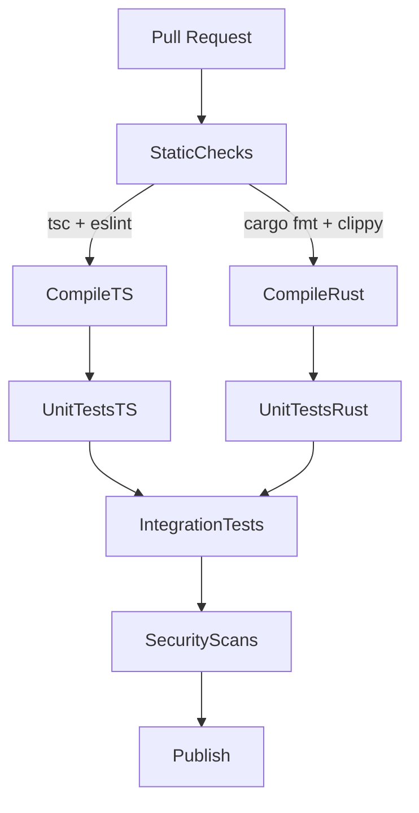

# Executive Summary

The **sphere-engine-server** backend contains a genuine enforcement core (policy loader + intent validator + ledger append). However, it currently **fails open on missing policies** and has a forgeable approval gap. The **metacanon-core** Rust code is not yet buildable or testable. To go from this snapshot to enterprise-readiness, we must *immediately* harden gating, fix compilation gaps, and prove key invariants. 

In practice, our first tasks are:  
- **Seal governance boundaries** (lens presence, explicit approvals)  
- **Enable concrete evidence** (immutable hashes, signed audit trail)  
- **Eliminate bypass channels** (no unvalidated writes, signed approvals only)  
- **Fix the build** (add missing crates/modules, passing tests)  
- **Instrument observability and CI** (metrics, gating, red-team scenarios)  

This checklist below prioritizes actionable items and open questions so that testing can start *right away*. We assume a 2028 readiness horizon (justifying mature SDLC practices like NIST AI RMF and ISO/IEC 42001).

## Must Do Items (Actionable Checklist)

1. **Implement fail-closed lens enforcement** – *Owner: Backend Engineer, Effort: Small.* In `contactLensValidator.ts` (L49–L106), *reject* all intents when `policies.contactLensesByDid.get(agentDid)` is undefined (except explicitly allowed emergency shutdown). Currently an empty lens set effectively allows any action. Add a check:
    ```ts
    const lens = policies.contactLensesByDid.get(input.agentDid);
    if (!lens && normalizedIntent !== 'EMERGENCY_SHUTDOWN') {
      return { allowed: false, code: 'LENS_NOT_FOUND', message: `No lens for ${input.agentDid}`, requiresApproval: false, highRisk };
    }
    ```
    **Accept Test:** A Vitest scenario where an unknown agent DID always yields `LENS_NOT_FOUND`. (Existing policyLoader tests assume a lens file exists; now if none, `dispatchIntent` must abort before database insert.)
  
2. **Deny-by-default on empty `permittedActivities`** – *Owner: Backend Engineer, Effort: Small.* Update the loader schema in `policyLoader.ts` so that `permittedActivities` must be non-empty, or treat empty as deny-all. For example:
    ```ts
    // policyLoader.ts: require at least one allowed activity
    permittedActivities: z.array(z.string().min(1)).min(1),
    prohibitedActions: z.array(z.string()),
    ```
    **Accept Test:** A policy JSON with empty `permittedActivities` should **fail to load** (throw schema error). Otherwise, dispatcher should reject intents not explicitly in the list.

3. **Require production secrets and strict mode** – *Owner: DevOps / Security, Effort: Small.* In `engine/src/config/env.ts` (L19–L36), add guards so the service refuses to start with default keys or non-strict signature mode:
    ```ts
    if (parsedEnv.RUNTIME_ENV === 'production') {
      if (parsedEnv.CONDUCTOR_PRIVATE_KEY === 'dev-conductor-secret') 
        throw new Error('Missing CONDUCTOR_PRIVATE_KEY in production');
      if (parsedEnv.SPHERE_SIGNATURE_VERIFICATION !== 'strict')
        throw new Error('SPHERE_SIGNATURE_VERIFICATION must be strict in production');
    }
    ```
    **Accept Test:** In a CI job or staging deploy simulation, setting no env or `SPHERE_SIGNATURE_VERIFICATION=off` should cause startup to fail.

4. **Enforce signed quorum for material-impact** – *Owner: Backend Engineer, Effort: Medium.* Replace the current free-form attestation array check in `conductor.ts` (L1127–L1152) with **signed ACK checks**. Use the existing `acknowledgeEntry` mechanism (`sphere_acks` table) to verify counselor signatures. For example:
    - Query `sphere_acks` where `target_sequence=message.sequence` and `actor_did` in active counselors.
    - Verify at least `quorumCount` distinct valid counselor ACKs.
    - Reject if not met.
    
    **Patch Sketch:** Remove or disable the block starting at L1127 and instead:
    ```ts
    const counselorACKs = await client.db.select('SELECT actor_did FROM sphere_acks WHERE target_sequence=? AND actor_did IN (?)', [seq, activeCounselors]);
    if (counselorACKs.length < policies.counselorQuorumCount) {
      throw new ConductorError('COUNSEL_QUORUM_FAILED', `Quorum ${policies.counselorQuorumCount} not met`);
    }
    ```
    **Accept Test:** Disallow dispatch of a material-impact intent if no ACKs exist; allow once the requisite ACK signatures are recorded.

5. **Embed governance hashes in ledger entries** – *Owner: Backend Engineer, Effort: Medium.* Modify the `LedgerEnvelope` in `conductor.ts` (near L624–L632) to include a `governance:` field containing the hashes of `high_risk_intent_registry.json`, the lens pack, and `governance.yaml`. For example:
    ```ts
    ledgerEnvelope.governance = {
      highRiskRegistryHash: policies.highRiskRegistry.hash,
      contactLensHash: policies.contactLensSchemaHash,
      governanceYamlHash: policies.governanceConfigHash
    };
    ```
    Include these in the canonicalization and hash computation.  
    **Accept Test:** A ledger entry’s JSON (in database) contains the governance hash fields, and `entry_hash` changes if policies change.

6. **Define canonicalization for arrays** – *Owner: Backend Engineer, Effort: Small.* Decide which arrays represent unordered sets (e.g. `attestation: string[]`) and sort them before hashing. For any ordered arrays (like message bytes), leave intact. Update the `canonicalize` function in `conductor.ts` (L107–L128) accordingly.  
    **Accept Test:** Add a property-based test: `canonicalize(x) === canonicalize(permutedSets(x))` for test cases where only set-ordering changed.

7. **Fix Rust build errors (missing crates and modules)** – *Owner: Rust Engineer, Effort: Medium.* Update `metacanon-core/Cargo.toml` and code:
    - **Cargo.toml:** Add dependencies shown in code: `thiserror`, `ring`, `aes-gcm`, `rand`, and `uuid` (for tests).  
    - **Modules:** Create `src/prelude.rs` to re-export shared types (`ActionSpace`, `WillVector`, `ValidationError`) or remove all `crate::prelude::*` imports in `action_validator.rs` and friends (L1–L3).  
    - **Validation function:** Implement `validate_action_with_will_vector` (called in `compute.rs` L358–L402) in a common module (e.g. `validation.rs`) and re-export it at crate root.
    
    **Accept Tests:** `cargo clippy --all-targets -D warnings` and `cargo test` should now compile and run (initially with minimal passing tests). 

8. **Fix or remove broken contract tests** – *Owner: QA Engineer, Effort: Medium.* The JS contract tests read missing files (`deliverables/*.md`) and assume content from providers:
    - Either supply those deliverables files or rework tests.  
    - In particular, the SoulFile/hard-code tests (e.g. `provider-routing.contract.test.js`) need valid contract data or should be disabled.  
    **Accept Test:** Running `npm test` in `metacanon-core` must succeed without missing-file errors.  

9. **Add red-team test harness and examples** – *Owner: Security Engineer, Effort: Medium.* Create automated tests for the most critical attacks:
    - **Bypass write:** Try a direct SQL `INSERT` into `sphere_events` (as a non-conductor role) and assert failure.  
    - **Signature compromise:** Manually inject an entry with a wrong signature and verify it is detected.  
    - **Break-glass attempts:** Fuzz `activateBreakGlass` with and without proper fields and check that no unauthorized shutdown occurs.  
    - Provide snippets or scripts for these (e.g., a node script running `directDb.query('INSERT ...')`).
    **Accept Test:** These red-team scripts should fail to subvert the system (in tests they should be caught or prevented).

10. **Instrument observability and metrics** – *Owner: DevOps, Effort: Small.* Define and log/emit the exact fields below for each intent:
    - **Log fields (JSON):** `trace_id, thread_id, message_id, intent_normalized, actor_did, thread_state, validation_code, allowed, requiresApproval, prismHolderApproved, highRisk, contactLensHash, policyHash, entryHash`.  
    - **Counters:** e.g. `intent_attempt_total{intent,allowed}`, `approval_required_total`, `lens_missing_total`, `audit_failures_total`.  
    - **Histograms:** e.g. `dispatch_latency_ms`, `db_tx_latency_ms`.  
    - **Alerts:** Define triggers for `lens_missing_total > 0`, `audit_failures_total > 0`, `break_glass_failed > threshold`, etc.  

11. **Plan key/signature migration (HMAC→Ed25519)** – *Owner: Security/Dev, Effort: Medium.* Draft a short migration plan:
    - Update `LedgerEnvelope` to include `sigAlg` and `keyId`.  
    - Dual-sign new entries: keep old HMAC and also add Ed25519 (as in dev branch).  
    - Rotate conductor key: publish new public key, update services to use it.  
    - After confidence, drop HMAC in production.  
    Provide test vectors (e.g. scripts to verify both signatures, and to reject if `keyId` unknown).  
    **Accept Test:** After switch, older entries are still verifiable under old key, new entries under new key, and an attempt to verify with wrong key fails.

12. **Define CI gating flow** – *Owner: DevOps, Effort: Small.* Enforce at least: 
    - **Lint & build:** TypeScript type-check + Rust clippy.  
    - **Unit tests:** 100% passing.  
    - **Integration tests:** Spin up a Postgres container, run key workflows (`dispatchIntent`, `haltThread`, `ACK quorum`), then tear down.  
    - **Security scans:** Secret check (no default creds), dependency scan.  
    - **Release build:** SLSA provenance if required.  

    We recommend following a pipeline like this mermaid diagram:
    ```mermaid
    flowchart TB
      PR[Pull Request] --> StaticChecks
      StaticChecks -->|tsc + clippy| Compile
      Compile --> UnitTests
      UnitTests --> IntegrationTests
      IntegrationTests --> SecurityGates
      SecurityGates --> Publish
    ```
    (Each box represents an automated CI stage.)

## Must Answer Questions

Before testing, we need to resolve these open questions. Each item includes how to answer it (command, inspection, etc.):

1. **Is the policy loading covering all governance files?**  
   *Check:* Does `governanceRoot/contact_lenses` actually contain lens JSON files? Are `high_risk_intent_registry.json` and `governance.yaml` present?  
   *Method:* List directory tree; inspect returned values from `loadGovernancePolicies()` in a REPL or add debug logs.  
   
2. **What are all declared intents and high-risk categories?**  
   *Check:* Review `governance/high_risk_intent_registry.json` and `governance/governance.yaml`.  
   *Method:* Use `grep` or a node REPL to dump `policies.highRiskRegistry; policies.governanceConfig`. Ensure no unknown intents slip through.

3. **Is the Db schema aligned with the code?**  
   *Check:* The code (e.g. `ensureSchema()` in `conductor.ts`) implicitly defines tables. Does it match the deployed schema?  
   *Method:* Compare `drizzle` migration files in `/engine/drizzle` with actual DB state after init. Run `npm run migrate:dev` and inspect tables with a SQL client.  

4. **Are all environment variables set correctly?**  
   *Check:* Confirm that in test/prod, no default credentials are used.  
   *Method:* `console.log(process.env)` in staging bootstrap (but scrub secrets), or use dotenv-linter to ensure `.env.example` has no secrets, and production CI disallows defaults.

5. **Are the required human approvals provisioned?**  
   *Check:* Does the system know who the Prism Holder and Counselors are? These likely come from a secure store.  
   *Method:* Inspect how the code loads authorized DIDs (perhaps `contactLens` files or external config). Verify that `activeCouncilors` list is non-empty and matches intended IDs.

6. **What happens if a direct DB write is attempted?**  
   *Check:* Should throw or fail.  
   *Method:* As a sanity test, try using the DB client as an attacker:  
   ```js
   const directRes = await client.db.execute('INSERT INTO sphere_events (...)');
   ```  
   It should fail due to permissions or not run at all. If it succeeds, revise DB roles.

7. **Are there any unhandled exceptions?**  
   *Check:* Static analysis (TypeScript compiler, Rust clippy) plus running the code through normal flows.  
   *Method:* Review logs of a dry run, or run `ts-node` on the engine and watch for throws not caught (in tests). Fix any promise rejections.  
   
8. **Does the system produce an unforgeable audit trail?**  
   *Check:* Verify that `entry_hash` changes when payload changes, and that attacker cannot tamper a previous row without detection.  
   *Method:* After dispatching a few intents, manually alter one `sphere_events.entry_hash` in the DB and rerun the verifier tool. It should flag the mismatch.

9. **Is the Rust core `ComputeRouter` wired into the engineering pipeline?**  
   *Check:* The system expects pre-generated embedding model responses. But is `ComputeRouter` actually invoked anywhere (service code)?  
   *Method:* If planning to test, ensure there is a Rust binary or Tauri app that uses `metacanon-core`. Otherwise, build and run a smoke test on a simple `route_generate` call.

10. **Have we versioned the contact-lens schema?**  
    *Check:* If the JSON schema changes, how do we migrate old lenses?  
    *Method:* If there is a lens schema file (`contact_lens_schema.json` L1–L69), note its version or last modified date. Plan migrations if schema changes.

Each question should be resolved via inspection, scripted queries, or small tests before trusting the system in a real test scenario.

## Adversarial Scenarios and Monitoring

- **Red-team tests to run first:**  
  - *No-lens bypass:* Attempt an intent with a non-existent DID and verify rejection.  
  - *Fake quorum:* Dispatch a material-impact intent with `attestation` = all active counselors, without any actual ACKs. Confirm rejection.  
  - *Ledger tampering:* After a few events, manually flip a hash in the DB; run `verify_chain()` script to see detection.  
  - *Signature swapping:* Try injecting an entry with a wrong `conductorSignature`; expect validation failure.  

- **Observability/metrics:**  
  - Log **all** the fields listed above on each request/intent.  
  - Expose counters like `intents_total{intent,status}`, `lens_missing_total`, `audit_failure_total`.  
  - Alert if any _lens_missing_total_ or _audit_failure_total_ > 0 (should never happen in normal ops).

- **Key management:**  
  - Inventory current Ed25519/did:key keys used for system actors (PrismHolder, etc) and plan periodic rotation.  
  - Acceptance tests: revoke a key (remove from registry), ensure past signatures still verify, new signatures fail.

## CI/Test Gating Flow

Embed the final mermaid diagram for the CI pipeline:



Each stage must pass before merging or release.

