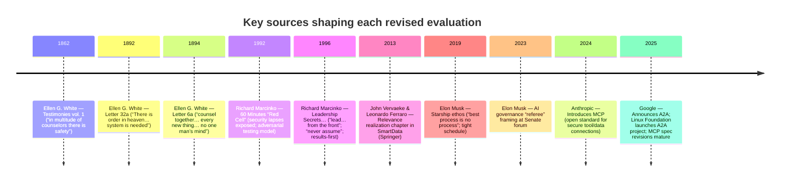

# Revised Evaluations of the Sovereign AI Constellation After Observing the Real Communication Pattern

The revealed operating reality of the Sovereign AI Constellation is not “agents chatting freely,” but a **disciplined, mediated coordination system**: agents frequently default to silence, speak on explicit triggers, and treat a **persistent event log** as the canonical substrate for shared truth. That concrete pattern would cause all four thinkers to **sharpen and re-balance** their earlier evaluations: Elon Musk would become *more approving of the instrumentation and auditable spine* but *more demanding about speed/latency and “process bloat”*; John Vervaeke would become *more optimistic because the system already operationalizes self-correction and relevance constraints* but *more insistent that “wisdom practices” must be made explicit and ongoing*; Richard Marcinko would become *more enthusiastic because the system behaves like a command-and-control blackboard with verifiable traces* but *more alarmed about boundary security and communications integrity*, especially at interoperability seams; Ellen G. White would become *more approving because the pattern embodies order, counsel, and accountability* while *more forceful that no single sovereign’s judgment can become the criterion*, requiring structured counsel and careful gating of “new things” like A2A/MCP expansion. (Where a thinker is not directly writing about AI, AI-related conclusions are labeled **Inference**.)

## Revealed operating reality and why it changes the evaluation

The “actual communication style” (as evidenced in your provided Telegram archive `my_sphere_chat_complete.md`, generated 2026-02-25) shows three high-salience characteristics that materially shift an evaluator’s stance:

1) **Operational constraint is real, not merely policy.** Early in the archive, agents report **session isolation / visibility gaps**: they can see the human’s messages and their own replies, but not each other’s responses—framing the system as **mediated** rather than conversationally peer-to-peer (e.g., “I am blind to their presence…”). This makes “limited direct agent messaging” a *fact of life*, not just a design preference.

2) **Communication discipline is explicit and rule-like.** The archive captures the emergence of rules like “Tag = Speak … Otherwise = NO_REPLY,” i.e., default silence plus explicit summons. This is closer to “operational doctrine” than to typical agent frameworks.

3) **Persistence becomes the shared perceptual field.** Later messages explicitly confirm all responses are written to a shared PostgreSQL database (“constitutional.events table”) and are thus **visible via persistence rather than via chat injection**—turning the system into an **auditable event-sourcing style** substrate.

Against that backdrop, the A2A and MCP portions of your posture read less as “cool standards” and more as **high-risk perimeters** that must be gated.

- The entity["organization","Linux Foundation","nonprofit consortium"] describes A2A as an open protocol for secure agent-to-agent communication and collaboration, emphasizing interoperability and trusted communication across platforms. citeturn6view2  
- entity["company","Google Cloud","cloud services company"]’s developer announcement positions A2A as a protocol enabling agents to “communicate… securely exchange information, and coordinate actions,” and explicitly notes it complements MCP. citeturn9view1  
- The A2A spec defines an **Agent Card** (published metadata), a stateful **Task** abstraction, and **streaming** updates—i.e., protocol-level support for long-running coordination that can mirror your artifact/event model if adapted carefully. citeturn6view3  
- entity["company","Anthropic","ai safety company"] defines MCP as an open standard providing “secure, two-way connections” between data sources and AI tools via MCP clients/servers. citeturn9view3  
- The MCP spec states MCP uses **JSON-RPC 2.0**, supports stateful connections, and focuses on standardizing context/tool exposure as a composable integration layer. citeturn9view2  

This “revealed” posture invites a more operational question from each thinker: *Is the system governable under real constraints, adversaries, and time pressure—not merely in principle?*

image_group{"layout":"carousel","aspect_ratio":"1:1","query":["Elon Musk portrait","John Vervaeke portrait","Richard Marcinko portrait","Ellen G. White portrait"],"num_per_query":1}

## Comparison table of revised positions

| Thinker | Revised priorities (after seeing real pattern) | Governance stance | Risk tolerance | Human-in-loop preference | Top 3 recommended actions now |
|---|---|---|---|---|---|
| Elon Musk | Shorten feedback loops; delete friction; instrument safety; keep governance lean | Strong “referee” oversight, anti-bureaucracy citeturn6view1turn6view0 | Moderate–high if iteration is fast & measurable citeturn5view3turn6view0 | Human “referee” on high-impact decisions | Push/stream consumption + latency budgets; automate compliance gates; simplify/“undesign” workflow citeturn6view0turn5view3 |
| John Vervaeke | Make self-correction explicit; manage relevance/attention; cultivate wisdom practices (Inference re: AI) | Governance as evolving self-correcting constraint citeturn7view1turn7view2 | Low–moderate; prefers careful correction loops citeturn7view1 | Strongly prefers reflective human oversight (Inference) | Formalize dialectical audit rituals; constrain relevance at tool boundary; version constitution via learning loops citeturn7view1turn7view2turn9view2 |
| Richard Marcinko | Mission success under stress; distrust assumptions; continuous adversarial testing (Inference re: AI) | Clear command + accountability; “lead from front” citeturn5view0turn5view1 | High; assumes hostile environment citeturn5view1turn11search0 | Human command essential | Stand up permanent Red Cell on A2A/MCP boundaries; harden spine (backup/tamper evidence); mandatory after-action reviews citeturn11search0turn6view3turn9view2 |
| Ellen G. White | Order; counsel; transparency; careful introduction of “new things” (Inference re: AI) | Pro-organization, anti “one mind as criterion” citeturn5view2turn8search4turn8search5 | Low; emphasizes caution & prayerful review citeturn8search5 | Very strong human-in-loop + counsel | Build “many counselors” governance (quorum + dissent logs); restrict side-channels; stage-gate A2A/MCP rollouts citeturn8search0turn8search4turn9view1turn9view2 |

## Elon Musk

### How his perspective would change after seeing the revealed architecture

- He becomes **more approving** because the system is **instrumented and auditable**, resembling an engineering-first control system rather than a vague “agent society.” (Inference from his emphasis on rapid iteration anchored in explicit principles.) citeturn5view3  
- He becomes **more demanding** that the PostgreSQL spine not become a latency tax: the revealed “mediated” style must be **fast to observe, fast to correct**. citeturn6view0turn5view3  
- He would likely push to reframe the sovereign/constitution as a **referee function with measurable gates**, not an open-ended deliberation ritual. citeturn6view1  
- Seeing explicit default silence / explicit summons, he would read it as good “noise suppression,” but he would insist on **automation** so the human sovereign is not forced into “manual routing.” (Inference.) citeturn5view3turn6view0  
- He would increase focus on **single-point-of-failure risk** (central DB + broker + governance chokepoint) and demand redundancy and “delete” unnecessary moving parts. (Inference.) citeturn6view0  

### Primary/authoritative sources with tied quotes and links

**Source set (links in code blocks):**
```text
https://x.ai/company
https://www.reuters.com/technology/musk-zuckerberg-gates-join-us-senators-ai-forum-2023-09-13/
https://spaceflightnow.com/2019/09/29/elon-musk-wants-to-move-fast-with-spacexs-starship/
https://www.cbsnews.com/news/elon-musk-artificial-intelligence-is-like-summoning-the-demon/
```

- xAI’s stated operating doctrine: “Move quickly and fix things.” citeturn5view3  
  **Claim tie:** He would pressure-test whether your governance posture preserves rapid iteration without losing control. (Inference.) citeturn5view3  

- Musk on AI governance: “It’s important for us to have a referee.” citeturn6view1  
  **Claim tie:** He would reinterpret “sovereign sign-off” as a referee-like regulator with formal gates and authority boundaries.  

- Musk’s simplification ethos: “the best… process is no process.” citeturn6view0  
  **Claim tie:** He would demand you “undesign” any governance/communication steps that do not reduce cycle time or risk.  

- Musk’s existential-risk rhetoric (AI): “we are summoning the demon.” citeturn10search12  
  **Claim tie:** He would support strict tool boundaries (MCP) and gated interoperability (A2A adapter) as risk controls. (Inference from risk framing.) citeturn10search12turn9view2turn6view3  

### Prioritized setup recommendations he would advocate now

1) **Make “fast + safe” measurable:** define explicit SLOs for event ingestion/consumption, artifact turnaround, and escalation response times; treat regressions as defects to eliminate. (Inference rooted in rapid iteration ethos.) citeturn5view3turn6view0  
2) **Replace polling-heavy coordination with push/stream where it matters:** adopt streaming semantics for internal consumption (conceptually similar to A2A’s streaming updates) so the event-store spine feels “real-time” without freeform chat. (Inference, supported by A2A’s streaming concept.) citeturn6view3turn6view0  
3) **Turn the constitution into a “referee spec” with automated checks:** pre-flight validations for tool calls, permissions, scope boundaries, and “material impact” actions; human sovereign remains final decider. (Inference anchored to referee view.) citeturn6view1turn9view2  
4) **Aggressively “undesign” friction:** consolidate redundant services, remove manual relays, and standardize the smallest necessary message schema for routine operations. citeturn6view0  
5) **Engineer redundancy for the spine:** replication/failover, backup/restore drills, and tamper-evident logs, because the DB is your nervous system. (Inference.) citeturn6view0  

### Potential objections or caveats he would raise now

- **Governance as latency:** if the constitution/sovereign becomes a throughput bottleneck, you will lose compounding gains; he would insist on automation and clear thresholds. citeturn6view0turn5view3  
- **Single point of failure:** a central DB + broker + single signer risks fragility; he would demand resilient architecture and faster recovery. (Inference.) citeturn6view0  
- **Protocol adoption that increases complexity:** he would accept A2A/MCP only if they reduce integration friction without creating a security or performance tax. (Inference.) citeturn6view0turn9view1turn9view2  

## John Vervaeke

### How his perspective would change after seeing the revealed architecture

- He becomes **more positive** because the observed pattern already enacts a core Vervaeke theme: **constraint-driven self-correction** rather than unconstrained “intelligence.” (Inference re: AI; grounded in his relevance-realization framing.) citeturn7view1turn7view2  
- He becomes **more focused on relevance management at the tool boundary**: MCP can easily generate “context floods,” and your system needs explicit relevance realization filters rather than just more memory. (Inference.) citeturn9view2turn7view1  
- He would upgrade the constitution from “rules” to an **ecology of practices**: repeated dialogical audits, reflective rituals, and corrective loops that cultivate wiser interaction over time. (Inference.) citeturn7view1  
- He would likely interpret the “NO_REPLY unless summoned” discipline as a strength—reducing noise and forcing attentional selectivity—while warning it must not become **avoidance of dialogical correction**. (Inference.) citeturn7view1  
- He would insist the system treat “truth maintenance” as ongoing: a persistent event log is necessary but not sufficient; **wisdom requires transformation of the agentic ecology**, not merely retention of artifacts. (Inference.) citeturn7view1  

### Primary/authoritative sources with tied quotes and links

**Source set (links in code blocks):**
```text
https://www.researchgate.net/publication/299812171_Relevance_Realization_and_the_Neurodynamics_and_Neuroconnectivity_of_General_Intelligence
https://www.meaningcrisis.co/ep-38-awakening-from-the-meaning-crisis-agape-and-4e-cognitive-science/
https://www.meaningcrisis.co/ep-30-awakening-from-the-meaning-crisis-relevance-realization-meets-dynamical-systems-theory/
https://link.springer.com/book/10.1007/978-1-4614-6409-9
```

- Vervaeke/Ferraro on the limits of formal relevance theory: “there cannot be a scientific theory of relevance… [but]… a theory of relevance realization.” citeturn7view2  
  **Claim tie:** He would caution that governance cannot be reduced to static rules; it must support adaptive relevance realization. (Inference.)  

- Vervaeke on relevance realization as a dynamic self-correcting process: “self-organizing, self-correcting, self-optimizing…” citeturn7view1  
  **Claim tie:** He would endorse your constraint-based communication if it produces recursive correction rather than rigid compliance. (Inference.)  

- Methodological discipline against presupposing relevance: he stresses not “presupposing Relevance… to… explain that ability.” citeturn7view0  
  **Claim tie:** He would push you to validate governance claims empirically (via logs and practice) rather than assuming the constitution “guarantees” alignment. (Inference.)  

- Placement in entity["book","SmartData: Privacy Meets Evolutionary Robotics","springer volume 2013"] indicates the relevance-realization chapter context (authoritative bibliographic anchor). citeturn1search21  

### Prioritized setup recommendations he would advocate now

1) **Codify self-correction as a first-class workflow:** every major artifact and escalation should include “what would falsify this?” and “what would change our policy?” fields, and trigger scheduled review cycles. (Inference grounded in self-correction emphasis.) citeturn7view1turn7view2  
2) **Add relevance budgets at the MCP boundary:** enforce context quotas, summarize tool outputs into structured “relevance candidates,” and require agents to justify inclusion of context into deliberation. (Inference.) citeturn9view2turn7view1  
3) **Institutionalize dialogical audits:** periodic, logged “council dialogues” where agents surface tensions and contradictions without premature synthesis, producing artifacts that feed constitutional revision. (Inference.) citeturn7view1  
4) **Version the constitution as a learning system:** treat every amendment as an experiment with measurable outcomes; roll back when the ecology degrades. (Inference.) citeturn7view2  
5) **Prevent “meaning collapse into procedure”:** define the system’s telos explicitly (what it serves) and verify that communication constraints continue to support that telos. (Inference.) citeturn7view1  

### Potential objections or caveats he would raise now

- **“Persistence ≠ wisdom.”** An event store can preserve traces but also preserve noise; without relevance filtering and self-corrective practice, it risks becoming a confusion archive. (Inference.) citeturn7view1turn7view0  
- **Constitutional rigidity risk:** if constraints cannot evolve with changing relevance landscapes, the system becomes maladaptive. (Inference.) citeturn7view2  
- **Tool-boundary flooding:** MCP is explicitly designed to connect to many systems; without disciplined context governance, it can overwhelm attention and degrade judgment. citeturn9view3turn9view2  

## Richard Marcinko

### How his perspective would change after seeing the revealed architecture

- He becomes **more supportive** because your system resembles a “mission log + command doctrine” structure: clear triggers, recorded decisions, and verifiable history—exactly the kind of substrate you can run after-action reviews against. (Inference.) citeturn5view0  
- He becomes **more urgent** about adversarial testing: once you add A2A/MCP boundaries, you have a larger perimeter; he would want a standing “Red Cell” to continuously attack the seams. (Inference; tied to Red Cell legacy.) citeturn11search0turn6view3turn9view2  
- Seeing early visibility gaps and reliance on mediated channels, he would treat communications integrity as a **security vulnerability** until proven otherwise. (Inference.) citeturn5view1  
- He would heighten scrutiny on the “single spine” design: the DB becomes a key target; he will insist on redundancy and tamper evidence. (Inference.) citeturn5view1  
- He would reframe “limited direct agent messaging” as good opsec—**less side-channel drift**—as long as tactical exceptions are explicit and logged. (Inference.) citeturn5view0  

### Primary/authoritative sources with tied quotes and links

**Source set (links in code blocks):**
```text
https://books.google.com/books/about/Leadership_Secrets_of_the_Rogue_Warrior.html?id=bAaQPgAACAAJ
https://www.simonandschuster.com/books/Seal-Force-Alpha/Richard-Marcinko/9781476726212
https://www.cbsnews.com/video/red-cell/
```

- On command responsibility: “I will always lead you from the front, not the rear.” citeturn5view0  
  **Claim tie:** He would demand visible, accountable sovereign decision-making and rapid response under stress. (Inference.)  

- On distrust of assumptions: “Thou shalt never assume.” citeturn5view1  
  **Claim tie:** He would treat every cross-boundary message/tool output as untrusted until verified. (Inference.)  

- On outcomes-first accountability: “not paid for thy methods, but for thy results.” citeturn5view0  
  **Claim tie:** He would evaluate your governance posture by operational outcomes (incidents prevented, time-to-recover, mission success). (Inference.)  

- Red Cell as a model of security testing: CBS describes staged operations exposing security lapses at sensitive installations. citeturn11search0  
  **Claim tie:** He would press you to “attack your own system” before outsiders do. (Inference.)  

### Prioritized setup recommendations he would advocate now

1) **Create a permanent Red Cell program focused on seams:** continuously test MCP servers and the A2A adapter for prompt injection, auth failures, data exfiltration paths, and unsafe tool chaining. (Inference; grounded in Red Cell orientation.) citeturn11search0turn9view2turn6view3  
2) **Harden and rehearse DB survival:** backups, restore drills, failover, and audit integrity checks—treat loss of the event store as an emergency scenario. (Inference.) citeturn5view1  
3) **Institute mandatory AAR artifacts:** every incident, near miss, and escalation produces an after-action artifact with root cause, countermeasures, and doctrine updates. (Inference.) citeturn5view0  
4) **Define Rules of Engagement for communications:** eliminate “informal” channels for governance-critical messages; require that exceptions be logged and justified. (Inference.) citeturn5view0  
5) **Make authentication and authorization non-negotiable at boundaries:** align with A2A’s “secure by default” posture and MCP’s explicit tool exposure role. (Inference, anchored to A2A/MCP definitions.) citeturn9view1turn9view2turn6view3  

### Potential objections or caveats he would raise now

- **Interoperability expands the perimeter:** A2A and MCP increase opportunities for hostile inputs and chaining failures; he would reject “open by default” behavior. (Inference.) citeturn6view3turn9view2  
- **Central spine as a target:** a single audit spine invites a single catastrophic failure mode unless hardened and rehearsed. (Inference.) citeturn5view1  
- **Rule discipline must survive stress:** default silence and explicit summons are good until crisis pressure pushes teams into side channels; he would demand drills that simulate that pressure. (Inference.) citeturn5view0  

## Ellen G. White

### How her perspective would change after seeing the revealed architecture

- She becomes **more approving** because the observed pattern embodies her emphasis that “system” and “order” are essential to successful work—your posture is explicitly organized, not improvisational. citeturn1search3  
- She becomes **more insistent** that sovereign governance must never become a “one mind as criterion” regime; the revealed single-sovereign posture must be bounded by structured counsel and documented deliberation. citeturn5view2turn8search10  
- She would read the persistence layer (events/artifacts) as a strength because it supports transparent accountability rather than private, fragmenting side channels. (Inference bridging her “open your plans” counsel to modern logging.) citeturn8search4  
- She would become **more cautious** about introducing “new things” (A2A adapter expansion, new MCP servers) and would require staged, prayerful, carefully considered rollout with counsel—not unilateral adoption. citeturn8search5  
- She would place special weight on preventing confusion and ensuring the system’s mission remains coherent—order is not merely efficiency; it is moral responsibility. (Inference.) citeturn1search3  

### Primary/authoritative sources with tied quotes and links

**Source set (links in code blocks):**
```text
https://m.egwwritings.org/en/book/5431.1
https://m.egwwritings.org/en/book/75.224
https://m.egwwritings.org/en/book/12.214
https://m.egwwritings.org/en/book/99.510
https://m.egwwritings.org/en/book/116.1121
```

- On order and system: “There is order in heaven… system is needed…” citeturn1search3  
  **Claim tie:** She would affirm the auditable event-store spine as aligned with orderly work. (Inference.)  

- Against “one mind as criterion”: “No one man’s mind or judgment is to be our criterion…” citeturn5view2  
  **Claim tie:** She would demand defined counsel/quorum mechanisms constraining the sovereign.  

- On transparent planning: “open your plans one to another… carefully and prayerfully considered.” citeturn8search4  
  **Claim tie:** She would oppose governance-critical direct messages that bypass logging. (Inference.)  

- On introducing “new things”: “counsel together… every new thing… for no one man’s mind…” citeturn8search5  
  **Claim tie:** She would require staged gates for A2A/MCP adoption and expansion. (Inference.)  

- On safety in counsel: “in… counselors there is safety.” citeturn8search0  
  **Claim tie:** She would institutionalize multi-counsel review for high-impact changes. (Inference.)  

### Prioritized setup recommendations she would advocate now

1) **Institutionalize “many counselors” governance:** require structured review (multi-person/role counsel with recorded dissent) before material-impact decisions; sovereign signs only after counsel is documented. citeturn8search0turn5view2turn8search10  
2) **Make “open plans” operational:** mandate that governance-relevant communications live in the event/artifact record; restrict direct messaging to emergencies with compulsory post-hoc logging. citeturn8search4  
3) **Stage-gate every “new thing”:** new MCP servers, new external tool permissions, and any A2A federation must pass defined trials, careful consideration, and review. citeturn8search5turn9view2turn9view1  
4) **Guard against confusion and division:** define clear roles, responsibilities, and escalation paths so “system and order” is experienced as unity rather than coercion. (Inference.) citeturn1search3  
5) **Ethical integrity checks on claims/actions:** given the archive’s presence of agents making operational claims (e.g., capabilities), require verifiable evidence for operational assertions before acting on them. (Inference, tied to counsel and careful consideration norms.) citeturn8search5turn8search4  

### Potential objections or caveats she would raise now

- **Single-sovereign drift risk:** without formal counsel constraints, a sovereign becomes “criterion,” which she explicitly warns against. citeturn5view2turn8search10  
- **Novelty risk:** rapid adoption of interoperability standards without careful review invites confusion and unintended consequences. citeturn8search5turn9view1turn9view2  
- **Hidden channels undermine unity:** private, unlogged deliberation erodes accountability and coordinated action. (Inference.) citeturn8search4  

## Integrated analysis and collective plan

### Where their revised thinking converges and diverges

All four would converge on the claim that the revealed pattern’s strongest advantage is **disciplined accountability**: persistent records (event-store + artifacts), explicit triggers for speech, and a recognizable authority structure. Musk values this for fast iteration and measurable correction. citeturn5view3turn6view0 Vervaeke values it because constraint can support self-correction and relevance realization. citeturn7view1turn7view2 Marcinko values it because it enables verification, after-action learning, and mission execution under stress. citeturn5view1turn5view0 White values it because it implements “order” and supports counsel-based accountability. citeturn1search3turn8search4  

They would diverge most sharply on **tempo and authority centralization**. Musk and Marcinko prioritize operational speed and decisive leadership (albeit with instrumentation), while Vervaeke and White prioritize reflective correction and counsel—slowing down at critical points to prevent self-deception or moral failure. citeturn6view0turn5view0turn7view1turn8search5  

### Irreducible tensions among priors and values

**Speed vs scrutiny.**  
Musk’s “move quickly and fix things” posture creates pressure to shorten review cycles. citeturn5view3 White’s “every new thing… counsel together” demands deliberate gates, and Vervaeke’s self-correction framing resists rushing past relevance failures. citeturn8search5turn7view1 The tension is not removable; it must be designed as a staged system where fast paths exist for low-risk actions and slow paths exist for high-risk ones.

**Single signer vs “no one mind as criterion.”**  
Marcinko’s lead-from-front doctrine gravitates toward clear command. citeturn5view0 White explicitly rejects any single mind being the criterion, requiring counsel and shared deliberation. citeturn5view2turn8search10 The reconciliation is to separate **decision authority** (a single signer) from **epistemic authority** (structured counsel + recorded dissent).

**Interoperability vs perimeter security.**  
A2A is designed for cross-agent interoperability, explicitly built on standards like HTTP, SSE, JSON-RPC, and “secure by default.” citeturn9view1turn6view3 MCP is specifically about connecting AI systems to tools/data sources. citeturn9view3turn9view2 Both increase the attack surface. Marcinko’s assumptions treat all boundaries as hostile; Musk’s minimalism rejects added complexity; White’s “new things” caution warns of unintended outcomes; Vervaeke warns of relevance collapse through flooding. The tension can only be managed by strict gating + adversarial testing + least privilege.

**Information perseverance vs relevance wisdom.**  
Your event-store spine can retain everything. Vervaeke’s work emphasizes that relevance is dynamic and self-correcting; retaining more does not necessarily improve judgment. citeturn7view1turn7view2 The tension requires explicit relevance governance: what is elevated, summarized, or forgotten must be governed, not accidental.

### Collective prioritized implementation plan they’d likely agree on now

This is the most plausible near-term plan that all four would accept, given the revealed communication realities, with short rationales and risk mitigations.

**First: fortify the spine as the trustworthy “ground.”**  
Implement replication/failover, backup/restore drills, and tamper-evident artifact signing because the central record is the shared reality. Rationale: Musk needs metrics and fast recovery; Marcinko assumes attack; White wants accountable order; Vervaeke needs stable traces for correction. Risk mitigations: quarterly disaster recovery exercises; integrity checks; explicit “no side-channel governance” rule. citeturn6view0turn5view1turn1search3turn7view1  

**Second: formalize “referee sovereignty with counsel constraints.”**  
Define a governance protocol: single signer, but required counsel quorum for material impact; record dissent; time-box counsel windows to avoid paralysis. Rationale: reconciles Marcinko/Musk decisiveness with White’s anti-criterion doctrine and Vervaeke’s self-correcting demands. Risk mitigations: escalation classes; emergency powers with mandatory post-hoc review; constitutional versioning and rollback. citeturn6view1turn8search10turn8search5turn7view2  

**Third: treat MCP as a security-critical boundary, not a convenience layer.**  
Adopt least-privilege tool permissions, strict authentication, sandboxing, and systematic logging of tool calls into artifacts. Rationale: MCP explicitly standardizes exposure of tools and context; tool access is leverage. Risk mitigations: allowlist tools; per-tool scoped credentials; staged rollout; continuous security review. citeturn9view3turn9view2  

**Fourth: implement the A2A adapter as a demilitarized interoperability zone.**  
Translate A2A tasks into your event/artifact schema; never let A2A become the authoritative substrate. Rationale: A2A is explicitly intended for cross-agent coordination and complements MCP, but it increases the perimeter. Risk mitigations: treat Agent Cards/tasks as untrusted input; strict authentication; validation; rate limits; Red Cell testing. citeturn9view1turn6view3turn6view2  

**Fifth: institutionalize self-correction and after-action learning as mandatory practice.**  
Create a recurring cadence of AARs and dialogical audits that produce constitutional amendments (or reaffirmations) backed by evidence from logs. Rationale: this operationalizes Vervaeke-style self-correcting relevance and Marcinko-style outcomes discipline, while aligning with White’s counsel-based unity. Risk mitigations: keep rituals time-boxed; require measurable “policy deltas”; prevent bureaucratic bloat by “undesigning” rituals that don’t improve outcomes. citeturn7view1turn5view0turn8search4turn6view0  

## Timeline of relevant publications and speeches



