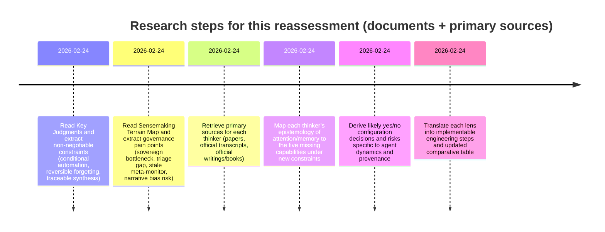

# Do deep research on how John Vervaeke, Jonathan Pageau, Jordan Peterson, and Ellen G. White would reassess your Queryable Memory System after reading the Key Judgments and Sensemaking Terrain Map

## Executive summary

The two documents you provided materially change the “center of gravity” of the design conversation. Before, it was reasonable to treat your system as an advanced searchable memory store with missing “intelligence-layer” features. After reading (A) the Key Judgments file and (B) the Sensemaking Terrain Map, it is more accurate to treat the system as an **attentional-and-governance environment**—a toolchain that shapes how a sovereign human (entity["people","Paul","prism holder user"]) and multiple agents coordinate, decide, and stay epistemically honest. fileciteturn0file1 fileciteturn0file0

Across the four thinkers, the reassessment converges on five updated imperatives:

**Attention governance becomes the primary design requirement.** The Key Judgments document explicitly asserts (with “high confidence”) that the bottleneck is attention, not storage. fileciteturn0file1 This strongly amplifies Vervaeke’s “relevance realization” frame, Peterson’s “order vs chaos” frame, Pageau’s “center–margin hierarchy,” and White’s warnings about burdening the mind with undigested information. citeturn0search16turn0search2turn1search1turn0search3

**Conditional automation, reversible forgetting, and traceable synthesis are no longer optional—they are constitutional constraints.** Those constraints appear as “non‑negotiable” in Key Judgments. fileciteturn0file1 This shifts all four thinkers to endorse automation only as **decision support** with auditable provenance and human approval as the final gate. citeturn0search16turn1search2turn1search13turn2search6

**Your missing capabilities map to operational governance problems in the agent system.** In Sensemaking Terrain Map, the biggest pain points are: sovereign dependency for routine decisions, escalation triage ambiguity, blocked sub‑agent activation, and a failed meta‑monitor (“the Heartbeat Monitor is itself stale”). fileciteturn0file0 The missing features should therefore be designed not only for “knowledge work,” but also for **agent coordination hygiene**: triage, drift detection, and bias/provenance controls. fileciteturn0file0

**Cross-document synthesis becomes higher-risk and higher-value simultaneously.** Higher-value because it could reduce sovereign bottlenecks and make patterns across agent communications legible; higher-risk because the Terrain Map explicitly warns that narrative and reporting incentives may bias agent outputs (“optimizing for appearing aligned,” “founding myth risk”). fileciteturn0file0

**FB.zip import becomes strictly “quarantine-first” in all four frames.** Given the stated diagnosis of “digital warehouses” producing cognitive attrition, importing a large, high-noise social corpus becomes an attention and moral-psychological risk unless you first implement triage, provenance, and reversible forgetting defaults. fileciteturn0file1 citeturn0search3turn1search2turn0search2

A robust, cross-thinker “default configuration” after reading the two documents is:

- Auto-themes: **Yes**, but proposal-only; require human approval. fileciteturn0file1  
- Cross-doc synthesis: **Yes**, but always cite sources; never “self-contained” summaries. fileciteturn0file1  
- Dynamic relevance: **Yes**, with explicit value/goals inputs and explanations. fileciteturn0file1  
- Forget command: **Yes**, archive/demote by default; deletion only with explicit, reviewed intent. fileciteturn0file1  
- System-suggested forgetting/TTL: **Yes**, but “soft TTL” recommendations only—no hard auto-delete. fileciteturn0file1  
- FB.zip import: **No by default**, until the above is in place; then **Yes** as quarantined “margin” data with strict filters. fileciteturn0file1 fileciteturn0file0

## What the two documents change

### What the documents are, in operational terms

- **Key Judgments** frames the memory system as an “Attentional Environment” and explicitly names three design constraints as non-negotiable: *Conditional Automation*, *Reversible Forgetting*, and *Traceable Synthesis*. fileciteturn0file1  
- **Sensemaking Terrain Map** describes the *current* multi-agent coordination environment (communication protocols, escalations, stale monitors, dependency bottlenecks) and identifies several unresolved tensions that require human policy decisions (scope of autonomy, operational thresholds, preventing configuration drift). fileciteturn0file0

### Extracted “document-driven requirements” table

| Document-derived requirement | What it implies for your five missing capabilities | Why it matters (per the documents) |
|---|---|---|
| “Attention governance is the primary challenge” | Theme extraction + synthesis + weighting must reduce cognitive load, not increase it | Key Judgments rejects “digital warehouses” as diminishing returns and cognitively harmful fileciteturn0file1 |
| Conditional automation | Auto-themes and synthesis must be advisory; require explicit approval gates | Called “non-negotiable” fileciteturn0file1 |
| Reversible forgetting | Forgetting/TTL must default to demotion/archive, not deletion | Called “non-negotiable” fileciteturn0file1 |
| Traceable synthesis | Cross-doc synthesis must always show provenance back to source items | Called “non-negotiable” fileciteturn0file1 |
| Sovereign bottleneck and triage gap | Weighting + synthesis should operationalize triage and pre-authorized decision trees | Terrain Map highlights routine decisions deferred to the sovereign and lack of escalation classification layer fileciteturn0file0 |
| Narrative / alignment bias risk | Synthesis must include dissent signals, confidence, and audit trails | Terrain Map warns of “founding myth” and optimizing for alignment rather than friction fileciteturn0file0 |

### Mermaid timeline of research steps



## John Vervaeke

### Core relevant ideas, prioritized to primary sources

- **Relevance is realized, not retrieved.** Cognitive systems must continually solve “what matters now?” under combinatorial explosion; relevance is a dynamic, context-sensitive process rather than a static property of stored information. citeturn0search16  
- ****Wisdom includes the ability to ignore well.** Skillful cognition depends on filtering and constraint satisfaction, not exhaustive accumulation—directly aligning with your “Attentional Environment” language. citeturn2search3  
- **Non-propositional knowing matters for meaning and agency.** Overreliance on propositional “warehouse” knowledge can degrade sensemaking by mis-framing what cognition is for (an argument he connects to automation/knowledge systems). citeturn1search0  
- **Automation can threaten meaning when it substitutes for understanding.** In his writing on automated information processing, Vervaeke warns about the displacement of wisdom by information systems that compress without cultivating self-correcting insight. citeturn1search0  
- **Good systems support self-correction and reframing.** The practical implication is governance: explainability, contestability, and practices that help agents/humans revise frames rather than calcify them. citeturn0search16turn2search3  

Vervaeke’s academic home base (entity["organization","University of Toronto","toronto, canada"]) and research agenda on relevance realization are directly pertinent to the “attention governance” diagnosis in your Key Judgments file. citeturn0search16 fileciteturn0file1

### Illustrative quotes tied to updated analysis

- “We argue that an explanation of relevance realization is a pervasive problem within cognitive science…” citeturn0search16  
- “Where is the wisdom we have lost in knowledge? Where is the knowledge we have lost in information?” (quoted epigraph in his essay) citeturn1search0  

### How Vervaeke would reinterpret the five missing capabilities given the two documents

**Automatic thematic analysis**  
After reading Key Judgments’ insistence on attention governance and conditional automation, Vervaeke would likely reframe auto-theming as: *a candidate generator for relevance constraints*, not an authoritative classifier. It should propose themes that help the sovereign and agents reduce option space (triage escalations, isolate configuration drift signals) while preserving the ability to reframe. fileciteturn0file1 fileciteturn0file0 citeturn0search16

**Cross-document synthesis**  
The Terrain Map’s explicit warnings about narrative bias (“founding myth”) and alignment incentives (“appearing aligned”) make synthesis both urgent and dangerous. Vervaeke would insist synthesis must be **traceable and corrigible**, exposing competing framings rather than smoothing them into a single story. Implement synthesis as *reframing support*: “Here are 3 plausible interpretations + evidence trails.” fileciteturn0file0 fileciteturn0file1 citeturn2search3

**Dynamic relevance weighting**  
Given the sovereign bottleneck and unresolved triage gap, relevance scoring becomes “relevance realization scaffolding”: it should help the sovereign delegate and pre-authorize routine decisions without collapsing into algorithmic authority. Vervaeke would likely want scores that incorporate **context**, **goal inputs**, and **confidence**, plus an audit trail of “why this mattered.” fileciteturn0file0 fileciteturn0file1 citeturn0search16

**Intelligent forgetting / TTL**  
Because Key Judgments calls reversible forgetting non-negotiable, Vervaeke’s “ignore well” becomes operational: forgetting is mainly **access control and demotion**, enabling reframing later. The Terrain Map’s “drill artifact vs real failure” ambiguity suggests TTL should demote low-confidence noise rapidly while preserving provenance for later reclassification. fileciteturn0file1 fileciteturn0file0 citeturn2search3

**FB.zip import**  
Vervaeke would likely advise that FB.zip is an archetypal “warehouse temptation.” Under an attentional environment architecture, import should be purpose-bound and gated until triage + relevance realization loops exist—otherwise you amplify cognitive attrition, not wisdom. fileciteturn0file1 citeturn1search0turn0search16

### Five concrete yes/no decisions Vervaeke would likely endorse now

1. **Yes** to auto-themes, **No** to auto-finalization: themes must be “proposed hypotheses” requiring approval. fileciteturn0file1 citeturn0search16  
2. **Yes** to cross-doc synthesis, **Yes** to mandatory provenance and dissent surfacing (“multiple framings”). fileciteturn0file1 fileciteturn0file0  
3. **Yes** to dynamic relevance scores, **Yes** to explainability (“why surfaced?”) and user-goal inputs; **No** to opaque ranking. fileciteturn0file1 citeturn0search16  
4. **Yes** to “forget” as reversible archive/demotion, **No** to default hard delete. fileciteturn0file1 citeturn2search3  
5. **No (default)** to FB.zip import until triage + relevance loop exist; **Yes** later with quarantine and narrow use-cases. fileciteturn0file0 fileciteturn0file1  

### Risks and ethical concerns he would raise in light of the two documents

- **Epistemic dependency and learned helplessness risk:** Terrain Map notes agents repeatedly asking for authorization on decisions they might make themselves; Vervaeke would flag a relevance-realization failure mode where agency is externalized to “the system” (or the sovereign) instead of cultivated. fileciteturn0file0 citeturn0search16  
- **Provenance and model drift risk:** Terrain Map emphasizes configuration drift (e.g., long-standing API confusion) and stale meta-monitoring; Vervaeke would treat this as a systemic breakdown in self-correction loops—an ethical problem because it degrades contact with reality. fileciteturn0file0 citeturn1search0  
- **Sensitive data scope is unspecified:** the documents do not specify what sensitive/client data exists in agent communications; he would require privacy boundaries and access control before scaling synthesis or importing FB.zip. (Unspecified in provided files.) fileciteturn0file0 fileciteturn0file1  

### Three actionable engineering steps aligned with Vervaeke’s revised stance

1. **Implement “triage-as-relevance-realization” flows:** build a classification workflow for escalations (noise/drill/known issue/unknown) where automation proposes and humans approve; store approvals as training signals for future proposals. fileciteturn0file0 fileciteturn0file1  
2. **Add contestable synthesis objects:** every synthesis result must include: evidence pointers, alternative framings, confidence, and the ability to “challenge/override” and record why. fileciteturn0file1 citeturn0search16  
3. **Instrument drift detection:** implement meta-monitoring so the “monitor monitors itself,” and create automated alerts when monitoring becomes stale—explicitly addressing the Terrain Map blind spot. fileciteturn0file0  

### Provenance notes for Vervaeke

- Influenced by Key Judgments: “attention governance” priority; non‑negotiables (conditional automation, reversible forgetting, traceable synthesis). fileciteturn0file1  
- Influenced by Terrain Map: sovereign bottleneck; triage gap; stale meta-monitor; risk of narrative masking dysfunction. fileciteturn0file0  
- Unspecified in documents: exact privacy model; exact categories of sensitive content. fileciteturn0file0 fileciteturn0file1  

## Jonathan Pageau

### Core relevant ideas, prioritized to primary sources

- **Symbolism is pattern recognition plus participation:** meaning is not merely extracted; it is lived through repeated structures, ritual, and story. citeturn0search1  
- **Memory is connection across center and margin:** he explicitly frames the relation between center and margin as “memory,” emphasizing belonging/hierarchy rather than mere storage. citeturn1search1  
- **Healthy order is hierarchical, not totalizing:** center–margin structure preserves a meaningful core while tolerating periphery without forcing exhaustive closure. citeturn1search1turn0search1  
- **Suspicion of “accounting for everything”:** he warns that the desire to account for everything can become a “system” that brands and controls—a symbolic critique relevant to surveillance-like data hoarding. citeturn1search2  
- **Narrative is powerful and risky:** the Terrain Map’s “founding myth” warning maps closely to Pageau’s view that story organizes perception; myths can reveal truth or mask disorder depending on how they’re oriented. fileciteturn0file0 citeturn0search1  

Primary venue: entity["podcast","The Symbolic World","pageau podcast"] transcripts are direct primary sources. citeturn0search1turn1search1turn1search2

### Illustrative quotes tied to updated analysis

- “The relationship between the margin and the center… is memory.” citeturn1search1  
- “Symbolism is trying to see the structures… the patterns… repeated…” citeturn0search1  

### How Pageau would reinterpret the five missing capabilities given the two documents

**Automatic thematic analysis**  
After reading Key Judgments, Pageau would likely accept auto-themes only if they serve a *center–margin architecture*: the system should protect a curated “center” (governing principles, constitutionally salient items) while allowing automated patterning to organize the margin. Automated themes must not act as totalizing taxonomy that erases narrative ambiguity. fileciteturn0file1 citeturn1search2turn0search1

**Cross-document synthesis**  
The Terrain Map’s “founding myth risk” is precisely a Pageau concern: synthesis that becomes one triumphant narrative can conceal dysfunction. He would want synthesis that preserves *hierarchical truth*: center (governing commitments) vs margin (unresolved tensions), and explicitly marks what requires sovereign judgment. fileciteturn0file0 citeturn1search1

**Dynamic relevance weighting**  
Pageau would interpret weights as a practical encoding of hierarchy. Given the documents’ emphasis on sovereign dependency, he would likely recommend that weights be anchored not to engagement/recency alone but to a consciously defined “center” (your constitutional and value commitments). Otherwise the periphery (noise, escalations, drills) can tyrannize the center by demanding attention. fileciteturn0file0 citeturn1search2turn0search1

**Intelligent forgetting / TTL**  
With “reversible forgetting” non-negotiable, Pageau would strongly prefer **movement to the margin** (archive/demotion) over deletion. The Terrain Map’s need to reclassify escalations (drill vs real) makes reversibility essential: you must be able to “remember differently” later. fileciteturn0file1 fileciteturn0file0 citeturn1search1

**FB.zip import**  
After reading Key Judgments’ critique of warehouses and Pageau’s own warning about “accounting for everything,” he would almost certainly recommend: do not import FB.zip until you have explicit center–margin policies and governance. If imported, it belongs in the margin by default, with strict filters and no auto-surfacing into the center. fileciteturn0file1 citeturn1search2

### Five concrete yes/no decisions Pageau would likely endorse now

1. **Yes** to auto-themes as “pattern hints,” **No** to auto-themes redefining the center without sovereign approval. fileciteturn0file1 citeturn0search1  
2. **Yes** to cross-doc synthesis, **Yes** to explicitly separate “center commitments” vs “margin noise” vs “requires sovereign judgment.” fileciteturn0file0 citeturn1search1  
3. **Yes** to dynamic relevance weights, **No** to purely engagement/recency-driven ranking; weights must be anchored to explicit central principles. fileciteturn0file1 citeturn1search2  
4. **Yes** to reversible forgetting (archival demotion), **No** to default deletion. fileciteturn0file1 citeturn1search1  
5. **No** to FB.zip import until center–margin governance is implemented; **Yes** later only as quarantined margin with strict intake rules. fileciteturn0file1 fileciteturn0file0  

### Risks and ethical concerns he would raise in light of the two documents

- **Totalizing system risk (“account for everything”):** Key Judgments frames the danger of warehouse accumulation; Pageau would interpret unbounded synthesis + FB import as a move toward a controlling accounting system that flattens human meaning. fileciteturn0file1 citeturn1search2  
- **Myth masking dysfunction:** Terrain Map explicitly warns that a motivating “founding myth” may obscure what’s broken; Pageau would want design features that allow the “shadow” and the unresolved to remain visible. fileciteturn0file0 citeturn0search1  
- **Authority confusion is a moral hazard:** Terrain Map emphasizes the sovereign as epistemic integrator; Pageau would worry about confusing agent outputs, database outputs, and sovereign judgment—especially if synthesis is presented as final. fileciteturn0file0  

### Three actionable engineering steps aligned with Pageau’s revised stance

1. **Implement a center–margin state machine:** every item has a state (center / near / margin / archive), and automation can only propose state changes; only the sovereign approves promotion to center. fileciteturn0file1 citeturn1search1  
2. **Design synthesis as narrative with explicit remainder:** require synthesis outputs to include “unresolved tensions,” “unknowns,” and “dissent signals,” preventing totalizing closure. fileciteturn0file0 citeturn1search2  
3. **Treat FB.zip as “margin-only ingestion”:** quarantine it with strong filters and prevent automatic resurfacing unless explicitly requested—protecting the center from noise. fileciteturn0file1  

### Provenance notes for Pageau

- Influenced by Key Judgments: warehouse critique; conditional automation; reversible forgetting; traceable synthesis. fileciteturn0file1  
- Influenced by Terrain Map: “founding myth risk”; sovereign as integration bottleneck; unresolved tensions requiring human judgment. fileciteturn0file0  
- Unspecified in documents: the content type/subject matter distribution of FB.zip (e.g., professional vs personal vs sensitive). fileciteturn0file0  

## Jordan Peterson

### Core relevant ideas, prioritized to primary sources

- **Meaning regulates exposure to the unknown:** too much turns change to chaos; too little yields stagnation. This is directly applicable to your attention governance problem. citeturn0search2  
- **Order vs chaos is a practical architecture problem:** functional systems impose order without becoming tyrannical; governance is a balancing act, not a fixed rule set. citeturn0search2turn1search13  
- **We think (and self-correct) through dialogue:** he argues people need communication to keep minds organized and to distinguish trivial concerns from truly important experiences—relevant to agent communication logs as “thinking substrate.” citeturn1search13  
- **Remembering and forgetting are both necessary:** he explicitly links healthy cognition to both functions, implying forgetting mechanisms should be deliberate and structured. citeturn1search13  
- **Truthfulness requires audit and correction:** while this is broader than a single quote, his framework implies systems that generate narratives must remain grounded and contestable, otherwise they become rationalization engines. citeturn0search2turn1search13  

Primary anchors: entity["book","Maps of Meaning: The Architecture of Belief","peterson book 1999"] and entity["book","Beyond Order: 12 More Rules for Life","peterson book 2021"] (via official/publisher excerpts). citeturn0search2turn1search13

### Illustrative quotes tied to updated analysis

- “The subjective sense of meaning is the instinct governing rate of contact with the unknown.” citeturn0search2  
- “We need to talk—both to remember and to forget.” citeturn1search13  

### How Peterson would reinterpret the five missing capabilities given the two documents

**Automatic thematic analysis**  
Given Key Judgments’ attention-governance mandate, Peterson would ask: does auto-theming reduce chaos or increase it? He would endorse it if it helps triage, reduces sovereign overload, and surfaces genuinely important patterns (e.g., recurring configuration drift, repeated escalation types). He would reject it if it multiplies novelty and produces meta-chatter that feels meaningful but destabilizes action. fileciteturn0file1 fileciteturn0file0 citeturn0search2

**Cross-document synthesis**  
Terrain Map shows both the need for synthesis (to reduce bottlenecks and prevent drift) and a risk (narrative masking dysfunction). A Peterson-aligned synthesis would be *map-making for action*: surfacing what is unknown, what is stable, and what requires decision thresholds—while staying traceable to prevent self-deception. fileciteturn0file1 fileciteturn0file0 citeturn1search13

**Dynamic relevance weighting**  
Peterson’s hierarchy-of-values implication becomes explicit here: the system needs rules/thresholds so the sovereign is not forced to manually adjudicate every ambiguity (the “authorization ceiling” problem in Terrain Map). Relevance weights should be tied to explicit goals (operational success definition, autonomy scope) and should penalize “trivial, overblown concerns” unless escalations meet criteria. fileciteturn0file0 citeturn1search13turn0search2

**Intelligent forgetting / TTL**  
Key Judgments demands reversible forgetting. Peterson would likely recommend “cleaning the room” at the memory level: demote old noise; keep what supports responsibility and truth. Terrain Map’s drill-vs-real ambiguity suggests TTL should not destroy evidence, but it can demote low-confidence noise quickly to prevent chaos. fileciteturn0file1 fileciteturn0file0 citeturn1search13

**FB.zip import**  
FB.zip is high “unknown exposure.” Under Peterson’s model, without strict governance it risks plunging the system into chaos—both cognitively (noise) and psychologically (rumination loops). After reading Key Judgments’ warehouse critique, he would push to defer import until triage, weighting, and forgetting discipline are working. fileciteturn0file1 citeturn0search2

### Five concrete yes/no decisions Peterson would likely endorse now

1. **Yes** to auto-themes, **Yes** to strict caps (top N themes) and action-linking; **No** to unlimited novelty surfacing. fileciteturn0file1 citeturn0search2  
2. **Yes** to cross-doc synthesis, **Yes** to always showing supporting sources and uncertainty; **No** to ungrounded “single story” outputs. fileciteturn0file0 fileciteturn0file1  
3. **Yes** to dynamic relevance scoring, **Yes** to explicit user-defined goals/thresholds (operational success definition; autonomy scope). fileciteturn0file0 citeturn1search13  
4. **Yes** to a forget command (archive/demote), **No** to default hard deletion. fileciteturn0file1 citeturn1search13  
5. **No (default)** to FB.zip import until order-maintenance (triage + scoring + reversible forgetting) is implemented; **Yes** afterward as quarantined margin. fileciteturn0file1 fileciteturn0file0  

### Risks and ethical concerns he would raise in light of the two documents

- **Chaos via unresolved triage:** Terrain Map makes clear escalations lack classification and the monitor itself is stale; Peterson would treat this as “unbounded unknown exposure” that undermines meaning and action. fileciteturn0file0 citeturn0search2  
- **Social cognition distortion:** Terrain Map suggests agents may optimize for appearing aligned. Peterson would warn you need structured disagreement and accountability, otherwise summaries become propaganda for coherence rather than tools for truth. fileciteturn0file0 citeturn1search13  
- **Values governance is underspecified:** Key Judgments raises “whose values govern the hierarchy?” For Peterson, that is the central ethical problem of any weighting/synthesis system. The documents surface the issue but do not specify a resolution policy. fileciteturn0file1  

### Three actionable engineering steps aligned with Peterson’s revised stance

1. **Encode explicit thresholds and “definition of success” as first-class configuration:** create a config artifact (per project/system) that defines acceptable operational status, escalation thresholds, and autonomy scope; wire this into relevance scoring and triage. fileciteturn0file0  
2. **Build “structured dialogue” into the tool:** require synthesis outputs to present competing interpretations; log objections/edits as part of the memory (to prevent “single story” drift). fileciteturn0file0 citeturn1search13  
3. **Implement a weekly “order maintenance” workflow:** surface top unresolved tensions, stale monitors, and repeated escalations; force prioritization decisions and archive/demote noise. fileciteturn0file0  

### Provenance notes for Peterson

- Influenced by Key Judgments: attention governance; automation boundary; governance of values; prevention paradox. fileciteturn0file1  
- Influenced by Terrain Map: triage gap; stale monitors; sovereign overload; narrative/alignment bias. fileciteturn0file0  
- Unspecified: the system’s formal mechanism for dissent/objection logging across agents. fileciteturn0file0  

## Ellen G. White

### Core relevant ideas, prioritized to primary sources

- **Crowding the mind with undigested knowledge weakens it:** she explicitly warns that taxing memory without assimilation makes the mind incapable of vigorous effort and dependent on others’ judgment. This directly supports the “Attentional Environment” critique of warehouses. citeturn0search3  
- **Attention shapes character:** in her writings, she emphasizes that “by beholding we become changed” and that the mind adapts to what it dwells upon—making content hygiene a moral and cognitive requirement. citeturn2search0  
- **Independence of judgment is ethically central:** dependence on external judgment is a vulnerability; in a tool context, that translates into “don’t outsource moral discernment to system outputs.” citeturn0search3  
- **Deliberate intake discipline:** “put away… foolish reading matter… commit… promises to memory” expresses a strong preference for selective ingestion and intentional memorization. citeturn2search6  
- **The system must protect the mind from corrosive loops:** if the mind is shaped by what it repeatedly revisits, then a memory system that constantly resurfaces low-quality or morally degrading material is ethically dangerous. citeturn2search0turn0search3  

Primary anchors: entity["book","Education","ellen g white book 1903"] and entity["book","Mind, Character, and Personality","ellen g white compilation"] via official sources. citeturn0search3turn2search0turn2search6

### Illustrative quotes tied to updated analysis

- “The mind thus burdened with that which it cannot digest and assimilate is weakened…” citeturn0search3  
- “By beholding we become changed. The mind gradually adapts itself…” citeturn2search0  

### How Ellen White would reinterpret the five missing capabilities given the two documents

**Automatic thematic analysis**  
Key Judgments’ “attention governance” diagnosis would read to White as validation: do not build a machine that accelerates accumulation. She would approve auto-themes only insofar as they *reduce burden and promote assimilation*: fewer, clearer themes that foster disciplined focus and moral clarity—never a proliferation of categories that encourages endless browsing. fileciteturn0file1 citeturn0search3turn2search0

**Cross-document synthesis**  
Terrain Map reveals risks of dependency and alignment incentives; White’s warning that the weakened mind depends “on the judgment and perception of others” maps directly to a synthesis system that speaks with unjustified authority. Synthesis is acceptable only if it strengthens independent judgment: traceable sources, explicit uncertainty, and prompts that require human evaluation. fileciteturn0file0 fileciteturn0file1 citeturn0search3

**Dynamic relevance weighting**  
She would likely endorse weighting as a mechanism of content hygiene: it can prevent trivial/impure/ruminative materials from dominating attention. The Key Judgments emphasis on “ignore well” corresponds to her counsel against mind-crowding. But the weights must embody disciplined values, not engagement. fileciteturn0file1 citeturn0search3turn2search0

**Intelligent forgetting / TTL**  
Because reversible forgetting is a Key Judgments non-negotiable, White’s “put away” counsel translates to: default archiving/demotion of low-value material; preserve accountable records; do not keep everything “in the room” of the mind. Terrain Map’s drill-vs-real ambiguity further argues for reversibility and reclassification rather than deletion. fileciteturn0file1 fileciteturn0file0 citeturn0search3turn2search6

**FB.zip import**  
White would regard FB.zip as a high-risk attentional input unless strictly governed. Key Judgments warns warehouses harm discernment; White warns undisciplined reading matter corrodes the mind and that minds adapt to what they dwell on. She would likely recommend a strict “do not import until hygiene systems exist” posture, and if imported, quarantine + heavy filtering. fileciteturn0file1 citeturn2search6turn2search0

### Five concrete yes/no decisions Ellen White would likely endorse now

1. **Yes** to auto-themes only if they reduce overload; **No** to theme proliferation that encourages browsing/accumulation. fileciteturn0file1 citeturn0search3  
2. **Yes** to cross-doc synthesis, **Yes** to mandatory traceability and uncertainty; **No** to authoritative summaries that invite dependence. fileciteturn0file1 citeturn0search3  
3. **Yes** to dynamic relevance weighting oriented to content hygiene and deep focus; **No** to engagement/novelty-optimized ranking. fileciteturn0file1 citeturn2search0  
4. **Yes** to reversible forgetting (default archive/demotion), **No** to “everything stays active forever.” fileciteturn0file1 citeturn0search3  
5. **No (default)** to FB.zip import until hygiene + governance exist; **Yes** later only with quarantine and strict rules. fileciteturn0file1 citeturn2search6  

### Risks and ethical concerns she would raise in light of the two documents

- **Overburdening and dependency:** Key Judgments diagnoses cognitive attrition; White explicitly warns burdened minds become dependent on others’ judgment—directly applicable to agent-generated synthesis if treated as final. fileciteturn0file1 citeturn0search3  
- **Moral/attentional contamination risk:** Terrain Map implies ongoing exposure to unresolved escalations, stale monitoring, and narrative investment; White would warn that repeated dwelling shapes the soul, and a poorly governed memory environment can entrench anxiety, vanity, or resentment loops. fileciteturn0file0 citeturn2search0  
- **Sensitive data is unspecified:** neither document specifies whether agent communications contain confidential client material or personal content; she would demand protective boundaries before FB import and automated synthesis. (Unspecified in provided files.) fileciteturn0file0 fileciteturn0file1  

### Three actionable engineering steps aligned with Ellen White’s revised stance

1. **Add ingestion “assimilation gates”:** bulk imports and high-volume agent logs enter a “quarantine” zone until summarized, purpose-labeled, and consciously promoted—preventing mind-crowding by default. fileciteturn0file1  
2. **Deploy strong default demotion policies:** implement soft TTL that demotes low-utility items unless renewed; keep an audit trail; require explicit human approval for deletion. fileciteturn0file1 citeturn0search3  
3. **Implement content hygiene filters for FB.zip:** create explicit exclusion categories and prevent automatic resurfacing; allow retrieval only by intentional request, reducing “dwelling” exposure. citeturn2search6turn2search0  

### Provenance notes for Ellen White

- Influenced by Key Judgments: warehouse critique; attention governance priority; reversible forgetting; conditional automation; traceable synthesis. fileciteturn0file1  
- Influenced by Terrain Map: evidence of dependency and ambiguity needing sovereign judgment; risks of narrative masking dysfunction. fileciteturn0file0  
- Unspecified in documents: explicit rules for confidentiality, encryption, role-based access, and consent boundaries. fileciteturn0file0 fileciteturn0file1  

## Comparative synthesis and decision flow

### Updated comparative table in light of Key Judgments and Terrain Map

| Thinker | Emphasis (meaning vs utility) after these docs | Stance on automation now | Stance on forgetting now | Default relevance policy now | Ethical flags sharpened by the docs |
|---|---|---|---|---|---|
| Vervaeke | Meaning-as-agency: tool must cultivate relevance realization, not just output. citeturn0search16turn2search3 | Conditional with explicit approval workflows, because Key Judgments requires it and Terrain Map shows drift/bias risk. fileciteturn0file1 fileciteturn0file0 | Archive/demote with reversible reclassification (drill vs real). fileciteturn0file1 | Decay + context boosting + explainability (relevance as hypothesis). citeturn0search16 | Opaque synthesis creating false wisdom; dependency loops; drift due to failed meta-monitor. fileciteturn0file0 |
| Pageau | Meaning through hierarchy and belonging; protect center from noise, resist totalizing accounting. citeturn1search1turn1search2 | Conditional; automation can organize the margin but cannot redefine the center. fileciteturn0file1 | Archive/margin, not delete; preserve connection for future reframing. citeturn1search1 | Conservative center-first weighting; cap novelty; avoid “system of accounting.” citeturn1search2 | Totalizing control; myth masking dysfunction; authority confusion between sovereign/agents/system. fileciteturn0file0 |
| Peterson | Utility-for-meaning: order-maintenance so contact with unknown doesn’t become chaos. citeturn0search2turn1search13 | Pro but bounded: automation must reduce chaos and support responsibility; never ungrounded narrative. fileciteturn0file1 | Archive/demote with disciplined review; forgetting required for order. citeturn1search13 | Decay policy anchored to explicit goals/thresholds (operational success, autonomy scope). fileciteturn0file0 | Chaos from triage gap; “appearing aligned” incentives; values-governance unresolved. fileciteturn0file1 |
| Ellen White | Moral discernment: protect attention; assimilation over accumulation. citeturn0search3turn2search0 | Conditional; automation only if it strengthens discernment and reduces overload. fileciteturn0file1 | Strongly pro reversible demotion; deletion only with explicit intent. citeturn0search3 | Conservative hygiene-first; aggressively demote trivia/noise; minimize resurfacing loops. citeturn2search6turn2search0 | Dependency on system/agents; moral contamination via “dwelling”; FB import as high-risk intake. fileciteturn0file1 |

### Mermaid flowchart of six key decisions showing how the documents shift recommendations

```mermaid
flowchart TD
  A[Key Judgments + Terrain Map\nshift system from warehouse to attentional environment] --> B{Auto-themes?}
  B -- No --> B0[Only manual tagging\nHigher sovereign load persists]
  B -- Yes --> B1[Yes, but proposal-only\nHuman approval required\n(conditional automation)]

  B1 --> C{Cross-doc synthesis?}
  B0 --> C
  C -- No --> C0[No synthesis\nBottlenecks + drift risk remain]
  C -- Yes --> C1[Yes, but traceable + auditable\n(avoid founding-myth bias)]

  C1 --> D{Dynamic relevance scoring?}
  C0 --> D
  D -- No --> D0[Binary flags only\nMore noise + triage burden]
  D -- Yes --> D1[Yes: decay + goals + explainability\n(help ignore well)]

  D1 --> E{User 'forget' command?}
  D0 --> E
  E -- No --> E0[No direct forgetting\nWarehouse accumulation continues]
  E -- Yes --> E1[Yes: reversible archive/demotion\n(reversible forgetting)]

  E1 --> F{System-suggested TTL/forgetting?}
  E0 --> F
  F -- No --> F0[No automated suggestions\nUser must notice clutter]
  F -- Yes --> F1[Yes: soft TTL recommend only\nNo hard auto-delete]

  F1 --> G{Import FB.zip now?}
  F0 --> G
  G -- No --> G0[Default after docs:\nDefer until triage + hygiene exist]
  G -- Yes --> G1[Only after guardrails:\nQuarantine + strict filters\nMargin-only by default]
```

