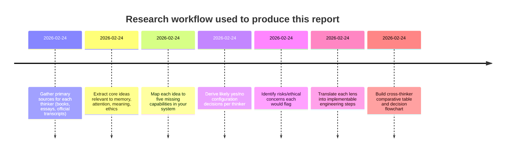

# Designing a Queryable Memory System Through Four Lenses

## Executive summary

Your system already solves the “mechanical memory” problem: you can persist, query, and filter a large body of events/artifacts/memories with structured metadata (PostgreSQL + JSONB; salient/background flags; basic aggregation). The gaps you listed—automatic thematic analysis, cross-document synthesis, dynamic relevance weighting, intelligent forgetting/TTL, and FB.zip import—are largely the “attention-and-meaning” layer: how the system decides what matters, how it connects items into coherent understanding, and how it prevents overload. Those are precisely the domains these four thinkers emphasize, but for different reasons.

From **John Vervaeke**, the most important design implication is: *relevance is not a property of stored items; it is an ongoing process of “relevance realization.”* You’ll want automation (embeddings, clustering, scoring), but always as **decision support** with transparency and human override—because relevance must remain context-sensitive and corrigible. A “living ecology of practices” around the tool (review rituals, reframing workflows, reflection prompts) matters as much as algorithms. citeturn11view0turn24view0turn10view3turn23search0

From **Jonathan Pageau**, the deepest implication is: *memory is connection and belonging in a hierarchy (center/margin), not merely storage.* He would likely push you toward a **center–margin architecture**: a curated “center” of identity-defining memories (salient) and a tolerated “margin” that is not forced into total order. He would warn against “totalizing” data-fication—“accounting for everything”—as a form of pride/tyranny, and he would want import/synthesis features to preserve narrative meaning rather than flatten everything into tags. citeturn10view1turn25view0turn13view0turn21view1

From **Jordan Peterson**, the dominant implication is: *your system is a hierarchy-of-values machine.* Its purpose is not to know everything, but to help you aim, act, and tell the truth about what you’re doing—without either drowning in chaos (too much information) or becoming stagnant (too little exploration). Peterson strongly supports a disciplined hierarchy (weights, decay, default policies), but he also stresses social-cognitive checks (dialogue, auditability, honesty) and the psychological necessity of both remembering *and* forgetting. citeturn10view0turn17view0turn16view2turn15view3

From **Ellen G. White**, the most design-driving implication is: *overloading the memory faculty without assimilation weakens the mind and undermines moral discernment.* She would endorse forgetting/archiving and strict intake controls (especially for FB-like content) to protect attention, character, and truth-discrimination. She also emphasizes the *power of what the mind dwells on*—suggesting governance, curation, and “content hygiene” are not optional; they are moral safeguards. citeturn10view2turn19view0turn5search7

Across all four, a convergent recommendation emerges: **automation is acceptable only when it strengthens human agency rather than replacing it**—especially around relevance, synthesis, and forgetting. That implies (a) human-in-the-loop defaults, (b) explainability (“why did this surface?”), (c) reversible forgetting (archive > delete), and (d) careful consent/privacy boundaries for high-risk imports like FB.zip. citeturn11view0turn25view0turn17view0turn19view0

## System context and decision points

### What is specified vs unspecified

**Specified (from your description):**
- Storage/query layer is live and functioning (events/artifacts/memories; JSONB metadata; read/write split; metadata filters; salient/background flags; basic aggregation).  
- Partial Google Drive import and constellation definitions exist; FB.zip is not yet imported.  
- Missing capabilities: automatic thematic analysis, cross-document synthesis, dynamic relevance weighting, intelligent forgetting/TTL, and FB.zip import.  

**Unspecified (material to ethical and design evaluation):**
- Who can access the system (single-user vs multi-user; roles/permissions).  
- Whether client work contains sensitive or regulated data; how consent is managed.  
- Encryption at rest/in transit; audit logs; retention policies; deletion guarantees.  
- Whether the system generates “answers” (LLM summaries) that could be mistaken as ground truth (and what safeguards exist).  

These unspecified items become major ethical flags in all four perspectives (truth, discernment, non-totalizing governance, and protection of attention). citeturn19view0turn13view0turn17view0turn23search0

### Mermaid timeline of research steps



### Mermaid flowchart for the six key yes/no decisions

```mermaid
flowchart TD
  A[Start: Decide defaults for intelligence layer] --> B{Enable automatic theme extraction?}
  B -- No --> B0[Keep manual tagging + curated constellations]
  B -- Yes --> B1[Use embeddings/clustering with human approval]

  B1 --> C{Enable cross-document synthesis views?}
  B0 --> C
  C -- No --> C0[Only per-item retrieval]
  C -- Yes --> C1[Add project/client/theme rollups + provenance]

  C1 --> D{Enable dynamic relevance scoring?}
  C0 --> D
  D -- No --> D0[Binary flags only (salient/background)]
  D -- Yes --> D1[Scores with decay + context boosting + explainability]

  D1 --> E{Allow user "forget" command?}
  D0 --> E
  E -- No --> E0[Only manual archive by admin]
  E -- Yes --> E1[Move items to archive + reversible restore]

  E1 --> F{Allow system-suggested forgetting/TTL?}
  E0 --> F
  F -- No --> F0[No automatic demotion; user initiates]
  F -- Yes --> F1[Soft TTL: recommend demotion; never hard-delete by default]

  F1 --> G{Import FB.zip now?}
  F0 --> G
  G -- No --> G0[Defer; define consent + scope + filters first]
  G -- Yes --> G1[Import with quarantine + consent checks + minimized retention]
```

## John Vervaeke

### Core relevant ideas in 3–6 bullets with primary sources

- **Relevance is a process, not a static label**: cognition must continually constrain overwhelming option spaces; a “theory of relevance” is not straightforward, but mechanisms for *relevance realization* can be modeled. citeturn24view0turn11view0  
- **Intelligence and wisdom depend on selectively ignoring information** rather than exhaustively computing everything; what matters is context-sensitive constraint and reframing. citeturn11view0turn24view0  
- **Knowing is plural**: propositional “knowing that” is only one mode; procedural, perspectival, and participatory knowing are central to meaning and agency, and each relates to different “memories” (semantic, procedural, episodic, self). citeturn10view3  
- **Modern cultures over-index propositional knowledge (“propositional tyranny”)**, which can suppress non-propositional knowing that supports meaning-in-life; restoring meaning requires an **ecology of practices** (interlocking disciplines, communities, dialogical reflection). citeturn10view3turn23search0  
- **Automation risks flattening meaning into information processing**; the danger is confusing more data/answers with wisdom and contact with reality. citeturn23search0turn24view0  

Primary sources used above: Vervaeke et al., “Relevance Realization and the Emerging Framework in Cognitive Science” (full text) citeturn24view0; Vervaeke & Ferraro, “Relevance, Meaning and the Cognitive Science of Wisdom” citeturn11view0; Vervaeke’s official Lectern essay on kinds of knowing and “propositional tyranny” citeturn10view3; Vervaeke’s essay “Meaning at Risk in the Age of Automated Information Processing.” citeturn23search0

### Illustrative quote tied to your design problem

> “Rather, we must be able to ignore the vast majority of this information.” citeturn11view0

This directly reframes your system’s “intelligence layer” goal: not “find everything,” but “help me ignore well.” citeturn11view0turn24view0

### How Vervaeke would view each missing capability

**Automatic thematic analysis (embeddings + clustering)**  
Vervaeke would likely see this as a legitimate attempt to externalize part of “co-relevance” discovery (patterning across information) but would warn that theme extraction can’t be the whole of relevance realization, because relevance depends on goals, context, and the agent’s shifting self-world fit. citeturn11view0turn24view0  
Plainly: he would say “yes, compute candidate patterns—then let the human reframe and approve what counts as a theme.” citeturn11view0turn10view3

**Cross-document synthesis**  
He would strongly support *structured synthesis* as a way to support reframing: moving from many fragments to coherent “problem formulations” across time and domains. citeturn11view0turn24view0  
But he would also insist synthesis must preserve contact with source reality (provenance, traceability), otherwise it becomes “propositional tyranny”: impressive narratives not grounded in lived relevance. citeturn10view3turn23search0

**Dynamic relevance weighting (continuous scores, decay, context boosting)**  
This is very close to what his framework wants—*if* designed correctly. Relevance realization is dynamic, multiscale, and dependent on competing constraints and goals, so static flags will underperform. citeturn24view0turn11view0  
However, he would likely insist that the system treat the score as *hypothesis*, not truth: offer explanations, allow user override, and support intentional reframing. citeturn11view0turn10view3turn23search0

**Intelligent forgetting / TTL**  
He would interpret forgetting as part of adaptive cognition: you cannot remain intelligent without losing access to most information most of the time. citeturn11view0  
Yet he would likely prefer “soft forgetting” (demotion or archival) over irreversible deletion by default—because wisdom requires the ability to revisit and reframe older material when goals change. citeturn11view0turn24view0

**FB.zip import**  
He would treat “more data” as a temptation of informationalism: importing a huge social corpus can swamp salience and distort relevance realization if not carefully constrained. citeturn11view0turn23search0  
He’d likely urge: import only with a clear practice around it (what is it for?) and with strong constraints to prevent drowning in low-relevance noise. citeturn10view3turn24view0

### Five likely yes/no decisions Vervaeke would endorse

1. **Yes**: implement embeddings/clustering, but **No**: auto-finalize theme labels without human confirmation. citeturn24view0turn10view3  
2. **Yes**: cross-document synthesis, but **Yes**: require provenance links back to source items for every synthesized claim. citeturn23search0turn11view0  
3. **Yes**: dynamic relevance scoring with decay, but **Yes**: “why this surfaced” explanations and user override controls. citeturn11view0turn24view0  
4. **Yes**: a “forget” mechanism, but **No**: irreversible deletion as the default; prefer archival demotion. citeturn11view0turn24view0  
5. **No (default)**: import FB.zip until you define the *purpose/practice* and constraints; if imported, **Yes**: quarantine and aggressive noise filtering. citeturn23search0turn11view0  

### Risks or ethical concerns Vervaeke would raise

He would warn about **mistaking information processing for wisdom**, especially if your system starts generating confident thematic “takes” that feel like insight but are really just pattern compression without lived relevance. citeturn23search0turn10view3  
He would also flag **self-deception risks**: automated weights can systematically reinforce a distorted salience landscape (what you look at becomes what you become), unless you design deliberate counter-practices and reflective checks. citeturn10view3turn11view0

### Three actionable engineering steps aligned with Vervaeke

1. **Build a “relevance hypothesis” pipeline**: embeddings → candidate clusters → human confirmation → store as “proposed_theme” with confidence and rationale, never as unquestionable truth. citeturn24view0turn11view0  
2. **Add an “explain my retrieval” layer**: every surfaced item shows which constraints fired (query match, embedding similarity, recency decay, user goals) and allows “downrank/override.” citeturn11view0turn24view0  
3. **Instrument an “ecology of practice” around the tool**: implement weekly review surfaces (salient audit, noise audit, “what did I repeatedly return to?”) to keep the system training your attention intentionally, not accidentally. citeturn10view3turn23search0  

## Jonathan Pageau

### Core relevant ideas in 3–6 bullets with primary sources

- **Symbolism is pattern perception and participation**: the world is too complex to apprehend as mere fragments; meaning emerges through recognizing repeated structures and participating in them (ritual, story, tradition). citeturn12view0  
- **Attention and memory compress complexity into narrative**: you remember what you attend to, and you turn overwhelming events into a “little story” that preserves causality of meaning. citeturn25view0  
- **Hierarchy is unavoidable**: reality is experienced as “higher/lower,” unity/multiplicity, center/margin; healthy order is not eliminating the margin but relating it properly to the center. citeturn25view0turn21view1  
- **Memory as connection**: remembering is a way of being connected across distance—especially connection to what unites (for Pageau, ultimately God). citeturn10view1  
- **Suspicion of “totalizing systems”**: attempting to “account for everything” is framed as an “excess of perfection” and pride—linked to tyranny and control. citeturn13view0  

Primary/official sources used above are Pageau’s own transcripts on entity["organization","The Symbolic World","media platform"]. citeturn10view1turn12view0turn13view0turn25view0  
A closely aligned additional primary text, explicitly discussing “attentional prioritisation” and “centre/margin,” is the ARC “Subsidiary Hierarchy” paper associated with Pageau and Peterson. citeturn21view1turn20view0

### Illustrative quote tied to your design problem

> “The relationship between the margin and the center … is memory.” citeturn10view1

For Pageau, that implies your memory system should not merely store; it should *organize belonging*—what is central, what is peripheral, and how the peripheral stays meaningfully connected without being forced into a total scheme. citeturn10view1turn21view1

### How Pageau would view each missing capability

**Automatic thematic analysis**  
He would be sympathetic to the *goal* (seeing patterns), because symbolism is “recognizing repeated structures.” citeturn12view0  
But he would be wary of automated theming that strips the human participant out: in his account, meaning is not merely detected; it is also *lived and participated in* (ritual, story, embodied attention). citeturn12view0turn25view0  
Plainly: he’d want automation to propose patterns while preserving interpretive hierarchy and human discernment—and leaving room for ambiguity and “margins.” citeturn21view1turn13view0

**Cross-document synthesis**  
He would strongly endorse synthesis if it is narrative and hierarchical: compressing many variables into “a little story” is precisely how meaning functions. citeturn25view0  
However, he would insist synthesis not become “total accountancy”—not the forced closure of every remainder. He explicitly warns against the desire to “account for everything” as totalizing pride. citeturn13view0

**Dynamic relevance weighting**  
He would interpret relevance weighting as a form of hierarchy: what is “higher” gathers meaning and organizes the lower. citeturn25view0turn21view1  
But he would likely want relevance weights anchored to an explicit “highest” principle (the organizing center), and he would resist shifting weights that make the margin tyrannize the center (e.g., novelty or exceptions automatically becoming primary). citeturn21view1turn13view0

**Intelligent forgetting / TTL**  
Pageau’s frame suggests a **margin strategy**, not annihilation: the margin is necessary; you don’t destroy it, you relate it. citeturn21view1  
So he would likely prefer a system that “moves to the periphery” rather than deletes—similar to how older stories remain available but not constantly central. citeturn10view1turn25view0

**FB.zip import**  
He would be especially cautious: importing a large corpus of social content can easily become a “totalizing” move—attempting exhaustive capture of the self’s history, including trivial or corrosive material. His critique of “accounting for everything” directly applies. citeturn13view0  
If imported, he would likely recommend strong boundaries—quarantine, selective import, and explicit ritual/meaning structures around what it is for. citeturn12view0turn25view0

### Five likely yes/no decisions Pageau would endorse

1. **Yes**: automatic theme proposals, but **No**: treating clusters as final “truth”; keep interpretive layers and ambiguity. citeturn12view0turn21view1  
2. **Yes**: cross-document synthesis, but **Yes**: constrain synthesis to “narrative compression” with explicit center/margin structure, not total capture. citeturn25view0turn13view0  
3. **Yes**: dynamic relevance weights, but **Yes**: require an explicit “center” (highest principle / identity) that weights cannot silently override. citeturn21view1turn10view1  
4. **Yes**: forgetting as “move to margin/archival,” but **No**: hard deletion as default (deletion is an extreme form of severed connection). citeturn10view1turn21view1  
5. **No (default)**: FB.zip import until you define what belongs at the center; **Yes**: if imported, do it as a quarantined “margin” dataset with strict filters. citeturn13view0turn21view1  

### Risks or ethical concerns Pageau would raise

He would likely warn that a memory system can become an instrument of **control and surveillance**—externally (tracking) and internally (trying to dominate all narrative margins). His critique of “totalizing systems” explicitly targets technological control patterns. citeturn13view0  
He would also flag an interpretive danger: automated themes can turn symbolic vision into a flattening taxonomy, where living meaning is reduced to labels detached from the “higher” organizing goods. citeturn12view0turn21view1

### Three actionable engineering steps aligned with Pageau

1. **Implement a center–margin data model**: every item has a “distance-from-center” state (center/salient, near, far/margin, archive), and automated processes are permitted only to *suggest* movement toward/away from center. citeturn21view1turn10view1  
2. **Build synthesis as story-first**: cross-doc views should generate “beginning/middle/end” timelines and causal-of-meaning links (why it mattered), not just keyword aggregation. citeturn25view0turn10view1  
3. **Add anti-totalizing guardrails**: caps on automated coverage (e.g., “top N themes”), explicit “remainder bucket,” and deliberate “unknown/ambiguous” tagging so the system never claims exhaustive closure. citeturn13view0turn21view1  

## Jordan Peterson

### Core relevant ideas in 3–6 bullets with primary sources

- **Meaning is regulation of contact with the unknown**: too much unknown is chaos; too little is stagnation. Meaning emerges in the proportionate balance. citeturn10view0  
- **Order/chaos is a functional polarity**: rules and structure prevent slavery to impulse, but overly rigid order becomes oppression; disciplined structure is justified because it enables higher aims. citeturn16view2  
- **A workable life requires a hierarchy**: action implies prioritization (some goals outrank others); this directly maps to relevance policies and weighting. (Inference from his framework of value/meaning as a guide for action.) citeturn10view0turn16view2  
- **Narrative and dialogical processing organize the mind**: “we mostly think by talking,” and we talk about the past to separate trivial concerns from what is truly important—explicitly linking communication to remembering and forgetting. citeturn17view0  
- **Psychological health needs both remembering and forgetting**: he explicitly frames talk as serving both functions, implying that deliberate forgetting is not a defect but a requirement for order. citeturn17view0  

Primary sources used above: Peterson’s “Three Excerpts from entity["book","Maps of Meaning: The Architecture of Belief","peterson 1999"]” (official excerpt page) citeturn10view0; publisher excerpt from entity["book","12 Rules for Life: An Antidote to Chaos","peterson 2018"] citeturn16view2turn15view3; publisher extract from entity["book","Beyond Order: 12 More Rules for Life","peterson 2021"] citeturn17view0.

### Illustrative quote tied to your design problem

> “The subjective sense of meaning is the instinct governing rate of contact with the unknown.” citeturn10view0

This maps almost one-to-one onto your missing capabilities: theme extraction and synthesis increase “contact with the unknown,” while relevance weighting and forgetting prevent chaos by constraining exposure. citeturn10view0turn16view2

### How Peterson would view each missing capability

**Automatic thematic analysis**  
He’d likely say: yes—*if it helps you aim and act* (utility), but no—if it generates endless novelty that destabilizes ordering. In his schema, too much unbounded information becomes chaos. citeturn10view0turn16view2  
Plainly: he would want it bounded: limited themes, clear names, evidence, and practical linkage to responsibility/projects. citeturn15view3turn10view0

**Cross-document synthesis**  
He’d strongly support synthesis as “map-making”: building a coherent structure that lets you navigate life’s complexity. citeturn10view0turn16view2  
But he’d insist on truth-oriented synthesis: a system that composes attractive narratives without grounded source links becomes a tool for self-deception (inference; grounded in his repeated insistence that meaning pursued “without self-deception” sustains the person). citeturn10view0turn17view0

**Dynamic relevance weighting**  
This fits his view that life requires prioritization and hierarchy. He would likely endorse continuous scores with decay to keep the system aligned with current aims (avoiding stagnation, avoiding chaos). citeturn10view0turn15view3  
He would also likely demand explicit control: users must be able to say “this matters” and have the system obey, because goal-structure is the core stabilizer. citeturn16view2

**Intelligent forgetting / TTL**  
Peterson is unusually explicit here: “We need to talk – both to remember and to forget.” That suggests he sees forgetting as part of mental order. citeturn17view0  
He would likely recommend: never let the system silently delete important records, but do implement disciplined “cleaning” (demotion, archiving, and periodic review) so “trivial, overblown concerns” don’t dominate. citeturn17view0turn16view2

**FB.zip import**  
He would ask: what is the responsibility/aim of importing it? If FB.zip is mostly trivial noise, it raises chaos and temptation toward resentment/rumination; if it is needed for truthful life-review, import it with structure and boundaries. (Inference grounded in his emphasis on meaning as balanced contact and the need to distinguish trivial from important.) citeturn10view0turn17view0

### Five likely yes/no decisions Peterson would endorse

1. **Yes**: automatic thematic analysis, but **Yes**: cap the number of surfaced themes and tie them to action-oriented contexts (project/client/responsibility). citeturn10view0turn15view3  
2. **Yes**: cross-document synthesis, but **Yes**: every synthesis view must show supporting sources so you cannot “lie to yourself” via ungrounded summaries. citeturn17view0turn10view0  
3. **Yes**: dynamic relevance weighting with decay, **No**: purely passive scoring—require explicit user “aim” inputs (what am I trying to do?). citeturn10view0turn16view2  
4. **Yes**: “forget” as archive/demotion, **No**: automatic hard deletion by default; forgetting must be part of disciplined order, not chaotic loss. citeturn17view0turn16view2  
5. **Conditional**: FB.zip import—**Yes** only after defining purpose and implementing strong boundaries (quarantine, filters, and review rituals); otherwise **No**. citeturn10view0turn17view0  

### Risks or ethical concerns Peterson would raise

He would worry about **self-deception amplified by automation**: if the system generates explanation-like narratives that feel meaningful but are not grounded, it becomes a sophisticated rationalization engine. citeturn10view0turn17view0  
He would also flag **psychological destabilization**: importing and thematically surfacing vast personal/social media history can increase rumination and resentment (inference consistent with his chaos framing and emphasis on distinguishing trivial concerns from truly important experiences). citeturn17view0turn10view0

### Three actionable engineering steps aligned with Peterson

1. **Add an explicit “aim/hierarchy of values” configuration layer** per project/client (top priorities, non-negotiables). Use it as a hard prior for relevance scoring and theme surfacing. citeturn10view0turn15view3  
2. **Implement “order-maintenance rituals” in product**: weekly “clean-up” review, demote trivial items, promote what is truly important, and require user confirmation for major reweighting. citeturn17view0turn16view2  
3. **Make forgetting dialogical rather than silent**: when TTL triggers, the system should present: “Keep central / move to margin / archive,” with a short justification and reversible history, echoing the idea that we talk to separate trivial from important. citeturn17view0turn16view2  

## Ellen G. White

### Core relevant ideas in 3–6 bullets with primary sources

- **Over-taxing memory without assimilation weakens the mind**: education that crowds the mind with knowledge it cannot “digest and assimilate” undermines vigor and independent judgment. citeturn10view2  
- **The mind becomes what it dwells on**: “the mind gradually adapts itself” to its habitual objects; by beholding, we become changed—linking attention, character, and moral trajectory. citeturn19view0  
- **Discernment matters morally**: weakening independent reasoning makes people vulnerable to deception and tradition-following without evidence—an ethical risk of over-reliance on “the judgment and perception of others.” citeturn10view2  
- **Discipline and firmness shape desire**: removing “all hope” of a desired object can redirect attention (“law of substitute desire”), suggesting that intentional denial/constraints can be psychologically effective. citeturn19view0  
- **Content hygiene is spiritually weighty**: counsel to “put away the foolish reading matter” and commit higher truths to memory implies strong filtering of what is stored and rehearsed. citeturn5search7turn19view0  

Primary sources used above: entity["book","Education","ellen g. white 1903"] citeturn10view2; EGW Writings compilation “Mind, Character, and Personality” chapter “Laws Governing the Mind,” citing her writings and sources citeturn19view0; biographical account preserving her counsel about “foolish reading matter” and memorizing promises citeturn5search7.

### Illustrative quote tied to your design problem

> “The mind thus burdened with that which it cannot digest and assimilate is weakened.” citeturn10view2

This is almost a direct critique of “import everything and tag later.” citeturn10view2turn19view0

### How Ellen White would view each missing capability

**Automatic thematic analysis**  
She would likely be cautious: auto-theming can encourage *more intake* and faster scanning, which she describes as an education style that over-taxes memory and diminishes independent thought and moral discernment. citeturn10view2turn19view0  
But she could accept it conditionally if it helps you reduce overload and focus on higher-value material—i.e., if it supports assimilation rather than accumulation. citeturn10view2turn19view0

**Cross-document synthesis**  
She would likely support synthesis when it strengthens independent reasoning and “carefully comparing” evidence—because she explicitly warns that dependence on others’ judgment follows from weak reasoning. citeturn10view2turn19view0  
So: synthesis yes, but only with traceability and with prompts that require the user to judge truth vs error, rather than passively accept the system’s voice. citeturn10view2turn19view0

**Dynamic relevance weighting**  
She would likely approve of weighting insofar as it prevents the mind from being crowded with undigested trivia. citeturn10view2turn19view0  
However, she would insist weights embody moral intentionality: what you dwell on shapes you, so defaults must protect attention and character. If the weights optimize novelty or engagement, that would be spiritually and cognitively dangerous in her framework. citeturn19view0turn5search7

**Intelligent forgetting / TTL**  
She would strongly favor deliberate “putting away” of unhelpful content and mental habits. Her “law of substitute desire” implies that firm denial (removing hope) redirects attention, supporting a strong forgetting/archiving discipline. citeturn19view0  
But given her emphasis on truth and accountability, she would likely prefer archiving and restraint over impulsive erasure—especially for records tied to responsibility. (Inference grounded in her law-and-consequence framing and the emphasis on evidence and accountability.) citeturn19view0turn10view2

**FB.zip import**  
This would be her highest-risk feature. She explicitly counsels away from “foolish reading matter,” and she stresses that what the mind dwells on changes the person. Importing a large body of social content could institutionalize dwelling on triviality, conflict, or impurity. citeturn5search7turn19view0  
She would likely require: stringent filters, quarantine, and explicit selection of what is worth keeping—prioritizing content that builds character and discernment rather than mere recollection. citeturn10view2turn19view0

### Five likely yes/no decisions Ellen White would endorse

1. **Yes (conditional)**: automatic theming only if it reduces overload and promotes assimilation; **No** to theming that accelerates accumulation/scanning. citeturn10view2turn19view0  
2. **Yes**: cross-document synthesis, but **Yes**: require evidence trails and user judgment prompts to preserve discernment. citeturn10view2turn19view0  
3. **Yes**: dynamic relevance weighting that deprioritizes trivia and supports deep work; **No**: weights optimized for volume/engagement. citeturn10view2turn19view0  
4. **Yes**: intelligent forgetting via firm archival/demotion defaults; **No**: “nothing ever leaves” as a norm, because constant burden weakens the mind. citeturn10view2turn19view0  
5. **No (default)**: FB.zip import until strict intake rules exist; **Yes** only as a quarantined dataset with strong exclusions and purpose-limited use. citeturn5search7turn19view0  

### Risks or ethical concerns Ellen White would raise

Her ethical concerns are tightly tied to the moral psychology of attention: **what you store and rehearse trains your character.** A system that makes it easy to relive triviality, resentment, vanity, or impurity becomes spiritually corrosive. citeturn19view0turn5search7  
She would also warn about **dependency and deception**: if users sacrifice judgment to the system’s summaries, they become “easy prey” to error and manipulation. citeturn10view2turn19view0

### Three actionable engineering steps aligned with Ellen White

1. **Add “assimilation gates” to ingestion**: every bulk import requires summarization + purpose labeling + “keep vs archive” decisions before it becomes query-default. citeturn10view2turn19view0  
2. **Implement strong default demotion/TTL for low-value material**: after a defined window, trivial items move to archive unless explicitly renewed—mirroring disciplined denial that redirects desire and attention. citeturn19view0turn10view2  
3. **Create content hygiene policies for FB.zip**: quarantine, explicit exclusion lists (gossip/idle content), and “dwell-time” limits (the system should not endlessly resurface harmful loops). citeturn5search7turn19view0  

## Comparative synthesis

### Comparative table across the four thinkers

| Thinker | Emphasis (meaning vs utility) | Stance on automation | Stance on forgetting | Recommended default relevance policy | Ethical flags they would raise |
|---|---|---|---|---|---|
| John Vervaeke | Meaning-through-agency: wisdom is improving contact with reality, not just utility. citeturn23search0turn10view3 | Conditional: use automation as *relevance support* with human-centered reframing and transparency. citeturn24view0turn11view0 | Human-in-loop, mostly archive/demotion; forgetting is necessary but should remain revisitable for reframing. citeturn11view0turn24view0 | Decay + context boosting, but explainable and corrigible. citeturn11view0turn24view0 | Mistaking information processing for wisdom; automation reinforcing distorted salience/self-deception. citeturn23search0turn10view3 |
| Jonathan Pageau | Meaning as symbolic participation and hierarchical belonging (center/margin). citeturn12view0turn10view1 | Conditional: automation can suggest patterns, but must not totalize or flatten symbolic/narrative meaning. citeturn13view0turn25view0 | Archive-to-margin: keep connection; don’t aim to eliminate the remainder by default. citeturn21view1turn10view1 | Conservative: preserve a curated center; resist novelty/exception ruling the whole. citeturn21view1turn13view0 | Totalizing “account for everything” impulses; surveillance/control dynamics; pride/tyranny risk. citeturn13view0turn21view1 |
| Jordan Peterson | Balance: meaning enables proportionate contact with unknown; utility must serve truthful aiming and responsibility. citeturn10view0turn15view3 | Conditional-to-pro: automation is good if it builds order, not chaos; must stay grounded in truth. citeturn10view0turn17view0 | Strongly pro forgetting-as-order (explicitly: remember *and* forget); default to archive/demotion with review. citeturn17view0turn16view2 | Decay policy with explicit goal/aim inputs; avoid overwhelming complexity. citeturn10view0turn16view2 | Self-deception via ungrounded narratives; destabilization via chaotic overexposure (e.g., FB import). citeturn10view0turn17view0 |
| Ellen G. White | Moral formation: attention shapes character; “digest and assimilate” > accumulate. citeturn10view2turn19view0 | Conditional: automation only if it protects attention and strengthens discernment; suspicious of accumulation accelerators. citeturn10view2turn19view0 | Pro forgetting/archiving discipline; “put away” trivial/harmful content; avoid mind-burdening. citeturn10view2turn19view0 | Conservative: aggressive demotion of trivia; protect mind from overload; encourage deep engagement. citeturn10view2turn19view0 | Corrosive content shaping attention/character; dependency on “others’ judgment” (system) leading to deception. citeturn10view2turn19view0 |

### What this means for your near-term design choices

Even though these thinkers differ theologically and philosophically, the same *engineering posture* shows up repeatedly:

A “Queryable Memory System” should be built less like an infinite warehouse and more like a **trained attentional environment**—a tool that helps you:  
- discover patterns *without pretending to totalize*, citeturn13view0turn24view0  
- synthesize narratives *with traceable grounding*, citeturn25view0turn17view0  
- assign relevance dynamically *with explainability and override*, citeturn11view0turn21view1  
- forget deliberately *through reversible demotion*, citeturn17view0turn19view0  
- import high-risk corpora (FB.zip) only under explicit purpose + strong boundaries. citeturn13view0turn5search7